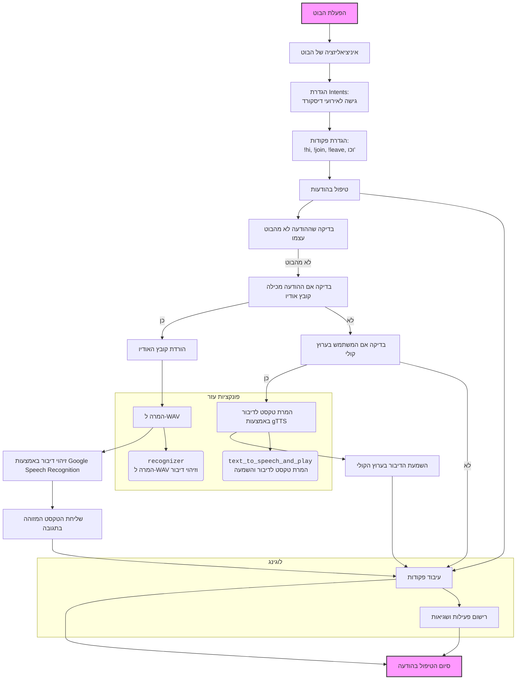
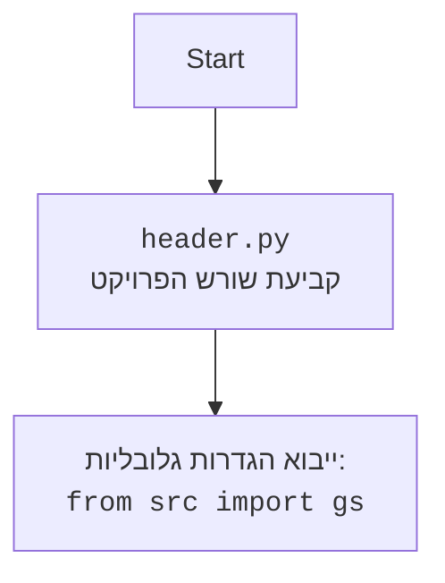

## ניתוח קוד בוט דיסקורד

### 1. <algorithm>
הקוד מתאר בוט דיסקורד המאפשר אינטראקציה עם משתמשים בערוצי טקסט וקול. הבוט מבצע מגוון פעולות, כולל זיהוי דיבור, המרת טקסט לדיבור, ניהול מודל למידת מכונה, ומתן משוב.

**תרשים זרימה:**
1. **הפעלת הבוט:**
   - הבוט מתחיל לפעול עם `discord.Client` ומוגדר עם קידומת פקודה `!`.
   - מוגדרים אינטנטים (intents) לגישה לאירועי דיסקורד רלוונטיים.
   ```python
   intents = discord.Intents.default()
   intents.message_content = True
   bot = commands.Bot(command_prefix='!', intents=intents)
   ```
2. **טיפול בפקודות:**
   - הבוט מגיב לפקודות שונות:
     - `!hi`: שולח הודעת פתיחה.
     ```python
     @bot.command()
     async def hi(ctx):
         await ctx.send("Hi!")
     ```
     - `!join`: מצטרף לערוץ הקולי של המשתמש.
     ```python
     @bot.command()
     async def join(ctx):
         voice_channel = ctx.author.voice.channel
         await voice_channel.connect()
     ```
     - `!leave`: עוזב את ערוץ הקולי.
     ```python
     @bot.command()
     async def leave(ctx):
         voice_client = ctx.voice_client
         await voice_client.disconnect()
     ```
     - `!train`, `!test`, `!archive`, `!select_dataset`, `!instruction`, `!correct`, `!feedback`, `!getfile`: פקודות לניהול מודל, קבצים והגדרות.
     - לדוגמא, `!train` יקבל קובץ או טקסט ויאמן את המודל עליו. (הקוד המלא אינו מוצג כאן, אך זוהי הפעולה העיקרית).
3. **טיפול בהודעות:**
   - הבוט מעבד הודעות נכנסות:
     - אם ההודעה היא קובץ אודיו, הבוט יזהה את הדיבור ויחזיר את הטקסט.
       - הורדת קובץ האודיו.
       - המרת קובץ האודיו לפורמט WAV.
       - זיהוי דיבור באמצעות Google Speech Recognition.
       - שליחת הטקסט המזוהה בתגובה.
     - אם המשתמש נמצא בערוץ קולי, הבוט ימיר את הטקסט לדיבור וישמיע אותו בערוץ הקולי.
       - המרת טקסט לדיבור באמצעות gTTS.
       - השמעת הדיבור בערוץ הקולי.
   ```python
   @bot.event
   async def on_message(message):
       if message.author == bot.user:
           return
       # ... בדיקה אם ההודעה היא קובץ אודיו ...
       # ... טיפול בזיהוי דיבור ...
       # ... טיפול בהמרת טקסט לדיבור ...
       await bot.process_commands(message)
   ```
4. **פונקציות עזר:**
   - `recognizer`: מורידה את קובץ האודיו, ממירה אותו ל-WAV ומזהה דיבור.
   - `text_to_speech_and_play`: ממירה טקסט לדיבור באמצעות gTTS ומשמיעה אותו בערוץ הקולי.
5. **לוגינג:**
   - הבוט משתמש בלוגר לרישום אירועים ושגיאות.
6. **הרצת הבוט:**
    - הבוט מופעל באמצעות טוקן דיסקורד המאוחסן בתוך `gs.credentials.discord.bot_token`.
    ```python
     bot.run(gs.credentials.discord.bot_token)
   ```

### 2. <mermaid>


**ניתוח תלויות:**
- `discord.py`: ספרייה ליצירת בוטים עבור דיסקורד. מאפשרת גישה לאירועים כמו קבלת הודעות, חיבור לערוצי קול ועוד.
- `speech_recognition`: ספרייה לזיהוי דיבור. משמשת להמרת אודיו לטקסט.
- `pydub`: ספרייה לעיבוד קבצי אודיו. משמשת להמרת קבצי אודיו לפורמט WAV.
- `gtts`: ספרייה להמרת טקסט לדיבור. משמשת להפקת אודיו מטקסט.
- `requests`: ספרייה לשליחת בקשות HTTP. משמשת להורדת קבצים.
- `pathlib`: ספרייה לעבודה עם נתיבי קבצים.
- `tempfile`: ספרייה ליצירת קבצים זמניים.
- `asyncio`: ספרייה לביצוע משימות אסינכרוניות. משמשת לטיפול באירועים בצורה לא חוסמת.
- `src.gs`:  הגדרות גלובליות של הפרויקט, כולל פרטי התחברות לבוט דיסקורד.

**תרשים זרימה של `header.py` (בהנחה שקיימת שורת `import header`):**


### 3. <explanation>

**ייבואים (Imports):**

- `discord`: ספריית ליבת הבוט, המאפשרת אינטראקציה עם ה-API של דיסקורד. משמשת ליצירת בוטים, ניהול ערוצים, משתמשים ואירועים.
- `discord.ext.commands`: הרחבה של ספריית דיסקורד, המספקת מנגנון לפקודות (command).
- `speech_recognition`: הספרייה האחראית על זיהוי דיבור, מאפשרת לבוט להבין תוכן דיבור.
- `pydub`: ספרייה לעיבוד קבצי אודיו, מאפשרת המרה בין פורמטי אודיו, שינוי עוצמה ועוד.
- `gtts`: ספרייה להמרת טקסט לדיבור, מאפשרת לבוט להשמיע טקסט באמצעות קול.
- `requests`: ספרייה לשליחת בקשות HTTP, משמשת להורדת קבצים מהאינטרנט.
- `pathlib`: ספרייה לטיפול בנתיבי קבצים, מאפשרת עבודה נוחה יותר עם קבצים.
- `tempfile`: ספרייה ליצירת קבצים זמניים, משמשת ליצירת קבצים זמניים במהלך פעולות הבוט.
- `asyncio`: ספרייה לטיפול בפעולות אסינכרוניות, מאפשרת לבוט לטפל במספר פעולות במקביל.
- `src.gs`:  יבוא הגדרות גלובליות מהתיקיה הראשית של הפרויקט, כולל פרטי חיבור לבוט, הגדרות מודלים ועוד.
- `src.logger`:  יבוא מודול לוגינג, מאפשר לבוט לכתוב הודעות לוג, לצרכי דיבג ובקרה.

**מחלקות (Classes):**

- המחלקה העיקרית היא `commands.Bot`, שהיא תת-מחלקה של `discord.Client` ומשמשת כבסיס לבוט דיסקורד. היא כוללת בתוכה את כל הפונקציונליות של טיפול באירועים, פקודות ותגובות.
    - המאפיינים העיקריים:
        - `command_prefix`: מגדיר את התחילית לפקודות (למשל "!").
        - `intents`: מגדיר את ההרשאות הדרושות לבוט.
    - השיטות העיקריות:
        - `bot.run`: מפעילה את הבוט באמצעות הטוקן.
        - `@bot.command()`: מקשט פונקציות כדי שיהפכו לפקודות.
        - `@bot.event`: מטפל באירועי דיסקורד כמו קבלת הודעה.

**פונקציות (Functions):**

- `recognizer(file_path)`:
    - **פרמטר:** `file_path`: נתיב לקובץ האודיו.
    - **ערך מוחזר:** הטקסט שזוהה מהאודיו, או `None` אם לא הצליח לזהות.
    - **מטרה:** הורדת קובץ אודיו, המרה לפורמט WAV, וזיהוי הדיבור באמצעות Google Speech Recognition.
- `text_to_speech_and_play(text, voice_channel)`:
    - **פרמטרים:** `text`: הטקסט להמרה לדיבור, `voice_channel`: ערוץ הקולי להשמיע בו את הדיבור.
    - **ערך מוחזר:** אין.
    - **מטרה:** ממירה טקסט לדיבור באמצעות `gTTS` ומשמיעה אותו בערוץ הקולי.

**משתנים (Variables):**

- `gs.credentials.discord.bot_token`: טוקן הבוט של דיסקורד, המשמש לאימות הבוט.
- `bot`: מופע של המחלקה `commands.Bot`, מייצג את הבוט עצמו.
- `intents`: מגדיר את הרשאות הבוט.
- `voice_client`: לקוח הערוץ הקולי, משמש לחיבור וניתוק הבוט מהערוץ.
- `message.author`: מחזיר את האובייקט שמייצג את המשתמש ששלח את ההודעה.
- `message.content`: מחזיר את הטקסט של ההודעה שנשלחה.
- `message.attachments`: רשימה של כל הקבצים שמצורפים להודעה.

**בעיות אפשריות ותחומים לשיפור:**
- **ניהול שגיאות:** חסר טיפול שגיאות מפורט יותר בפונקציות כמו `recognizer` ו-`text_to_speech_and_play`.
- **אבטחה:** שמירת טוקן הבוט ישירות בקוד אינה מומלצת. כדאי להשתמש במשתני סביבה או קובץ תצורה נפרד.
- **קריאות קוד:** הקוד יכול להיות מורכב יותר ככל שיגדל מספר הפקודות והפונקציות. מומלץ לפצל את הקוד למודולים קטנים יותר.
- **ביצועים:** ניתן לייעל את תהליך זיהוי הדיבור והמרת טקסט לדיבור על ידי שימוש בטכניקות שונות.

**שרשרת קשרים עם חלקים אחרים בפרויקט:**

- הבוט תלוי בהגדרות גלובליות (gs) המוגדרות בחלק אחר של הפרויקט, כגון פרטי חיבור לדיסקורד, נתיבים של קבצים, וכו'.
- הבוט משתמש במודול הלוגינג (`src.logger`) לרישום אירועים ושגיאות.
- הבוט עשוי ליצור קשר עם חלקים אחרים בפרויקט (לדוגמה, מודלים של למידת מכונה) דרך ממשק (API) או באמצעות שיתוף נתונים.

ניתוח זה מספק מבט מקיף ומובנה על הקוד, ומאפשר להבין את הפונקציונליות, התלויות, הבעיות האפשריות ואפשרויות השיפור.