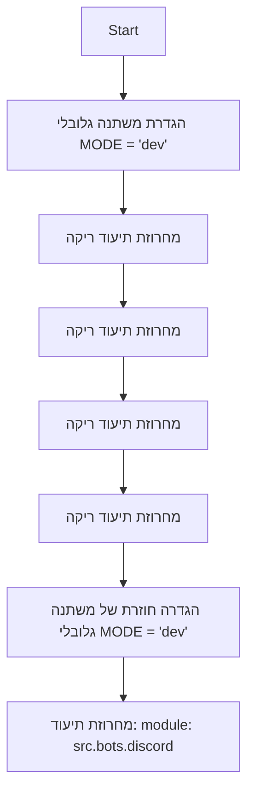

## <algorithm>

הקוד שסופק הוא קובץ `__init__.py` בספרייה `discord` בתוך החבילה `bots` של `src`. קובץ זה משמש בדרך כלל לאתחול חבילה והגדרת משתנים גלובליים בתוך החבילה.

1. **הגדרת מצב הפעלה:**
   - הקוד מתחיל בהגדרת משתנה גלובלי בשם `MODE` למחרוזת `'dev'`.
   - *דוגמה*: `MODE = 'dev'`  מגדיר את מצב הפעולה למצב פיתוח.

2. **תיעוד:**
   - הקוד מכיל מספר מחרוזות תיעוד רב-שורתיות (docstrings) ריקות.
   - *דוגמה*: `"""\n.. module:: src.bots.discord \n\t:platform: Windows, Unix\n\t:synopsis:\n\n"""` זוהי מחרוזת תיעוד לתיאור המודול, אך היא ריקה מתוכן.

3. **הגדרה חוזרת של מצב הפעלה:**
  - הקוד מגדיר שוב את המשתנה `MODE` לאותו ערך `'dev'`.
   - *דוגמה*:  `MODE = 'dev'`  מגדיר שוב את מצב הפעולה למצב פיתוח.

4. **תיעוד נוסף:**
  - ישנה עוד מחרוזת תיעוד שמציינת את שם המודול `src.bots.discord`.
  - *דוגמה*: `""" module: src.bots.discord """` מציינת שהקובץ שייך למודול זה.

**זרימת נתונים:**
אין זרימת נתונים מורכבת בקובץ זה. המשתנה `MODE` מוגדר פעם אחת ומוגדר שוב, אך לא מועבר או משמש בפונקציות או במחלקות.

## <mermaid>

**ניתוח תלויות:**

אין תלויות מיובאות בקובץ הזה, ולכן התרשים אינו כולל קשרים לתלויות.

## <explanation>

**ייבואים (Imports):**
- אין ייבוא קוד בקובץ זה. קובץ `__init__.py` יכול לייבא מודולים אחרים מתוך החבילה `src.bots.discord` כדי לגרום להם להיות נגישים כאשר החבילה מיובאת. במקרה זה, לא מבוצע ייבוא.

**מחלקות (Classes):**
- אין הגדרות של מחלקות בקובץ זה. קובץ `__init__.py` יכול להגדיר מחלקות בתוך החבילה, אך בקובץ הזה אין הגדרות כאלה.

**פונקציות (Functions):**
- אין הגדרות של פונקציות בקובץ זה. באופן דומה, קובץ `__init__.py` יכול להגדיר פונקציות בחבילה, אך אין פונקציות בקובץ הזה.

**משתנים (Variables):**
- `MODE`: משתנה גלובלי מסוג מחרוזת, שמוגדר פעמיים עם הערך `'dev'`. משתנה זה ככל הנראה נועד לשמש כדי לקבוע את מצב הפעולה של היישום (פיתוח, ייצור וכו'). הערך `'dev'` מרמז שהמצב המוגדר כברירת מחדל הוא פיתוח.

**בעיות אפשריות:**
- **הגדרה כפולה של `MODE`**: המשתנה `MODE` מוגדר פעמיים עם אותו ערך. זהו עודף קוד שאינו משפיע על הפונקציונליות הנוכחית אך יכול להצביע על חוסר תשומת לב לפרטים.
- **מחרוזות תיעוד ריקות**: הקובץ מכיל מספר מחרוזות תיעוד ריקות, שאינן מועילות. יש למלא אותן בתיאור רלוונטי של המודול או החבילה.
- **חוסר פעולה**: הקובץ לא עושה דבר מלבד להגדיר משתנה ולהדפיס מחרוזות תיעוד ריקות.

**תחומים לשיפור:**
- **הסרת ההגדרה הכפולה**: יש להסיר את ההגדרה הכפולה של המשתנה `MODE`.
- **הוספת תוכן למחרוזות תיעוד**: יש למלא את מחרוזות התיעוד בתיאור רלוונטי כדי להקל על השימוש וההבנה של המודול.
- **אתחול המודול**: בדרך כלל, בקובץ `__init__.py`, יש להוסיף פעולות אתחול נוספות, כגון ייבוא מודולים אחרים מהחבילה, או הגדרת משתנים ופונקציות גלובליות נוספות שיהיו נגישות למודולים אחרים בתוך החבילה.

**שרשרת קשרים:**
- הקובץ `__init__.py` שייך לחבילה `src.bots.discord`. הוא יכול לייבא מודולים אחרים בתוך החבילה הזו. בהיעדר תוכן נוסף, הוא משמש ככניסה (entry point) לחבילה כאשר היא מיובאת. לדוגמה, מודולים אחרים בתוך `src.bots.discord`, כמו קבצי קוד שונים המגדירים את הבוט של Discord, יכולים להשתמש במשתנה `MODE` כדי להגדיר את ההתנהגות שלהם בהתאם למצב הפעולה.