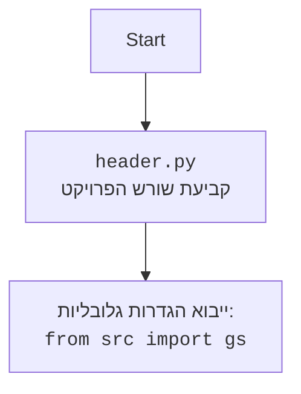

## <algorithm>

1. **הגדרת משתנים גלובליים**:
   - `MODE`: מוגדר כ-'dev'.
   - `PREFIX`: מוגדר כ-'!'.
   - `path_to_ffmpeg`: מגדיר את הנתיב לקובץ `ffmpeg.exe`.
   - `intents`: מגדיר את ההרשאות של הבוט (ברירת מחדל, תוכן הודעות ומצבי קול).
   - `bot`: יוצר מופע של בוט דיסקורד.
   - `model`: יוצר מופע של מודל למידת מכונה.

2. **אירוע `on_ready`**:
   - כאשר הבוט מחובר לדיסקורד, מדפיס הודעה ללוג.
     - לדוגמה: `"Logged in as DiscordBot#1234"`.

3. **פקודה `hi`**:
   - כאשר משתמש מפעיל את הפקודה `!hi`, הבוט שולח הודעה "HI!".
     - לדוגמה: משתמש שולח `!hi`, הבוט מגיב: `HI!`.

4. **פקודה `join`**:
   - כאשר משתמש מפעיל את הפקודה `!join`, הבוט מצטרף לערוץ הקולי של המשתמש.
     - אם המשתמש לא נמצא בערוץ קולי, הבוט שולח הודעה: "You are not in a voice channel.".
     - אחרת, הבוט מתחבר לערוץ ושולח הודעה: "Joined <שם הערוץ>".

5. **פקודה `leave`**:
   - כאשר משתמש מפעיל את הפקודה `!leave`, הבוט עוזב את הערוץ הקולי.
     - אם הבוט לא נמצא בערוץ קולי, הבוט שולח הודעה: "I am not in a voice channel.".
     - אחרת, הבוט מתנתק ושולח הודעה: "Disconnected from the voice channel.".

6. **פקודה `train`**:
   - כאשר משתמש מפעיל את הפקודה `!train`, הבוט מתחיל תהליך אימון של המודל.
     - אם מצורף קובץ, הקובץ נשמר באופן זמני ב-/tmp.
     - הבוט קורא למתודה `model.train` עם הנתונים, ספריה ודגל חיובי (ברירת מחדל).
     - אם תהליך האימון מתחיל, הבוט שולח הודעה עם מזהה המשימה: "Model training started. Job ID: <job_id>". אחרת, הבוט שולח הודעה: "Failed to start training.".
       - לדוגמה: משתמש שולח `!train data=some_data_here`, הבוט מתחיל אימון ומחזיר הודעה עם ה-Job ID.
       - לדוגמה: משתמש שולח `!train` עם קובץ מצורף, הקובץ נשמר ב/tmp, והבוט מתחיל אימון.

7. **פקודה `test`**:
   - כאשר משתמש מפעיל את הפקודה `!test`, הבוט בודק את המודל עם נתוני בדיקה.
     - נתוני הבדיקה נטענים מפורמט JSON.
     - הבוט קורא למתודה `model.predict` עם נתוני הבדיקה.
     - אם יש תחזיות, הבוט שולח הודעה עם התחזיות: "Test complete. Predictions: <predictions>".
     - אם אין תחזיות, הבוט שולח הודעה: "Failed to get predictions.".
     - אם נתוני הבדיקה בפורמט לא תקין, הבוט שולח הודעה: "Invalid test data format. Please provide a valid JSON string.".
       - לדוגמה: משתמש שולח `!test test_data={"input": "example"}`, הבוט מריץ בדיקה ומחזיר את התחזיות.

8. **פקודה `archive`**:
    - כאשר משתמש מפעיל את הפקודה `!archive`, הבוט מארכב קבצים בספריה שצוינה.
    - הבוט קורא למתודה `model.archive_files` עם שם הספריה.
    - אם פעולת הארכוב מצליחה, הבוט שולח הודעה: "Files in <directory> have been archived."
    - אם מתרחשת שגיאה, הבוט שולח הודעה עם פירוט השגיאה.
        - לדוגמה: משתמש שולח `!archive directory=path/to/directory`, הבוט מארכב את הספריה ומחזיר הודעה בהתאם.

9. **פקודה `select_dataset`**:
    - כאשר משתמש מפעיל את הפקודה `!select_dataset`, הבוט בוחר מערך נתונים לאימון.
    - הבוט קורא למתודה `model.select_dataset_and_archive` עם הנתיב לספריה ודגל חיובי (ברירת מחדל).
    - אם בחירת מערך הנתונים מצליחה, הבוט שולח הודעה: "Dataset selected and archived. Dataset: <dataset>".
    - אם בחירת מערך הנתונים נכשלת, הבוט שולח הודעה: "Failed to select dataset."
        - לדוגמה: משתמש שולח `!select_dataset path_to_dir_positive=/path/to/dataset`, הבוט בוחר מערך נתונים ומחזיר הודעה בהתאם.

10. **פקודה `instruction`**:
    - כאשר משתמש מפעיל את הפקודה `!instruction`, הבוט מציג את ההוראות מקובץ חיצוני.
    - הבוט טוען את התוכן מקובץ `_docs/bot_instruction.md`.
    - אם הקובץ קיים, הבוט שולח את ההוראות.
    - אם הקובץ לא נמצא, הבוט שולח הודעה: "Instructions file not found.".
    - אם מתרחשת שגיאה, הבוט שולח הודעה עם פירוט השגיאה.
        - לדוגמה: משתמש שולח `!instruction`, הבוט מציג את ההוראות מקובץ חיצוני.

11. **פקודה `correct`**:
    - כאשר משתמש מפעיל את הפקודה `!correct`, הבוט שומר תיקון לתגובה קודמת.
    - הבוט שולף את ההודעה לפי ה-ID שצוין.
    - אם ההודעה נמצאת, הבוט קורא למתודה `store_correction` כדי לשמור את התיקון ושולח הודעת אישור.
    - אם ההודעה לא נמצאת, הבוט שולח הודעה: "Message not found."
    - אם מתרחשת שגיאה, הבוט שולח הודעה עם פירוט השגיאה.
        - לדוגמה: משתמש שולח `!correct message_id=1234 correction="New correct text"`, הבוט שומר את התיקון ומחזיר הודעה.

12. **פונקציה `store_correction`**:
    - שומרת את הטקסט המקורי והתיקון בקובץ `corrections_log.txt`.

13. **פקודה `feedback`**:
    - כאשר משתמש מפעיל את הפקודה `!feedback`, הבוט שומר את המשוב של המשתמש.
    - הבוט קורא למתודה `store_correction` כדי לשמור את המשוב ושולח הודעה: "Thank you for your feedback. We will use it to improve the model.".
      - לדוגמה: משתמש שולח `!feedback feedback_text="The bot is great"`, הבוט שומר את המשוב ושולח הודעת תודה.

14. **פקודה `getfile`**:
    - כאשר משתמש מפעיל את הפקודה `!getfile`, הבוט שולח קובץ מצורף מהנתיב שצוין.
    - הבוט בודק אם הקובץ קיים.
    - אם הקובץ קיים, הבוט מצרף ושולח אותו.
    - אם הקובץ לא קיים, הבוט שולח הודעה: "File not found: <file_path>."
        - לדוגמה: משתמש שולח `!getfile file_path=/path/to/file.txt`, הבוט שולח את הקובץ.

15. **פונקציה `text_to_speech_and_play`**:
    - ממירה טקסט לדיבור באמצעות `gTTS` ומנגנת אותו בערוץ קולי.
    - שומרת את קובץ האודיו הזמני ב-/tmp.
    - אם הבוט לא מחובר לערוץ קולי, הוא מתחבר.
    - מנגנת את קובץ האודיו בערוץ הקולי.
    - לאחר שהניגון מסתיים, הבוט מתנתק מהערוץ הקולי.
        - לדוגמה: משתמש שולח הודעה שהבוט צריך להגיב אליה בקול.

16. **אירוע `on_message`**:
    - כאשר מתקבלת הודעה, הבוט בודק אם היא נשלחה על ידי עצמו.
    - אם ההודעה מתחילה בקידומת `!`, הבוט מעבד אותה כפקודה.
    - אם יש קבצים מצורפים, והם קבצי אודיו, הבוט מזהה את הטקסט מתוך האודיו באמצעות `recognizer` ואז שולח אותו למודל.
    - אם אין קבצים מצורפים, הבוט שולח את הטקסט למודל.
    - אם המשתמש נמצא בערוץ קולי, הבוט מפעיל את פונקציית `text_to_speech_and_play`.
    - אם המשתמש לא נמצא בערוץ קולי, הבוט שולח את התגובה בטקסט.
       - לדוגמה: משתמש שולח הודעה רגילה "Hello", הבוט שולח תגובה בטקסט.
       - לדוגמה: משתמש שולח הודעת אודיו, הבוט מזהה את הטקסט ושולח תגובה בטקסט או בקול.

17. **הרצת הבוט**:
    - אם הקובץ רץ ישירות (`__name__ == "__main__"`), הבוט מתחיל לפעול באמצעות קריאה ל- `bot.run()` עם הטוקן של הבוט.

## <mermaid>

```mermaid
flowchart TD
    subgraph DiscordBot
    Start[Start] --> Init[Initialize Bot]
    Init --> Intents[Set Intents]
    Intents --> CreateBot[Create Bot Instance]
    CreateBot --> ModelInit[Initialize Model]
    ModelInit --> OnReadyEvent[on_ready()]
    OnReadyEvent --> LoggedIn[Log "Logged in as {bot.user}"]
    
    LoggedIn --> HiCommand[hi(ctx) command]
    HiCommand -- "!hi" --> SendHi[Send "HI!"]
    SendHi --> EndCommand

    LoggedIn --> JoinCommand[join(ctx) command]
    JoinCommand -- "!join" --> CheckAuthorVoice[Check if author in voice channel]
    CheckAuthorVoice -- Yes --> ConnectToChannel[Connect to voice channel]
    ConnectToChannel --> SendJoinedMsg[Send "Joined {channel}"]
    CheckAuthorVoice -- No --> SendNotInVoice[Send "You are not in a voice channel."]
    SendNotInVoice --> EndCommand
    SendJoinedMsg --> EndCommand

    LoggedIn --> LeaveCommand[leave(ctx) command]
    LeaveCommand -- "!leave" --> CheckVoiceClient[Check if bot in voice channel]
    CheckVoiceClient -- Yes --> DisconnectChannel[Disconnect from voice channel]
    DisconnectChannel --> SendLeaveMsg[Send "Disconnected from the voice channel."]
    CheckVoiceClient -- No --> SendNotInChannel[Send "I am not in a voice channel."]
    SendNotInChannel --> EndCommand
    SendLeaveMsg --> EndCommand
    
    LoggedIn --> TrainCommand[train(ctx, data, data_dir, positive, attachment) command]
    TrainCommand -- "!train" --> CheckAttachment[Check for Attachment]
    CheckAttachment -- Yes --> SaveAttachment[Save attachment to /tmp]
    SaveAttachment --> CallModelTrain[Call model.train()]
    CheckAttachment -- No --> CallModelTrain
    CallModelTrain --> CheckJobId[Check if job_id exists]
    CheckJobId -- Yes --> SendTrainingStartedMsg[Send "Model training started. Job ID: {job_id}"]
    CheckJobId -- No --> SendTrainingFailedMsg[Send "Failed to start training."]
    SendTrainingFailedMsg --> EndCommand
    SendTrainingStartedMsg --> SaveJobId[Save Job Id]
    SaveJobId --> EndCommand


    LoggedIn --> TestCommand[test(ctx, test_data) command]
    TestCommand -- "!test" --> LoadTestData[j_loads(test_data)]
    LoadTestData --> CallModelPredict[Call model.predict()]
    CallModelPredict --> CheckPredictions[Check if predictions exist]
    CheckPredictions -- Yes --> SendPredictions[Send "Test complete. Predictions: {predictions}"]
    CheckPredictions -- No --> SendNoPredictions[Send "Failed to get predictions."]
    SendNoPredictions --> EndCommand
    SendPredictions --> HandleErrors[model.handle_errors()]
    HandleErrors --> EndCommand
    LoadTestData -- JSONDecodeError --> SendInvalidFormat[Send "Invalid test data format. Please provide a valid JSON string."]
    SendInvalidFormat --> EndCommand

    LoggedIn --> ArchiveCommand[archive(ctx, directory) command]
    ArchiveCommand -- "!archive" --> CallArchiveFiles[Call model.archive_files(directory)]
    CallArchiveFiles --> SendArchivedMsg[Send "Files in {directory} have been archived."]
    CallArchiveFiles -- Error --> SendArchiveErrorMsg[Send "An error occurred while archiving files: {ex}"]
    SendArchivedMsg --> EndCommand
    SendArchiveErrorMsg --> EndCommand
    
    LoggedIn --> SelectDatasetCommand[select_dataset(ctx, path_to_dir_positive, positive) command]
    SelectDatasetCommand -- "!select_dataset" --> CallSelectDataset[Call model.select_dataset_and_archive()]
    CallSelectDataset --> CheckDataset[Check if dataset selected]
    CheckDataset -- Yes --> SendDatasetSelectedMsg[Send "Dataset selected and archived. Dataset: {dataset}"]
    CheckDataset -- No --> SendDatasetFailedMsg[Send "Failed to select dataset."]
    SendDatasetFailedMsg --> EndCommand
    SendDatasetSelectedMsg --> EndCommand

    LoggedIn --> InstructionCommand[instruction(ctx) command]
    InstructionCommand -- "!instruction" --> LoadInstructions[Load instructions from _docs/bot_instruction.md]
    LoadInstructions --> CheckInstructions[Check if instructions file exists]
    CheckInstructions -- Yes --> SendInstructions[Send instructions]
    CheckInstructions -- No --> SendFileNotFoundMsg[Send "Instructions file not found."]
    SendFileNotFoundMsg --> EndCommand
    SendInstructions -- Error --> SendFileReadErrorMsg[Send "An error occurred while reading the instructions: {ex}"]
    SendFileReadErrorMsg --> EndCommand
    
    LoggedIn --> CorrectCommand[correct(ctx, message_id, correction) command]
    CorrectCommand -- "!correct" --> FetchMessage[Fetch message by message_id]
    FetchMessage --> CheckMessage[Check if message exists]
    CheckMessage -- Yes --> LogCorrection[Log correction]
    LogCorrection --> StoreCorrectionCall[Call store_correction()]
    StoreCorrectionCall --> SendCorrectionMsg[Send "Correction received: {correction}"]
    SendCorrectionMsg --> EndCommand
    CheckMessage -- No --> SendMsgNotFound[Send "Message not found."]
    SendMsgNotFound --> EndCommand
    FetchMessage -- Error --> SendCorrectErrorMsg[Send "An error occurred: {ex}"]
    SendCorrectErrorMsg --> EndCommand
    
     LoggedIn --> FeedbackCommand[feedback(ctx, feedback_text) command]
    FeedbackCommand -- "!feedback" --> StoreFeedback[Call store_correction()]
    StoreFeedback --> SendFeedbackMsg[Send "Thank you for your feedback. We will use it to improve the model."]
    SendFeedbackMsg --> EndCommand
    
    LoggedIn --> GetFileCommand[getfile(ctx, file_path) command]
    GetFileCommand -- "!getfile" --> CheckFileExists[Check if file exists at file_path]
    CheckFileExists -- Yes --> AttachAndSendFile[Attach and send the file]
    CheckFileExists -- No --> SendFileNotFound[Send "File not found: {file_path}"]
     AttachAndSendFile --> EndCommand
    SendFileNotFound --> EndCommand

    LoggedIn --> OnMessageEvent[on_message(message)]
    OnMessageEvent --> CheckMessageAuthor[Check if message from bot]
    CheckMessageAuthor -- Yes --> IgnoreMessage[Ignore Message]
    CheckMessageAuthor -- No --> CheckPrefix[Check if message starts with Prefix]
    CheckPrefix -- Yes --> ProcessCommands[Process commands]
    ProcessCommands --> EndCommand
    CheckPrefix -- No --> CheckAttachments[Check message attachments]
    CheckAttachments -- Yes --> CheckAudioAttachment[Check if attachment is audio]
    CheckAudioAttachment -- Yes --> RecognizeSpeech[Call recognizer() to get speech to text]
    RecognizeSpeech --> SendToModel[Send recognized_text to model.send_message()]
    CheckAttachments -- No --> SendToModelDirect[Send message.content to model.send_message()]
    SendToModelDirect --> CheckVoiceChannel[Check if author in voice channel]
    SendToModel --> CheckVoiceChannel
    CheckVoiceChannel -- Yes --> TextToSpeechAndPlay[Call text_to_speech_and_play()]
    CheckVoiceChannel -- No --> SendResponseText[Send response in text channel]
    TextToSpeechAndPlay --> EndCommand
     SendResponseText --> EndCommand
  
    
    EndCommand[End Command]
    IgnoreMessage[Ignore Message]
     
    end
    
    subgraph TrainingModel
        ModelInit --> TrainingModel
         CallModelTrain --> TrainingModel
         CallModelPredict --> TrainingModel
          CallArchiveFiles --> TrainingModel
           CallSelectDataset --> TrainingModel
           RecognizeSpeech --> TrainingModel
            SendToModelDirect --> TrainingModel
        TrainingModel --> EndModel
         
    EndModel[End TrainingModel]
    end
     subgraph AudioProcessing
          RecognizeSpeech --> AudioProcessing
        AudioProcessing --> EndAudioProcessing
       TextToSpeechAndPlay --> AudioProcessing
         
    EndAudioProcessing[End AudioProcessing]
    end
```



## <explanation>

**ייבואים (Imports):**

*   `discord`: ספרייה לתקשורת עם ממשק ה-API של דיסקורד.
*   `discord.ext.commands`: מספק כלים ליצירת פקודות עבור הבוט.
*   `pathlib.Path`: מספק דרך נוחה לעבוד עם נתיבי קבצים.
*   `tempfile`: ספרייה ליצירת קבצים זמניים.
*   `asyncio`: ספרייה לטיפול בפעולות אסינכרוניות.
*   `header`: מודול פנימי כנראה להגדרות כלליות (בפועל לא משמש).
*   `src.gs`: מודול פנימי שמכיל משתנים והגדרות כלליות (כמו credentials).
*  `src.ai.openai.model.training.Model`: מודול פנימי לניהול אימון של מודל AI.
*   `src.utils.jjson`: מודול פנימי לטעינה ופריקה של JSON.
*   `src.logger.logger`: מודול פנימי לניהול הלוגים.
*   `speech_recognition as sr`: ספרייה לזיהוי קולי.
*   `requests`: ספרייה להורדת קבצים מכתובות URL.
*   `pydub`: ספרייה לעריכת אודיו.
*   `gtts`: ספרייה ליצירת דיבור מטקסט.
*   `src.endpoints.bots.discord.chatterbox`: מודול פנימי להגדרות צ'אט בוט.

**מחלקות (Classes):**

*   `discord.ext.commands.Bot`: מחלקה ליצירת בוט דיסקורד.
    *   `command_prefix`: הקידומת של הפקודות.
    *   `intents`: הגדרות ההרשאות של הבוט.
    *   שיטות עיקריות: `run()` להפעלת הבוט, `command()` להגדרת פקודות, `event()` להגדרת אירועים.
*   `src.ai.openai.model.training.Model`: מחלקה לניהול מודל האימון.
    *   שיטות עיקריות: `train()`, `predict()`, `archive_files()`, `select_dataset_and_archive()`, `handle_errors()`, `send_message()`, `save_job_id()`.
*  `discord.File`: מחלקה ליצירת קובץ מצורף להודעת דיסקורד.
*   `discord.FFmpegPCMAudio`: מחלקה לניגון אודיו בדיסקורד.

**פונקציות (Functions):**

*   `on_ready()`: אירוע המופעל כאשר הבוט מוכן. מדפיס הודעה ללוג.
*   `hi(ctx)`: פקודה המגיבה בהודעה "HI!" למשתמש.
*   `join(ctx)`: פקודה שמחברת את הבוט לערוץ הקולי של המשתמש.
*   `leave(ctx)`: פקודה שמנתקת את הבוט מהערוץ הקולי.
*   `train(ctx, data, data_dir, positive, attachment)`: פקודה שמתחילה תהליך אימון של המודל עם נתונים מסופקים.
*   `test(ctx, test_data)`: פקודה לבדיקת המודל עם נתוני בדיקה.
*   `archive(ctx, directory)`: פקודה לארכוב קבצים בספריה שצוינה.
*  `select_dataset(ctx, path_to_dir_positive, positive)`: פקודה לבחירת מערך נתונים לאימון.
*   `instruction(ctx)`: פקודה להצגת הוראות מקובץ חיצוני.
*   `correct(ctx, message_id, correction)`: פקודה לתיקון תגובה קודמת.
*   `store_correction(original_text, correction)`: פונקציה לשמירת תיקונים.
*   `feedback(ctx, feedback_text)`: פקודה לשמירת משוב מהמשתמש.
*   `getfile(ctx, file_path)`: פקודה להחזרת קובץ מצורף מהנתיב שצוין.
*   `text_to_speech_and_play(text, channel)`: פונקציה להמרת טקסט לדיבור וניגונו בערוץ קולי.
*   `on_message(message)`: אירוע המופעל כאשר מתקבלת הודעה.

**משתנים (Variables):**

*   `MODE`: מצב הפעלה (כאן מוגדר כ-'dev').
*   `PREFIX`: קידומת הפקודות של הבוט (כאן מוגדר כ-`!`).
*   `path_to_ffmpeg`: הנתיב לקובץ `ffmpeg.exe`.
*   `intents`: הרשאות הבוט.
*   `bot`: אובייקט הבוט.
*   `model`: אובייקט המודל.
*   `logger`: אובייקט לניהול הלוגים.
*   `ctx`: אובייקט הקונטקסט של דיסקורד (ההקשר בו מתבצעת הפקודה או האירוע).

**בעיות אפשריות ותחומים לשיפור:**

*   קוד מורכב ללא תיעוד רב, דבר שמקשה על תחזוקה ושינויים.
*   שילוב לוגיקה מורכבת (כגון זיהוי קולי והמרת טקסט לדיבור) בתוך פונקציית האירוע `on_message` יכולה להוביל לקוד מסורבל.
*   ניהול שגיאות לא עקבי.
*  יש צורך בטיפול טוב יותר במשאבים - לדוגמה: קבצי אודיו זמניים לא נמחקים באופן אוטומטי.

**שרשרת קשרים:**

*   הבוט משתמש במודל `src.ai.openai.model.training.Model` כדי לבצע אימון, חיזוי ופעולות הקשורות למודל.
*   הבוט משתמש ב `src.utils.jjson` כדי לטעון ולפרוק נתוני JSON.
*   הבוט משתמש ב `src.logger.logger` כדי לרשום לוגים.
*  הבוט משתמש בספריות חיצוניות כמו `speech_recognition`, `requests`, `pydub`, ו-`gtts` כדי לבצע זיהוי קולי, הורדת קבצים, עריכת אודיו ויצירת דיבור מטקסט.
*   הגדרות ומשתנים גלובליים מוגדרים במודול `src.gs`.

קובץ זה מהווה חלק מרכזי במערכת הבוט, והוא אחראי על טיפול בפקודות ואינטראקציה עם משתמשי דיסקורד.