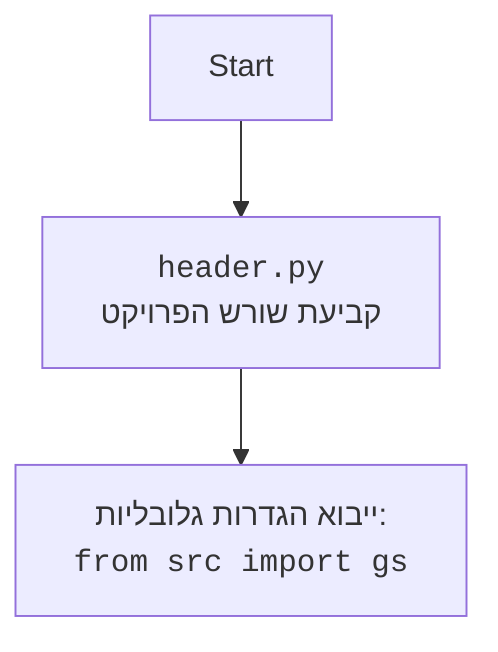

## <algorithm>

1. **הגדרת משתנה גלובלי `MODE`:**
   - המשתנה `MODE` מוגדר כ-'dev'.
   - *דוגמה:* `MODE = 'dev'`

2. **הגדרת פונקציה `set_project_root`:**
   - פונקציה זו מקבלת טאפל של מחרוזות `marker_files` (ברירת מחדל היא `('__root__', '.git')`).
   - היא מגדירה את `__root__` בתור סוג `Path`.
   - היא מקבלת את הנתיב של הקובץ הנוכחי ויוצרת ממנו אובייקט `Path`.
   - היא עוברת בלולאה על נתיבי ההורים של הקובץ הנוכחי.
     - עבור כל נתיב הורה, היא בודקת אם קיים קובץ או ספריה ששמו נמצא בתוך `marker_files`.
     - אם נמצא, הנתיב הופך להיות `__root__`, והלולאה מסתיימת.
   - אם `__root__` אינו בתוך `sys.path`, הוא מוסף לתחילת הרשימה `sys.path`.
   - הפונקציה מחזירה את `__root__`.
   - *דוגמה:*
      - אם הקובץ הנוכחי הוא `hypotez/src/bots/discord/header.py` והתיקייה `hypotez` מכילה את הקובץ `__root__`, הפונקציה תחזיר את הנתיב לתיקייה `hypotez`.

3. **קריאה לפונקציה `set_project_root` והגדרת `__root__`:**
   - הפונקציה `set_project_root` נקראת, והנתיב המוחזר נשמר במשתנה `__root__`.
   - *דוגמה:* `__root__ = Path('/path/to/hypotez')`

4. **ייבוא `gs`:**
   - מייבא את המודול `gs` מהחבילה `src`.
    - *דוגמה:* `from src import gs`

5. **טעינת הגדרות מתוך `settings.json`:**
    - מגדיר את `settings` בתור `dict`.
    - מנסה לפתוח את הקובץ `settings.json` הממוקם בתוך התיקיה `src` שנמצאת תחת הנתיב שחוזר מהפונקציה `set_project_root`, ולטעון את התוכן שלו לתוך `settings`.
    - אם הקובץ לא נמצא או אם יש שגיאת פענוח של JSON, לא קורה דבר.
    - *דוגמה:* אם `settings.json` מכיל `{"project_name": "my_project", "version": "1.0"}`, אז `settings` יהיה `{'project_name': 'my_project', 'version': '1.0'}`.

6. **טעינת תוכן הקובץ `README.MD` לתוך `doc_str`:**
    - מנסה לפתוח את הקובץ `README.MD` הממוקם בתוך התיקיה `src` שנמצאת תחת הנתיב שחוזר מהפונקציה `set_project_root`, ולטעון את התוכן שלו לתוך `doc_str`.
    - אם הקובץ לא נמצא או אם יש שגיאת פענוח של JSON, לא קורה דבר.
    - *דוגמה:* אם `README.MD` מכיל `"This is my project."`, אז `doc_str` יהיה `"This is my project."`.

7. **הגדרת משתנים גלובליים נוספים:**
    - המשתנה `__project_name__` מקבל את הערך של `project_name` מתוך `settings` או `hypotez` אם אין `settings`.
    - המשתנה `__version__` מקבל את הערך של `version` מתוך `settings` או מחרוזת ריקה אם אין `settings`.
    - המשתנה `__doc__` מקבל את הערך של `doc_str` או מחרוזת ריקה אם `doc_str` הוא `None`.
    - המשתנה `__details__` מקבל מחרוזת ריקה.
    - המשתנה `__author__` מקבל את הערך של `author` מתוך `settings` או מחרוזת ריקה אם אין `settings`.
    - המשתנה `__copyright__` מקבל את הערך של `copyrihgnt` מתוך `settings` או מחרוזת ריקה אם אין `settings`.
    - המשתנה `__cofee__` מקבל את הערך של `cofee` מתוך `settings` או הודעת ברירת מחדל אם אין `settings`.
    - *דוגמה:*
       - אם `settings` הוא `{'project_name': 'my_project', 'version': '1.0', 'author': 'John Doe', 'copyrihgnt': '2023'}` ו `doc_str` הוא `"This is my project."`, אז:
          - `__project_name__` יהיה `'my_project'`
          - `__version__` יהיה `'1.0'`
          - `__doc__` יהיה `"This is my project."`
          - `__details__` יהיה `''`
          - `__author__` יהיה `'John Doe'`
          - `__copyright__` יהיה `'2023'`
          - `__cofee__` יהיה `Treat the developer to a cup of coffee for boosting enthusiasm in development: https://boosty.to/hypo69`
       - אם `settings` הוא `None` ו `doc_str` הוא `None`:
          - `__project_name__` יהיה `'hypotez'`
          - `__version__` יהיה `''`
          - `__doc__` יהיה `''`
          - `__details__` יהיה `''`
          - `__author__` יהיה `''`
          - `__copyright__` יהיה `''`
          - `__cofee__` יהיה `Treat the developer to a cup of coffee for boosting enthusiasm in development: https://boosty.to/hypo69`

## <mermaid>
```mermaid
flowchart TD
    Start[התחלה] --> SetMode[הגדרת MODE = 'dev']
    SetMode --> setProjectRootFunc[הגדרת פונקציה set_project_root(marker_files)]
    setProjectRootFunc --> FindProjectRoot[חיפוש שורש הפרויקט]
    FindProjectRoot --> CheckMarkerFiles[בדיקת קיום קבצי marker]
    CheckMarkerFiles -- קובץ marker נמצא --> SetRootPath[קביעת שורש הפרויקט]
    CheckMarkerFiles -- קובץ marker לא נמצא --> NextParentDir[מעבר לספריית אב]
    NextParentDir --> CheckMarkerFiles
    SetRootPath --> UpdateSysPath[עדכון sys.path]
    UpdateSysPath --> ReturnRootPath[החזרת שורש הפרויקט]
    ReturnRootPath --> AssignRoot[הגדרת __root__ = set_project_root()]
    AssignRoot --> ImportGS[ייבוא מודול src.gs]
    ImportGS --> LoadSettings[טעינת settings.json]
    LoadSettings --> LoadReadme[טעינת README.MD]
    LoadReadme --> SetGlobalVars[הגדרת משתנים גלובליים]
    SetGlobalVars --> End[סיום]

    style Start fill:#f9f,stroke:#333,stroke-width:2px
    style End fill:#ccf,stroke:#333,stroke-width:2px
    style setProjectRootFunc fill:#ccf,stroke:#333,stroke-width:2px
```



## <explanation>

**ייבואים (Imports):**

- `import sys`: מודול `sys` משמש לגישה למשתנים ולפונקציות שקשורות ישירות למערכת ההפעלה ולסביבת הריצה. כאן משתמשים בו כדי להוסיף את שורש הפרויקט לנתיב החיפוש של המודולים (`sys.path`), כך שניתן יהיה לייבא מודולים אחרים בפרויקט.
- `import json`: מודול `json` משמש לעבודה עם נתוני JSON, שזה פורמט סטנדרטי לייצוג נתונים. כאן משתמשים בו כדי לטעון את קובץ ההגדרות `settings.json`.
- `from packaging.version import Version`: מחלקה `Version` מודול `packaging` משמש להשוואת גרסאות. הקוד לא משתמש בו ישירות אך הוא מיובא.
- `from pathlib import Path`: המחלקה `Path` ממודול `pathlib` משמשת לטיפול נוח ופשוט בנתיבי קבצים וספריות. כאן משתמשים בה כדי לטפל בשורש הפרויקט.
- `from src import gs`: מייבא את המודול `gs` מחבילת `src`, כנראה מודול המכיל הגדרות גלובליות.

**פונקציות (Functions):**

- **`set_project_root(marker_files=('__root__', '.git')) -> Path`**
   - **פרמטרים:** `marker_files` - טאפל של שמות קבצים או ספריות שמציינים את שורש הפרויקט. ברירת המחדל היא `('__root__', '.git')`.
   - **ערך מוחזר:** אובייקט `Path` שמייצג את הנתיב לשורש הפרויקט.
   - **מטרה:** הפונקציה מחפשת את שורש הפרויקט על ידי מעבר לספריות האב עד שהיא מוצאת קובץ או ספריה מהרשימה `marker_files`. ברגע שנמצא, הנתיב מתווסף ל `sys.path` כדי שניתן יהיה לייבא מודולים מכל מקום בפרויקט.
   - **דוגמה לשימוש:**
     - אם הקובץ הנוכחי נמצא בתוך `hypotez/src/bots/discord/header.py` והתיקייה `hypotez` מכילה את הקובץ `__root__`, הפונקציה תחזיר את הנתיב לתיקייה `hypotez`, לדוגמא: `Path('/path/to/hypotez')`.

**משתנים (Variables):**

- `MODE: str = 'dev'`: משתנה גלובלי שמציין את מצב הפעולה של התוכנית. במקרה זה הוא מוגדר כ-'dev', כנראה למטרת פיתוח.
- `__root__: Path`: משתנה גלובלי שאליו מוקצה הנתיב לשורש הפרויקט, באמצעות הפונקציה `set_project_root`. זה משמש לגישה לנתיבים אחרים בפרויקט בצורה קלה יותר.
- `settings: dict`: משתנה שמכיל את הגדרות הפרויקט, אשר נטענות מקובץ `settings.json`. הוא יכול להיות `None` אם הקובץ לא נמצא או שהיה כשל בטעינה.
- `doc_str: str`: משתנה שמכיל את תוכן קובץ `README.MD`. הוא יכול להיות `None` אם הקובץ לא נמצא או שהיה כשל בטעינה.
- `__project_name__: str`: שם הפרויקט, נלקח מהגדרות או ברירת מחדל `'hypotez'`.
- `__version__: str`: גרסת הפרויקט, נלקחת מהגדרות או מחרוזת ריקה.
- `__doc__: str`: תיאור הפרויקט, נלקח מקובץ `README.MD` או מחרוזת ריקה.
- `__details__: str`: פרטים נוספים על הפרויקט. לא נעשה בו שימוש בקוד ומוגדר כריק.
- `__author__: str`: מחבר הפרויקט, נלקח מהגדרות או מחרוזת ריקה.
- `__copyright__: str`: זכויות היוצרים של הפרויקט, נלקחות מהגדרות או מחרוזת ריקה.
- `__cofee__: str`: הודעה לעידוד תרומות, נלקחת מהגדרות או הודעת ברירת מחדל.

**שרשרת קשרים עם חלקים אחרים בפרויקט:**

- הקוד הזה משמש כקובץ ראשוני (header) בפרויקט. הוא מגדיר משתנים גלובליים, כולל שורש הפרויקט, הגדרות הפרויקט, ופרטים על הפרויקט.
- המשתנה `__root__` משמש חלקים אחרים בפרויקט כדי לגשת לקבצים וספריות אחרות.
- המשתנה `settings` משמש כדי להתאים אישית את הפרויקט.
- המשתנים האחרים `__project_name__`, `__version__`, וכו' משמשים בדרך כלל כחלק ממטא-דאטה של הפרויקט.

**בעיות אפשריות ותחומים לשיפור:**

-   טיפול שגיאות בטעינת `settings.json` ו-`README.MD`: הקוד משתמש ב `try-except` אך לא עושה דבר במקרה של שגיאה. ייתכן שיהיה יותר טוב להחזיר הודעת שגיאה או להשתמש בערכי ברירת מחדל.
-   אפשר להשתמש בשיטה יותר סטנדרטית לאיחזור שורש הפרויקט ולא להסתמך על סוגי קבצים. לדוגמא ניתן להשתמש ב `pyproject.toml`

בסה"כ, קוד זה מהווה נקודת התחלה של הפרויקט, ומגדיר את הסביבה הבסיסית שלו. הוא מטפל בשורש הפרויקט, טוען הגדרות ונתונים, ומגדיר משתנים גלובליים שישמשו חלקים אחרים של הפרויקט.