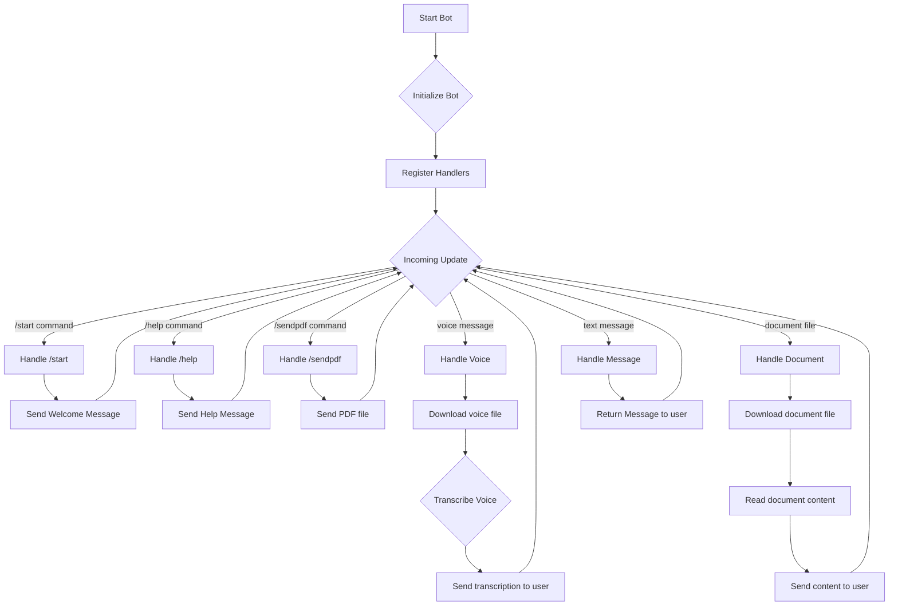
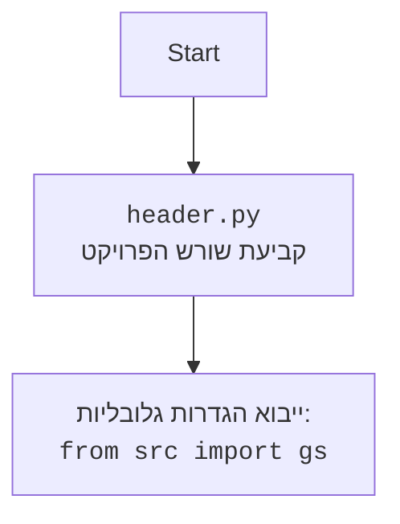

## <algorithm>

1. **אתחול בוט:**
   - הבוט מאותחל עם טוקן API של טלגרם.
   - מופעלות פונקציות לטיפול בפקודות והודעות.
   *דוגמה:* `TelegramBot(token="YOUR_TELEGRAM_TOKEN")`

2. **רישום מטפלים:**
   - הפונקציה `register_handlers` מגדירה את הפקודות וההודעות שהבוט יכול לטפל בהן.
   *דוגמה:* רישום מטפל לפקודה `/start`, מטפל להודעת טקסט, מטפל להודעות קוליות ומטפל למסמכים.

3. **טיפול בפקודות:**
   - הפקודה `/start`: שולחת הודעת פתיחה למשתמש.
   *דוגמה:* כאשר משתמש שולח `/start`, הבוט מגיב עם "Welcome! I am a simple bot."
   - הפקודה `/help`: שולחת הודעה עם רשימת הפקודות הזמינות.
   *דוגמה:* כאשר משתמש שולח `/help`, הבוט מגיב עם רשימת הפקודות הזמינות.
   - הפקודה `/sendpdf`: שולחת קובץ PDF למשתמש.
   *דוגמה:* כאשר משתמש שולח `/sendpdf`, הבוט שולח קובץ PDF לדוגמה.

4. **טיפול בהודעות קוליות:**
   - ההודעה הקולית נשמרת כקובץ זמני.
   - הקובץ נשלח לפונקציית תמלול (כרגע, פונקציית Placeholder).
   *דוגמה:* כאשר משתמש שולח הודעה קולית, הבוט מוריד את ההודעה לקובץ מקומי ושולח אותו לפונקציה לטיפול בקול.

5. **טיפול במסמכים:**
   - המסמך נשמר כקובץ זמני.
   - תכולת המסמך (אם הוא קובץ טקסט) נקראת.
   *דוגמה:* כאשר משתמש שולח קובץ טקסט, הבוט מוריד אותו לקובץ מקומי וקורא את תוכנו.

6. **טיפול בהודעות טקסט:**
   - הבוט מחזיר את הטקסט שהתקבל מהמשתמש.
   *דוגמה:* כאשר משתמש שולח "שלום", הבוט מגיב עם "שלום".

7. **זרימת נתונים:**
   - הבוט מקבל הודעות מהמשתמש -> מעביר אותן לפונקציות טיפול בהודעות הרלוונטיות -> מחזיר תגובה למשתמש.
   - כאשר מתקבלת הודעה קולית או מסמך, הקבצים מורדים -> מעובדים -> התוצאות מוחזרות למשתמש.

## <mermaid>

## <explanation>

### ייבואים (Imports)
*   `python-telegram-bot`: ספרייה ראשית ליצירת בוטים לטלגרם.
*   `pathlib`: עבודה עם נתיבי קבצים בצורה נוחה.
*   `tempfile`: יצירת קבצים זמניים לצורך עיבוד הודעות קוליות ומסמכים.
*   `asyncio`: הרצת משימות אסינכרוניות (אינו בשימוש ישיר בקוד המוצג אך מופיע בתיאור).
*   `requests`: הורדת קבצים מהאינטרנט (כנראה משימוש להורדת קבצים מטלגרם).
*   `src.utils.convertors.tts`: תמלול קול לטקסט (חלק מהחבילה `src.`, אינו בשימוש בקוד המוצג).
*   `src.utils.file`: קריאת תוכן של קבצי טקסט (חלק מהחבילה `src.`).

### מחלקות (Classes)

*   **TelegramBot Class**:
    *   `__init__(self, token: str)`: מאתחל את הבוט עם טוקן, מגדיר מטפלים להודעות.
    *   `register_handlers(self)`: רושם פונקציות לטיפול בפקודות (כמו `start`, `help`, `sendpdf`), הודעות טקסט, הודעות קוליות ומסמכים.
    *   `start(self, update: Update, context: CallbackContext)`: מטפל בפקודה `/start`. שולח הודעת ברוכים הבאים.
    *   `help_command(self, update: Update, context: CallbackContext)`: מטפל בפקודה `/help`. שולח הודעה עם רשימת הפקודות הזמינות.
    *   `send_pdf(self, pdf_file: str | Path)`: מטפל בפקודה `/sendpdf`. שולח קובץ PDF למשתמש.
    *   `handle_voice(self, update: Update, context: CallbackContext)`: מטפל בהודעות קוליות. מוריד את ההודעה לקובץ זמני ומעביר לתמלול.
    *   `transcribe_voice(self, file_path: Path) -> str`: פונקציית Placeholder לתמלול קול.
    *   `handle_document(self, update: Update, context: CallbackContext) -> str`: מטפל בקבצי מסמכים. מוריד את הקובץ וקורא את התוכן שלו.
    *   `handle_message(self, update: Update, context: CallbackContext) -> str`: מטפל בהודעות טקסט. מחזיר את הטקסט שהתקבל.

### פונקציות (Functions)

*   **main()**: הפונקציה הראשית שאחראית על אתחול הבוט, רישום המטפלים והפעלת הבוט.
*   כל השיטות של המחלקה `TelegramBot`, כמו שתוארו לעיל.

### משתנים (Variables)

*   `token`: מחרוזת המייצגת את הטוקן של בוט הטלגרם (מסופק על ידי טלגרם).
*   `update`, `context`: אובייקטים המסופקים על ידי הספרייה `python-telegram-bot` המשמשים להעברת מידע על הודעות והקשר ביניהן.

### בעיות אפשריות ותחומים לשיפור

*   **תמלול קול**: כרגע פונקציית `transcribe_voice` היא placeholder. יש לממש את התמלול האמיתי באמצעות ספרייה חיצונית או שירות API.
*   **טיפול בשגיאות**: חסר טיפול בשגיאות בקוד כמו שגיאות הורדה, שגיאות בקריאת קבצים וכדומה. יש להוסיף טיפול בשגיאות כדי שהבוט יהיה יציב יותר.
*   **הקשריות**: לא ברור איך הבוט מקבל את הטוקן שלו, האם הוא מוגדר כמשתנה סביבה או מקובץ חיצוני. כדאי לייעל את תהליך האתחול.
*  **שימוש אסינכרוני:** הספרייה `asyncio` מיובאת אבל לא בשימוש ישיר. כדאי לממש את הבוט באופן אסינכרוני כדי לשפר את הביצועים ולמנוע חסימת פעולות.

### קשרים עם חלקים אחרים בפרויקט

*  הבוט משתמש במודולים מחבילת `src`: `src.utils.convertors.tts` ו`src.utils.file`. זה מצביע על כך שיש מודולים נוספים בפרויקט שמשמשים למטרות אחרות.
*  הבוט מוגדר כאחד ה`endpoints` של הפרויקט (`src/endpoints/ai_games/101_basic_computer_games/ru/src/endoints/bots/telegram/`), מה שאומר שכנראה יש גם `endpoints` אחרים.