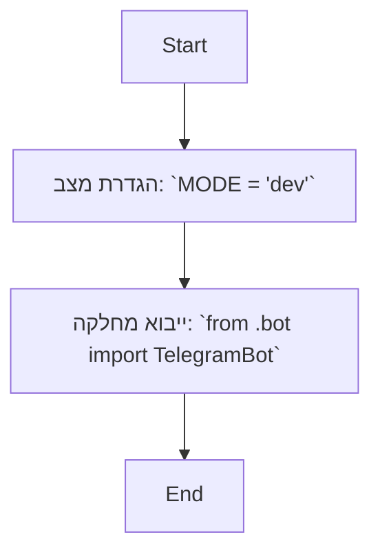

# ניתוח קוד: `hypotez/src/endpoints/ai_games/101_basic_computer_games/ru/src/endoints/bots/telegram/__init__.py`

## <algorithm>
1. **הגדרת מצב (MODE):** המשתנה `MODE` מוגדר כ-'dev', דבר המציין סביבת פיתוח.
   - דוגמה: `MODE = 'dev'`
2. **ייבוא המחלקה `TelegramBot`:**  מחלקת `TelegramBot` מיובאת מהמודול `bot.py` שנמצא באותו ספרייה.
    - דוגמה: `from .bot import TelegramBot`
3.  **סיום:** הקוד מסיים את ביצועו.

## <mermaid>

## <explanation>

**ייבואים (Imports):**
* `from .bot import TelegramBot`: מייבא את המחלקה `TelegramBot` מהמודול `bot.py` שנמצא באותה ספרייה. השימוש בנקודה (`.`) מציין ייבוא יחסי, כלומר המודול `bot` נמצא באותה תיקייה כמו קובץ ה-`__init__.py` הנוכחי.
    *  הקשר לחבילות `src.`:  קובץ ה-`__init__.py` מציין שזהו מודול בתוך החבילה `src.bots.telegram`. הייבוא היחסי מאפשר למודולים בתוך החבילה להתייחס אחד לשני בצורה קלה.

**משתנים (Variables):**
* `MODE`: משתנה מחרוזתי המוגדר כ-'dev'. הוא משמש כדי לציין את מצב הפעולה של היישום (פיתוח, ייצור וכו'). זהו משתנה גלובלי בתוך המודול הזה.
    * שימוש: משמש כנראה לניהול הגדרות שונות בהתאם לסביבה.

**בעיות אפשריות או תחומים לשיפור:**
*  **חוסר שימוש ב-`MODE`:** הקוד כרגע רק מגדיר את המשתנה `MODE`, אך לא משתמש בו. צריך לבדוק האם הוא משמש במודולים אחרים.
* **חוסר תיעוד:** אין תיעוד נוסף בקוד מעבר לתיעוד של מודול. מומלץ להוסיף תיעוד נוסף לגבי השימוש במודול, בעיקר כאשר הוא מתחיל להיות יותר מורכב.

**שרשרת קשרים עם חלקים אחרים בפרויקט:**

* **`bot.py`:** קובץ זה תלוי ב-`bot.py` בתוך אותו מודול `src.bots.telegram`.  הוא מייבא את `TelegramBot` שהוא כנראה מחלקה המשמשת לטיפול בתקשורת עם בוט טלגרם.
*  **שאר הפרויקט:** סביר להניח ש-`TelegramBot` משמש בנקודות שונות בפרויקט, כמו למשל ממשקי משתמש או שירותים אחרים. שאר הקשרים תלויים בשימוש במחלקה `TelegramBot` וצריכים להיבדק בקבצים אחרים בפרויקט.