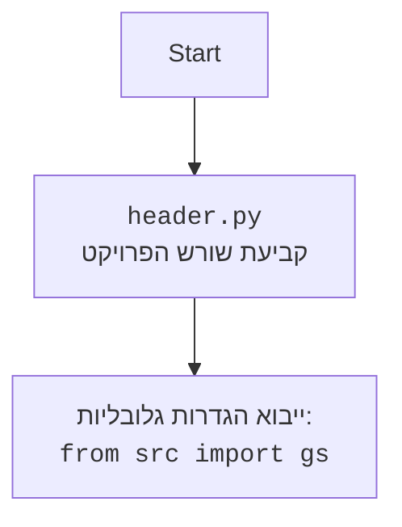

## <algorithm>

1. **התחלה (main):**
   - הפונקציה `main` מופעלת כאשר הסקריפט מורץ.
   - משתנה `token` מקבל את הערך מתוך הגדרות הפרויקט `gs.credentials.telegram.bot.kazarinov`.
   - נוצר אובייקט `TelegramBot` עם הטוקן.
   - מתווספים מטפלי פקודות (commands handlers) לאפליקציה של הבוט עבור הפקודות `/start`, `/help` ו-`/sendpdf`.
   - מתווספים מטפלי הודעות (message handlers) לאפליקציה של הבוט עבור הודעות טקסט, הודעות קוליות ומסמכים.
   - הבוט מתחיל לפעול באמצעות `bot.application.run_polling()`.

2. **איתחול הבוט (TelegramBot.__init__):**
   - הפונקציה `__init__` של המחלקה `TelegramBot` מופעלת.
   - אובייקט `Application` נוצר באמצעות הטוקן שסופק.
   - הפונקציה `register_handlers` נקראת כדי לרשום את המטפלים (handlers).

3. **רישום המטפלים (TelegramBot.register_handlers):**
   - מטפלי פקודות נרשמים עבור הפקודות `/start`, `/help` ו-`/sendpdf`.
   - מטפל הודעות נרשם עבור הודעות טקסט (לא פקודות).
   - מטפל הודעות נרשם עבור הודעות קוליות.
   - מטפל הודעות נרשם עבור מסמכים.
   - מטפל הודעות נרשם עבור הודעות טקסט לצרכי רישום לוג.

4. **טיפול בפקודת /start (TelegramBot.start):**
   - כאשר המשתמש שולח את הפקודה `/start`, פונקציה זו מופעלת.
   - הבוט שולח הודעה למשתמש: "Hello! I am your simple bot. Type /help to see available commands."

5. **טיפול בפקודת /help (TelegramBot.help_command):**
   - כאשר המשתמש שולח את הפקודה `/help`, פונקציה זו מופעלת.
   - הבוט שולח הודעה למשתמש עם רשימת הפקודות הזמינות.

6. **טיפול בפקודת /sendpdf (TelegramBot.send_pdf):**
    - כאשר המשתמש שולח את הפקודה `/sendpdf`, פונקציה זו מופעלת (בפועל צריך גם להוסיף שם של קובץ, אך הקוד הנוכחי לא מטפל בזה).
    - הפונקציה מקבלת ארגומנט `pdf_file` שהוא נתיב לקובץ PDF.
    - הקובץ נפתח בשיטת 'rb' (קריאת ביטים) והתוכן שלו נשלח למשתמש באמצעות פונקציית `reply_document` של הבוט.
   - אם מתרחשת שגיאה, הבוט שולח הודעת שגיאה למשתמש.

7. **טיפול בהודעה קולית (TelegramBot.handle_voice):**
   - כאשר המשתמש שולח הודעה קולית, פונקציה זו מופעלת.
   - הבוט מקבל את פרטי הקובץ מההודעה.
   - הקובץ הקולי נשמר בתיקייה זמנית.
   - הפונקציה `transcribe_voice` נקראת (כעת היא מחזירה טקסט קבוע בלבד).
   - הבוט שולח למשתמש הודעה עם הטקסט שהתקבל (או הודעת שגיאה).

8. **שירות תמלול קול (TelegramBot.transcribe_voice):**
   - פונקציה זו אמורה לבצע תמלול של הודעה קולית (כרגע לא עושה זאת).
   - כעת, היא מחזירה מחרוזת סטטית: "Распознавание голоса ещё не реализовано."

9. **טיפול במסמך (TelegramBot.handle_document):**
   - כאשר המשתמש שולח מסמך, פונקציה זו מופעלת.
   - הקובץ נשמר באופן זמני בשרת.
   - הפונקציה `read_text_file` נקראת כדי לקרוא את תוכן הקובץ הטקסטואלי.
   - הפונקציה מחזירה את תוכן הטקסט.

10. **טיפול בהודעת טקסט (TelegramBot.handle_message):**
   - כאשר המשתמש שולח הודעת טקסט (שאינה פקודה), פונקציה זו מופעלת.
   - הפונקציה מחזירה את הטקסט שהתקבל מהמשתמש.

11. **טיפול בהודעת לוג (TelegramBot.handle_log):**
    - כאשר המשתמש שולח הודעת טקסט כלשהי, פונקציה זו מופעלת.
    - הפונקציה שומרת את ההודעה ביומן הלוג.
    - הבוט שולח הודעה "Log received and processed." למשתמש.

## <mermaid>

```mermaid
flowchart TD
    A[main()] --> B{token = gs.credentials.telegram.bot.kazarinov};
    B --> C[bot = TelegramBot(token)];
    C --> D[bot.application.add_handler(CommandHandler(...))];
     D --> E[bot.application.add_handler(MessageHandler(...))];
    E --> F[bot.application.run_polling()];
    F --> G{TelegramBot.__init__(token)};
    G --> H[self.application = Application.builder().token(token).build()];
    H --> I[self.register_handlers()];
    I --> J[bot.application.add_handler(CommandHandler('start', self.start))];
      J --> K[bot.application.add_handler(CommandHandler('help', self.help_command))];
      K --> L[bot.application.add_handler(CommandHandler('sendpdf', self.send_pdf))];
        L --> M[bot.application.add_handler(MessageHandler(filters.TEXT & ~filters.COMMAND, self.handle_message))];
    M --> N[bot.application.add_handler(MessageHandler(filters.VOICE, self.handle_voice))];
     N --> O[bot.application.add_handler(MessageHandler(filters.Document.ALL, self.handle_document))];
    O --> P[bot.application.add_handler(MessageHandler(filters.TEXT & ~filters.COMMAND, self.handle_log))];
    P-->Q{User Sends /start};
    Q --> R[TelegramBot.start(update, context)];
        R --> S[update.message.reply_text("Hello! ...")];
    P -->T{User Sends /help};
    T --> U[TelegramBot.help_command(update, context)];
        U --> V[update.message.reply_text("Available commands: ...")];
     P -->W{User Sends /sendpdf};
    W --> X[TelegramBot.send_pdf(pdf_file)];
    X --> Y{Open pdf_file in 'rb' mode};
         Y --> Z[update.message.reply_document(document=pdf_file_obj)];
       Z --> AA{Exception during send pdf};
    AA --> AB[update.message.reply_text("Error while sending pdf...")];
    P -->AC{User Sends Voice Message};
    AC --> AD[TelegramBot.handle_voice(update, context)];
        AD --> AE[context.bot.get_file(voice.file_id)];
        AE-->AF[file.download_to_drive(file_path)];
        AF-->AG[transcribed_text = self.transcribe_voice(file_path)];
       AG-->AH[update.message.reply_text(f'Распознанный текст: {transcribed_text}')];
        AH-->AI{Exception during voice processing};
         AI-->AJ[update.message.reply_text("Error while processing voice...")];
        P -->AK{User Sends Document};
        AK --> AL[TelegramBot.handle_document(update,context)];
         AL-->AM[file.download_to_drive()];
            AM-->AN[read_text_file(tmp_file_path)];
           P -->AO{User Sends Text Message};
           AO-->AP[TelegramBot.handle_message(update,context)];
           AP-->AQ[return update.message.text];
      P --> AR{User Sends Text Message (Log)};
    AR-->AS[TelegramBot.handle_log(update,context)];
        AS-->AT[logger.info(f"Received log message: {log_message}")];
        AT-->AU[update.message.reply_text("Log received and processed.")];

```

**הסבר התלויות (Imports) בתרשים Mermaid:**

-   **`pathlib.Path`**: משמש לטיפול בנתיבי קבצים בצורה יותר ידידותית.
-   **`tempfile`**: משמש ליצירת קבצים זמניים.
-   **`asyncio`**: ספרייה לביצוע פעולות אסינכרוניות (כמו בקשת הורדת קובץ).
-   **`logging`**: משמש לתיעוד פעולות (לוגים) ברמת שגיאה.
-   **`telegram.Update`**: מחלקה של הספריה `python-telegram-bot` המייצגת עדכון שהתקבל מ-Telegram (כגון הודעה).
-   **`telegram.ext.Application`**: מחלקה של הספריה `python-telegram-bot` המנהלת את אפליקציית הבוט.
-   **`telegram.ext.CommandHandler`**: מחלקה של הספריה `python-telegram-bot` המטפלת בפקודות שמתחילות בסימן /.
-   **`telegram.ext.MessageHandler`**: מחלקה של הספריה `python-telegram-bot` המטפלת בהודעות מסוגים שונים.
-   **`telegram.ext.filters`**: מחלקה של הספריה `python-telegram-bot` המשמשת לסינון סוגי הודעות שונים.
-   **`telegram.ext.CallbackContext`**: מחלקה של הספריה `python-telegram-bot` מספקת הקשר לביצוע פעולות בתוך הבוט.
-   **`header`**: קובץ פנימי המכיל את ההגדרות של שורש הפרויקט. (מטופל בנפרד)
-   **`src.gs`**: משתנה הגדרות גלובליות מתוך הפרויקט.
-   **`src.utils.jjson`**: קובץ המטפל בהמרת נתונים לפורמט JSON (הטענה וגיבוב).
-   **`src.logger.logger`**: מודול הלוגר המשמש לתיעוד פעולות שמתבצעות בקוד.
-   **`requests`**: ספרייה המשמשת לשליחת בקשות HTTP, לדוגמה לצורך הורדת קבצים.
-   **`src.utils.convertors.tts`**: מודול שמטפל בטקסט לדיבור (text to speech) ודיבור לטקסט (speech to text).
-   **`src.utils.file.read_text_file`**: פונקציה לקריאת תוכן של קובץ טקסט.



## <explanation>

**ייבואים (Imports):**

-   `pathlib`: מספק דרך נוחה לעבוד עם נתיבי קבצים, ומייצג אותם כאובייקטים, מה שהופך את הקוד לקריא יותר ופחות רגיש לשגיאות בין מערכות הפעלה שונות.
-   `tempfile`: משמש ליצירת קבצים זמניים, מה שמאפשר אחסון זמני של קבצים שהורדו מהטלגרם, וניהול נכון שלהם.
-   `asyncio`: משמש לביצוע פעולות א-סינכרוניות, מה שמאפשר לבוט להמשיך לעבד הודעות אחרות בזמן שהוא ממתין לקבצים שונים, ולספק תגובה מהירה יותר.
-   `logging`: משמש לתיעוד פעולות הבוט, מה שמאפשר למפתחים לנטר את התנהגותו ולפתור תקלות בצורה יעילה.
-   `telegram` ו-`telegram.ext`: ספריה שמספקת את כל הפונקציונליות הנדרשת ליצירה של בוטים בטלגרם, כולל טיפול בעדכונים, שליחת הודעות, ועוד.
-    `header`: קובץ זה נועד לקבוע את שורש הפרויקט.
-   `src.gs`: מודול זה מכיל הגדרות גלובליות עבור הפרויקט, כולל מידע רגיש כמו אסימוני בוט.
-   `src.utils.jjson`: מודול זה מספק כלים לעבודה עם נתוני JSON, כגון טעינת נתונים מקבצים או גיבוב שלהם.
-   `src.logger.logger`: מודול זה מספק פונקציונליות רישום (לוג) עבור הפרויקט.
-    `requests`: ספרייה פופולרית לביצוע בקשות HTTP, ומשמשת כאן בעיקר להורדת קבצים משרת.
-   `src.utils.convertors.tts`: מודול זה מכיל פונקציונליות עבור המרת טקסט לדיבור ודיבור לטקסט.
-   `src.utils.file`: מודול זה מספק כלים לעבודה עם קבצים, כולל קריאת תוכן של קבצי טקסט.

**מחלקות (Classes):**

-   `TelegramBot`: המחלקה המרכזית שמגדירה את כל הפעולות של הבוט, כולל איתחול, רישום מטפלים, טיפול בפקודות, ועיבוד הודעות.
    -   `__init__(self, token: str)`: מאתחל את הבוט עם אסימון ה-API.
    -   `register_handlers(self)`: רושם את כל המטפלים בהודעות ובפקודות.
    -   `start(self, update: Update, context: CallbackContext)`: מטפל בפקודה /start, שולח הודעת פתיחה.
    -   `help_command(self, update: Update, context: CallbackContext)`: מטפל בפקודה /help, שולח רשימת פקודות.
    -   `send_pdf(self, pdf_file: str | Path)`: מטפל בפקודה /sendpdf, שולח קובץ PDF.
    -   `handle_voice(self, update: Update, context: CallbackContext)`: מטפל בהודעות קוליות, מוריד את הקובץ, ומתמלל (בגרסת דמה).
    -   `transcribe_voice(self, file_path: Path)`: פונקציית תמלול הקול (בגרסת דמה).
    -   `handle_document(self, update: Update, context: CallbackContext)`: מטפל במסמכים, מוריד אותם ושולף את הטקסט אם מדובר במסמך טקסט.
    -   `handle_message(self, update: Update, context: CallbackContext)`: מטפל בכל הודעות הטקסט (שאינן פקודות) ומחזיר את הטקסט.
    -    `handle_log(self, update: Update, context: CallbackContext)`: מטפל בהודעות לוג, שומר אותן ומחזיר תגובה.

**פונקציות (Functions):**

-   `main()`: פונקציה הראשית שמתחילה את פעולת הבוט, קוראת את האסימון מהגדרות הפרויקט, ויוצרת את אובייקט הבוט.
-   `TelegramBot.__init__(self, token: str)`: מאתחל את המחלקה `TelegramBot`, ומגדיר את הבוט.
-   `TelegramBot.register_handlers(self)`: פונקציה שמגדירה את כל הפונקציות שיתופעלו כאשר מתקבלים סוגים שונים של הודעות.
-  `TelegramBot.start(self, update: Update, context: CallbackContext)`: פונקציה שמופעלת כאשר המשתמש שולח את פקודת ה-start.
-  `TelegramBot.help_command(self, update: Update, context: CallbackContext)`: פונקציה שמופעלת כאשר המשתמש שולח את פקודת העזרה.
-  `TelegramBot.send_pdf(self, pdf_file: str | Path)`: פונקציה שמופעלת כאשר המשתמש שולח את פקודת ה-sendpdf.
-  `TelegramBot.handle_voice(self, update: Update, context: CallbackContext)`: פונקציה שמופעלת כאשר המשתמש שולח הודעת קול.
-  `TelegramBot.transcribe_voice(self, file_path: Path)`: פונקציה שמבצעת תמלול של קול (בגרסה הנוכחית היא משמשת כפונקציית דמה).
-   `TelegramBot.handle_document(self, update: Update, context: CallbackContext)`: פונקציה שמופעלת כאשר המשתמש שולח מסמך.
-   `TelegramBot.handle_message(self, update: Update, context: CallbackContext)`: פונקציה שמופעלת כאשר המשתמש שולח הודעת טקסט (שאינה פקודה).
-   `TelegramBot.handle_log(self, update: Update, context: CallbackContext)`: פונקציה שמופעלת כאשר המשתמש שולח הודעת טקסט כלשהי (לצרכי לוג).

**משתנים (Variables):**

-   `MODE = 'dev'`: משתנה גלובלי המגדיר את מצב הפעולה של הבוט (במקרה הזה, מצב פיתוח).
-   `application`: משתנה בתוך המחלקה `TelegramBot` שמייצג את אפליקציית הבוט, נוצר ע"י הספריה `python-telegram-bot`.
-   `token`: משתנה מסוג `str` המכיל את האסימון של הבוט, לצורך אימות מול ה-API של טלגרם.
-   `update`: אובייקט מסוג `telegram.Update`, שמייצג עדכון שהתקבל מ-Telegram, כגון הודעה או פקודה.
-    `context`: אובייקט מסוג `telegram.ext.CallbackContext`, המספק הקשר לביצוע פעולות בתוך הבוט.
-   `file_path`: משתנה מסוג `Path` שמייצג את נתיב הקובץ הזמני שבו נשמר קובץ קולי.
-   `transcribed_text`: משתנה מסוג `str`, שאמור להכיל את הטקסט שתומלל מההודעה הקולית.
-   `tmp_file_path`: משתנה מסוג `str` שמייצג את נתיב הקובץ הזמני שבו נשמר המסמך שהתקבל.

**בעיות אפשריות ותחומים לשיפור:**

-   **תמלול קולי:** פונקציית `transcribe_voice` היא כרגע דמה ולא מבצעת תמלול בפועל. יש צורך להטמיע שירות תמלול אמיתי, כמו Google Speech-to-Text.
-   **שליחת PDF:** הפונקציה `send_pdf` מקבלת נתיב קבוע לקובץ PDF. צריך להוסיף מנגנון שיאפשר בחירת קובץ PDF באופן דינמי.
-   **טיפול בשגיאות:** יש להוסיף טיפול שגיאות מקיף יותר, בעיקר בהורדת קבצים ובתמלול קולי.
-   **הגדרות:** כרגע האסימון של הבוט מופיע בהגדרות הפרויקט. כדאי לשקול להעביר את האסימון למקום מאובטח יותר, כמו משתנה סביבה.
-    **לוג:** הפונקציה `handle_log` רק שומרת הודעות טקסט, צריך גם להוסיף לוגים עבור פעולות אחרות כמו הורדת קבצים וכו'.

**שרשרת קשרים עם חלקים אחרים בפרויקט:**

-   הקובץ `bot.py` תלוי במודולים אחרים בפרויקט:
    -   `src.gs`: משמש לקבלת הגדרות גלובליות, כמו האסימון של הבוט.
    -   `src.utils.jjson`: משמש לגיבוב של מידע וטעינתו.
    -   `src.logger.logger`: משמש לתיעוד פעולות הבוט.
    -   `src.utils.convertors.tts`: משמש לביצוע המרות של טקסט לדיבור ודיבור לטקסט.
    -   `src.utils.file`: משמש לטיפול בקבצים ולקריאת תוכן של קבצי טקסט.
-   הבוט מתקשר עם ה-API של Telegram באמצעות הספריה `python-telegram-bot`.
-    הקובץ `header.py` משמש לקביעת שורש הפרויקט, כך שכל שאר החלקים בפרויקט יודעים איפה לחפש קבצים.

אלו הם הניתוח המפורט של הקוד, כולל ההסברים, והתרשימים.