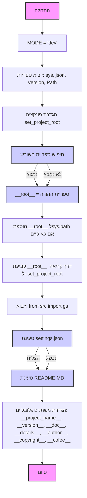
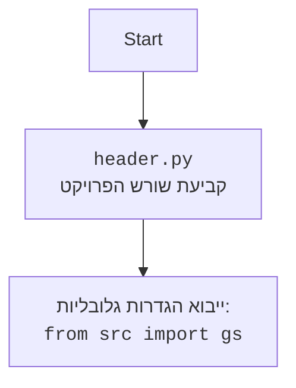

## ניתוח קוד: `hypotez/src/logger/header.py`

### 1. `<algorithm>`:

הקוד נועד לקבוע את ספריית השורש של הפרויקט ולאתחל הגדרות גלובליות. להלן תהליך העבודה צעד אחר צעד:

1.  **הגדרת משתנה גלובלי `MODE`**:
    *   המשתנה `MODE` מוגדר כ-`'dev'`, המציין מצב פיתוח. משתנה זה יכול לשמש בהמשך כדי לשנות התנהגות של הקוד בהתאם לסביבה (פיתוח, ייצור).
    *   דוגמה: `MODE = 'dev'`
2.  **ייבוא ספריות**:
    *   ייבוא `sys`, `json`, `Version` מהספרייה `packaging.version` ו- `Path` מהספרייה `pathlib`.
    *   דוגמה: `import sys, import json, from packaging.version import Version, from pathlib import Path`.
3.  **הגדרת פונקציה `set_project_root`**:
    *   מקבלת `marker_files` (ברירת מחדל: `('__root__', '.git')`) כטופל.
    *   מאתרת את ספריית השורש של הפרויקט על ידי מעבר היררכי בספריות אב, עד למציאת אחת מהספריות המכילות את אחד מהקבצים המוגדרים ב-`marker_files`.
    *   אם ספריית השורש לא נמצאת ברשימת הנתיבים של `sys.path`, היא מוסיפה את הספרייה לראש הרשימה.
    *   מחזירה את הנתיב לספריית השורש.
    *   דוגמא:
        *   הפונקציה נקראת עם `marker_files = ('__root__', '.git')`
        *   מתחילה עם הנתיב של הקובץ הנוכחי `hypotez/src/logger/header.py`
        *   עוברת על ספריות האב `hypotez/src/logger`, `hypotez/src`, `hypotez`
        *   אם בתיקייה `hypotez` קיים קובץ `.git`, היא מזהה אותה כספריית השורש.
        *   מוסיפה את הנתיב `hypotez` ל-`sys.path` אם הוא לא קיים.
4.  **קביעת משתנה גלובלי `__root__`**:
    *   קוראת לפונקציה `set_project_root()` כדי לקבוע את נתיב השורש של הפרויקט.
    *   המשתנה `__root__` (מסוג `Path`) מכיל את נתיב ספריית השורש של הפרויקט.
    *   דוגמה: `__root__ = set_project_root()`
5.  **ייבוא הגדרות גלובליות**:
    *   מייבאת מודול `gs` מהחבילה `src`, מה שמרמז על שימוש במשתנים גלובליים אחרים או הגדרות נוספות.
    *   דוגמה: `from src import gs`
6.  **טעינת `settings.json`**:
    *   מנסה לטעון את הקובץ `settings.json` מתוך ספריית השורש של הפרויקט (`src/settings.json`).
    *   אם הקובץ לא נמצא או שהוא לא בפורמט JSON חוקי, הבלוק `try` נכשל והבלוק `except` מתבצע ללא פעולה (`...`).
    *   דוגמא:
        *   מנסה לפתוח `hypotez/src/settings.json`
        *   אם הקובץ קיים והוא JSON תקין, הוא נטען למשתנה `settings`.
7. **טעינת `README.MD`**:
    *  מנסה לטעון את הקובץ `README.MD` מתוך ספריית השורש של הפרויקט (`src/README.MD`).
    *  אם הקובץ לא נמצא, הבלוק `try` נכשל והבלוק `except` מתבצע ללא פעולה (`...`).
    * דוגמא:
         * מנסה לפתוח `hypotez/src/README.MD`
         * אם הקובץ קיים הוא נטען למשתנה `doc_str`.
8.  **קביעת משתנים גלובליים נוספים**:
    *   משתמש במידע הטעון מתוך `settings.json` כדי להגדיר משתנים גלובליים: `__project_name__`, `__version__`, `__doc__`, `__details__`, `__author__`, `__copyright__` ו-`__cofee__`.
    *   אם `settings.json` לא נטען, המשתנים מקבלים ערכי ברירת מחדל.
    *  דוגמא:
         * אם `settings` הוגדר, `__project_name__` יקבל את הערך של `"project_name"` מתוך `settings`, אחרת הוא יקבל את הערך `'hypotez'`
         * אם `doc_str` הוגדר, `__doc__` יקבל את הערך שלו, אחרת הוא יקבל את הערך `''`
 

### 2. `<mermaid>`:





* **ניתוח התלויות:**
    *   `sys`:  מאפשר גישה למשתנים ולפונקציות הקשורות לזמן הריצה של המערכת. כאן, הוא משמש כדי לנהל את נתיבי החיפוש של מודולים (`sys.path`).
    *   `json`: משמש כדי לעבד קבצי JSON. כאן, הוא משמש לטעינה של קובץ ההגדרות `settings.json`.
    *  `packaging.version`: משמש כדי לנתח ולעבוד עם גרסאות תוכנה.
    *   `pathlib`:  מספק דרך נוחה לעבודה עם נתיבי קבצים ותיקיות. הוא משמש כאן כדי לבנות ולטפל בנתיבים לספריית השורש של הפרויקט.

### 3. `<explanation>`:

*   **ייבואים (Imports)**:
    *   `sys`: משמש לגישה לפונקציות הקשורות למערכת, במיוחד לניהול נתיבי החיפוש של המודולים (`sys.path`). הוספת ספריית השורש לנתיב החיפוש מאפשרת ייבוא חלקים אחרים בפרויקט בקלות.
    *   `json`: משמש לטעינה ועיבוד של קבצי JSON, במקרה זה, קובץ ההגדרות `settings.json`.
    * `packaging.version`: משמש לניתוח ולעבודה עם גרסאות, לא בשימוש ישיר בקוד זה אך מיובא.
    *   `pathlib.Path`: מספק דרך מונחית-עצמים לעבודה עם נתיבי קבצים ותיקיות. הוא מאפשר יצירת נתיבים וביצוע פעולות על קבצים ותיקיות בצורה ברורה וקריאה.

*   **מחלקות (Classes)**:
    *   אין מחלקות בקוד הזה.

*   **פונקציות (Functions)**:
    *   `set_project_root(marker_files=('__root__', '.git')) -> Path`:
        *   **פרמטרים**:
            *   `marker_files`: טופל של שמות קבצים או ספריות המזהים את שורש הפרויקט. ברירת המחדל היא `('__root__', '.git')`.
        *   **ערך מוחזר**:
            *   `Path`: אובייקט המייצג את נתיב ספריית השורש של הפרויקט.
        *   **מטרה**:
            *   הפונקציה מחפשת את ספריית השורש של הפרויקט על ידי מעבר על הספריות ההוריות עד שהיא מוצאת אחת מהספריות המכילות קובץ או ספרייה מהטופל `marker_files`. הפונקציה מבטיחה שהנתיב לספריית השורש נוסף ל-`sys.path` כך שניתן לייבא מודולים אחרים מהפרויקט.
        *   **דוגמה לשימוש**:
            ```python
             root_path = set_project_root() # מחפשת ספריות המכילות '__root__' או '.git'
             root_path = set_project_root(marker_files = ('my_root_marker',)) # מחפשת ספריות המכילות 'my_root_marker'
            ```

*   **משתנים (Variables)**:
    *   `MODE`: מחרוזת המגדירה את מצב הפעולה (כאן, 'dev' למצב פיתוח).
    *   `__root__`: אובייקט `Path` המכיל את נתיב ספריית השורש של הפרויקט.
    *   `settings`: מילון המכיל את ההגדרות שנטענו מקובץ `settings.json`.
    *   `doc_str`: מחרוזת המכילה את התוכן שנטען מקובץ `README.MD`.
    *   `__project_name__`, `__version__`, `__doc__`, `__details__`, `__author__`, `__copyright__` ו-`__cofee__`: משתנים גלובליים המאוחסנים את פרטי הפרויקט.
        *   המשתנים הגלובליים הללו נועדו להכיל מידע על הפרויקט. הם נטענים מתוך `settings.json`, ואם לא קיימים, מקבלים ערכי ברירת מחדל.

*   **שרשרת קשרים עם חלקים אחרים בפרויקט**:
    *   הקוד הזה קשור ישירות לקבצים `settings.json` ו-`README.MD`, שנמצאים בספריית השורש של הפרויקט.
    *   הוא גם תלוי במודול `gs` שמיובא מתוך `src`, מה שמצביע על כך שהוא עשוי להשתמש במשתנים גלובליים אחרים או הגדרות המוגדרות במודול זה.
    *   הקוד משפיע על אופן הייבוא של מודולים אחרים בפרויקט על ידי הוספת נתיב השורש ל-`sys.path`.

*   **בעיות אפשריות ותחומים לשיפור**:
    *   הקוד משתמש באליפסיס (`...`) בבלוק `except` מה שעלול להקשות על איתור בעיות, מומלץ להוסיף רישום שגיאות.
    *   הקוד מסתמך על קיומם של הקבצים `settings.json` ו- `README.MD` בספריית השורש של הפרויקט. אם קבצים אלו חסרים או פגומים, הקוד ימשיך לפעול אך עם הגדרות ברירת מחדל. כדאי לשקול לטפל במצבים אלו בצורה יותר אלגנטית.
    *   השימוש במשתנים גלובליים כמו `__project_name__`, `__version__` וכו', עלול להקשות על ניהול התלות בין חלקים שונים בפרויקט. מומלץ לשקול שימוש במנגנון אחר לשיתוף מידע כזה, כמו מחלקה או מודול הגדרות.
    *   אופן הגדרת השורש הוא פשוט, אם כי יעיל, ייתכן וניתן להשתמש בשיטות מתוחכמות יותר אם ישנה מורכבות גדולה יותר בפרויקט.