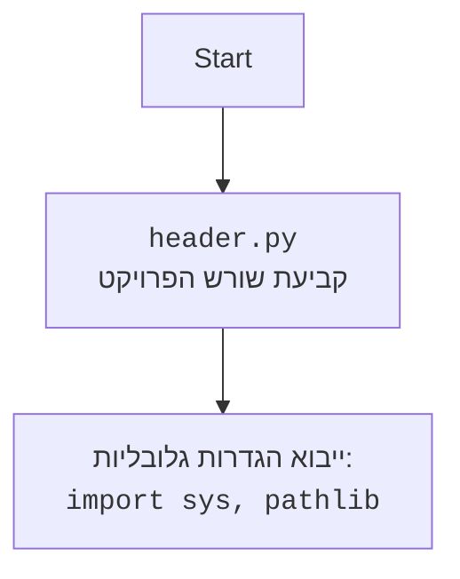

## <algorithm>

1.  **התחלה:** התהליך מתחיל בקריאה לפונקציה `set_project_root`.
2.  **אתחול נתיב נוכחי:** הנתיב הנוכחי נקבע על ידי קבלת הנתיב המוחלט של הקובץ הנוכחי (`__file__`).
    *   דוגמה: אם הקובץ `header.py` נמצא ב-`/home/user/my_project/src/`, הנתיב הנוכחי יהיה `/home/user/my_project/src`.
3.  **חיפוש נתיב שורש:** לולאה מתחילה לעלות במעלה עץ התיקיות מהנתיב הנוכחי.
    *   דוגמה: אם הנתיב הנוכחי הוא `/home/user/my_project/src`, הלולאה תבדוק קודם את `/home/user/my_project/src`, לאחר מכן את `/home/user/my_project/` ולבסוף את `/home/user/`.
4.  **בדיקת קבצי סמן:** בכל תיקייה, הלולאה בודקת אם קיימים אחד מקבצי הסמן (`pyproject.toml`, `requirements.txt`, `.git`).
    *   דוגמה: אם הלולאה בודקת את התיקייה `/home/user/my_project/` וקיים קובץ `pyproject.toml` בתיקייה זו, הלולאה תפסיק.
5.  **נתיב שורש נמצא:** אם נמצא קובץ סמן, הנתיב הנוכחי נחשב לנתיב השורש. הפונקציה ממירה אותו ל-`Path` אובייקט.
    *   דוגמה: אם הנתיב `/home/user/my_project/` נמצא כנתיב השורש, הוא יומר ל-`Path('/home/user/my_project')`.
6.  **הוספת נתיב השורש ל `sys.path`:** הפונקציה בודקת אם נתיב השורש נמצא כבר ברשימת הנתיבים של `sys.path`. אם לא, הוא מוכנס לתחילת הרשימה.
    *   דוגמה: אם `sys.path` מכיל `['/usr/lib/python3', '/home/user/my_project/src']` ונתיב השורש הוא `/home/user/my_project`, אז `sys.path` יהפוך ל-`['/home/user/my_project', '/usr/lib/python3', '/home/user/my_project/src']`.
7.  **החזרת נתיב השורש:** הפונקציה מחזירה את נתיב השורש כ-`Path` אובייקט.
    *   דוגמה: אם נתיב השורש הוא `/home/user/my_project/`, הפונקציה תחזיר `Path('/home/user/my_project/')`.
8.  **שמירת נתיב השורש ב `__root__`:** התוצאה של הפונקציה `set_project_root` נשמרת במשתנה הגלובלי `__root__`.
9.  **סיום:** הפונקציה מסיימת את ביצועה.

## <mermaid>

```mermaid
flowchart TD
    Start[התחל] --> GetCurrentPath[קבל את הנתיב הנוכחי של הקובץ]
    GetCurrentPath --> FindRootDirectory[מצא את תיקיית השורש]
    FindRootDirectory --> LoopStart[התחל לולאה: עלייה במעלה עץ התיקיות]
    LoopStart --> CheckMarkerFiles{בדוק אם קיים קובץ סמן (pyproject.toml, requirements.txt, .git)}
    CheckMarkerFiles -- כן --> RootFound[תיקיית שורש נמצאה]
    CheckMarkerFiles -- לא --> MoveUpDirectory[עלה לתיקייה האב]
    MoveUpDirectory --> LoopStart
    RootFound --> ConvertToPath[המר את נתיב השורש ל-Path אובייקט]
    ConvertToPath --> CheckSysPath{האם תיקיית השורש קיימת ב-sys.path?}
    CheckSysPath -- לא --> AddToSysPath[הוסף את תיקיית השורש ל-sys.path]
    CheckSysPath -- כן --> ReturnRootPath[החזר את נתיב השורש]
    AddToSysPath --> ReturnRootPath
    ReturnRootPath --> SaveRootVariable[שמור את נתיב השורש ב __root__]
    SaveRootVariable --> End[סיום]
```



## <explanation>

**ייבואים (Imports):**

*   `import sys`: מודול זה מספק גישה למשתנים ופונקציות שונות שקשורות לזמן ריצת המערכת של Python. במקרה זה, הוא משמש לשינוי `sys.path` - רשימת התיקיות בהן Python מחפש מודולים.
*   `from pathlib import Path`: `Path` היא מחלקה מודול `pathlib` המספקת דרך אובייקט-אוריינטית לניהול שמות קבצים ונתיבים. היא משמשת כאן לייצוג נתיב השורש של הפרויקט.

**פונקציות (Functions):**

*   `set_project_root()`:
    *   **פרמטרים**: הפונקציה לא מקבלת פרמטרים.
    *   **ערך מוחזר**: מחזירה אובייקט `Path` המייצג את הנתיב לתיקיית השורש של הפרויקט.
    *   **מטרה**: הפונקציה הזו אחראית על מציאת תיקיית השורש של הפרויקט על ידי מעבר במעלה עץ התיקיות ובדיקה אם קיימים קבצים שמוגדרים כקובצי סמן. אם תיקיית השורש לא קיימת ב `sys.path`, היא מוסיפה אותה לתחילת הרשימה.
    *   **דוגמה לשימוש**:

    ```python
    from header import set_project_root, __root__

    __root__ = set_project_root()
    print(__root__) # פלט: Path('/path/to/project/root')
    ```

**משתנים (Variables):**

*   `__root__`:
    *   **סוג**: אובייקט `Path`.
    *   **שימוש**: משתנה גלובלי השומר את הנתיב לתיקיית השורש של הפרויקט. משתמשים בו כדי לגשת לתיקיית השורש ממקומות שונים בפרויקט.
*   `__file__`:
    *   **סוג**: מחרוזת (String).
    *   **שימוש**: משתנה מובנה ב-Python שמייצג את הנתיב המוחלט של הקובץ הנוכחי. משמש כדי לקבוע את הנתיב ההתחלתי לחיפוש תיקיית השורש.
*   `marker_files`:
    *   **סוג**: רשימה (List).
    *   **שימוש**: רשימה המכילה את שמות הקבצים שמשמשים כ"סימנים" לתיקיית השורש.
    *   דוגמה: `['pyproject.toml', 'requirements.txt', '.git']`

**בעיות אפשריות או תחומים לשיפור:**

*   **קונפיגורציה:** הרשימה של `marker_files` מקודדת ישירות בקוד. אפשר לשקול להעביר אותה לקובץ קונפיגורציה או להשתמש במשתנה סביבה כדי להגדיר רשימה אחרת או להוסיף קבצי סמן נוספים.
*   **טיפול בשגיאות:** הקוד לא מטפל במקרה שבו לא נמצאת תיקיית שורש. אפשר להוסיף טיפול בשגיאות כדי למנוע קריסה או להתנהג בצורה נכונה יותר במקרה הזה.
*   **ביצועים:** אם יש הרבה תיקיות אב, החיפוש עלול להיות איטי. אפשר לשקול אופטימיזציות או שימוש בטכניקות אחרות לזיהוי שורש הפרויקט.

**שרשרת קשרים עם חלקים אחרים בפרויקט:**

*   **שימוש על ידי מודולים אחרים:** המשתנה `__root__` מיועד לשימוש במודולים אחרים בפרויקט כדי לגשת לתיקיית השורש ולבנות נתיבים יחסיים. לדוגמה, מודולים אחרים יכולים לעשות `from header import __root__` ואז להשתמש ב-`__root__` כדי לטעון קבצים.
*   **אינטראקציה עם `sys.path`**: על ידי הוספת תיקיית השורש ל-`sys.path`, הקוד הזה משפיע על האופן שבו Python מחפש מודולים בפרויקט. זה מאפשר יבוא של מודולים מכל מקום בפרויקט בלי צורך בנתיבים ארוכים ומסובכים.

בקיצור, קוד זה מספק פתרון פשוט ויעיל לניהול נתיבים בפרויקטים מורכבים. הוא עושה זאת על ידי קביעת תיקיית השורש באופן אוטומטי והוספתה ל-`sys.path`, מה שמפשט את יבוא המודולים ומקל על העבודה עם נתיבים.