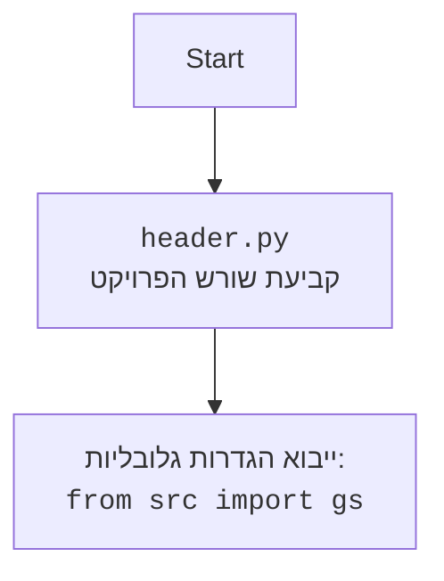

## <algorithm>

1. **אתחול:**
   - מתחילים מהמיקום הנוכחי של הקובץ (`header.py`).
   - `current_dir`: שומר את נתיב התיקייה הנוכחית. לדוגמה: `hypotez/src/endpoints/ai_games/101_basic_computer_games/ru`.

2. **לולאה לחיפוש שורש הפרויקט:**
   - מתחילים לולאה שחוזרת על עצמה עד שמגיעים לשורש המערכת או נמצא שורש פרויקט.
   - בודקים אם קיימים אחד מקבצי המרקר בתיקייה הנוכחית (`pyproject.toml`, `requirements.txt`, `.git`). לדוגמה: אם `pyproject.toml` קיים בתיקיית `hypotez`.
   - אם נמצא קובץ מרקר:
     - שורש הפרויקט נקבע להיות התיקייה הנוכחית.
     - הנתיב של שורש הפרויקט מומר לאובייקט `Path` ונשמר.
     - יוצאים מהלולאה.
   - אם לא נמצא קובץ מרקר:
     - עוברים לתיקייה האב של התיקייה הנוכחית. לדוגמה: עוברים מ`hypotez/src/endpoints/ai_games/101_basic_computer_games/ru` ל- `hypotez/src/endpoints/ai_games/101_basic_computer_games`.
   - אם הגענו לשורש מערכת ועדיין לא נמצא שורש פרויקט, הלולאה נעצרת והתוכנית תחזיר את שורש התיקייה של הקובץ.

3. **עדכון `sys.path`:**
   - בודקים אם נתיב שורש הפרויקט נמצא ברשימת הנתיבים בהם פייתון מחפש מודולים (`sys.path`).
   - אם נתיב שורש הפרויקט לא נמצא ברשימה, מוסיפים אותו לתחילת הרשימה כדי שניתן יהיה לייבא מודולים משורש הפרויקט.

4. **החזרת נתיב שורש הפרויקט:**
   - הפונקציה מחזירה את הנתיב של שורש הפרויקט כאובייקט `Path`. לדוגמה: אם שורש הפרויקט הוא `hypotez`, יוחזר אובייקט `Path` המייצג את הנתיב `hypotez`.

5. **שמירת שורש הפרויקט במשתנה גלובלי:**
   - שומרים את הנתיב המוחזר במשתנה הגלובלי `__root__`, כדי שיהיה זמין לשימוש בשאר חלקי הפרויקט.

## <mermaid>

```mermaid
flowchart TD
    Start[התחלה] --> CurrentDir[קבלת הנתיב של התיקייה הנוכחית]
    CurrentDir --> LoopStart[לולאת חיפוש שורש הפרויקט]
    LoopStart --> CheckMarkers{האם קיימים קבצי מרקר (pyproject.toml, requirements.txt, .git)?}
    CheckMarkers -- כן --> SetRoot[קביעת שורש הפרויקט כתיקייה הנוכחית]
    SetRoot --> ConvertPath[המרת הנתיב לאובייקט Path]
    ConvertPath --> LoopEnd[סיום לולאה]
    CheckMarkers -- לא --> MoveUp[מעבר לתיקיית האב]
    MoveUp --> CheckSystemRoot{האם הגענו לשורש המערכת?}
    CheckSystemRoot -- לא --> LoopStart
    CheckSystemRoot -- כן --> LoopEnd
    LoopEnd --> CheckSysPath{האם שורש הפרויקט נמצא ב-sys.path?}
    CheckSysPath -- לא --> AddSysPath[הוספת שורש הפרויקט לתחילת sys.path]
    AddSysPath --> ReturnRoot[החזרת נתיב שורש הפרויקט כאובייקט Path]
    CheckSysPath -- כן --> ReturnRoot
    ReturnRoot --> SaveRoot[שמירת הנתיב במשתנה גלובלי __root__]
    SaveRoot --> End[סיום]
```



## <explanation>

### ייבואים (Imports)
*   `from pathlib import Path`: מייבא את המחלקה `Path` מהמודול `pathlib`. המחלקה `Path` מספקת דרך נוחה לייצג ולעבוד עם נתיבי קבצים וספריות באופן עצמאי למערכת ההפעלה.
*   `import sys`: מייבא את מודול `sys`, המספק גישה למשתנים ולפונקציות שקשורות למערכת הפעלה. כאן משתמשים בו כדי לעדכן את `sys.path`, שהוא רשימה של נתיבי ספריות בהן פייתון מחפש מודולים.
*  אין יבוא של `src` ולכן לא יכולה להיות תלות במודולים אחרים בפרויקט.

### פונקציות (Functions)
*   `set_project_root()`:
    *   **פרמטרים:** אין פרמטרים.
    *   **ערך מוחזר:** אובייקט `Path` המייצג את הנתיב של שורש הפרויקט.
    *   **מטרה:** הפונקציה מגדירה את שורש הפרויקט באופן דינמי על ידי חיפוש קבצי מרקר בתיקיות, ומוסיפה את שורש הפרויקט ל-`sys.path`.
    *   **דוגמאות לשימוש:**
        ```python
        from header import set_project_root, __root__
        __root__ = set_project_root()
        print(__root__) # יציג את הנתיב של שורש הפרויקט
        ```
        במקרה זה, הפונקציה תחפש את התיקייה שבה נמצאים הקבצים  `pyproject.toml`, `requirements.txt`, `.git`, ואותה תגדיר כשורש הפרויקט.
        אם לא יימצא קובץ מהסוגים האלה, הפונקציה תחזיר את התיקייה בה נמצא הקובץ `header.py`.
        
### משתנים (Variables)
*   `__root__`: משתנה גלובלי שמאחסן את נתיב שורש הפרויקט כאובייקט `Path`, לאחר שהפונקציה `set_project_root()` נקראה. משתנה זה מאפשר גישה נוחה לשורש הפרויקט מכל מקום בקוד.
* `marker_files`: משתנה מקומי, רשימה של מחרוזות המכילות את שמות הקבצים המשמשים כ"מרקרים" לזיהוי שורש הפרויקט.
* `current_dir`: משתנה מקומי, אובייקט `Path` המייצג את התיקייה הנוכחית בזמן החיפוש של שורש הפרויקט.

### בעיות אפשריות ושיפורים
*   **קבצי מרקר:** הקוד משתמש בסט קבוע של קבצי מרקר. ניתן לאפשר הגדרה של קבצי מרקר שונים באמצעות משתנה סביבה או קובץ תצורה.
*   **טיפול בשגיאות:** הקוד אינו מטפל במקרים בהם לא נמצא שורש פרויקט, דבר שעלול לגרום לשגיאות בשימוש מאוחר יותר בתוכנית. ניתן להוסיף טיפול בשגיאות על ידי העלאת חריגה (Exception).

### שרשרת קשרים
1.  **`header.py`** הוא קובץ שנועד לספק את המיקום של שורש הפרויקט ולעדכן את `sys.path`.
2.  משתנה `__root__` שמוגדר בקובץ `header.py` אמור לשמש בקבצים אחרים בפרויקט כדי לגשת לנתיב שורש הפרויקט.
3.  הקובץ `header.py` יכול להשפיע על כל קובץ בפרויקט שמשתמש במשתנה `__root__` או מייבא את הפונקציה `set_project_root()`.

**סיכום:** הקוד מספק פתרון אוטומטי וגמיש לזיהוי שורש הפרויקט. הקוד מבוסס על קבצי מרקר קבועים שניתנים לשינוי, ועלולים לגרום לבעיות אם לא מטפלים בהם.