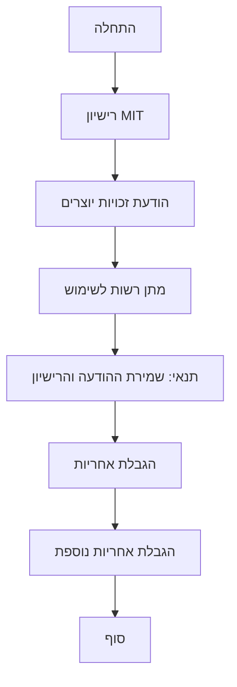

# ניתוח קוד

## <algorithm>

קובץ זה הוא למעשה רישיון MIT, ולא קוד. לכן אין אלגוריתם ליישם. ננתח את מרכיבי הרישיון:

1. **הודעת זכויות יוצרים:**
    - מציינת את השנה (2024) ואת בעל זכויות היוצרים (hypo69).
    - **דוגמה:** "Copyright (c) [2024] [hypo69]"

2. **מתן רשות:**
    - מעניקה רשות לשימוש, שינוי, הפצה, ביצוע פומבי, רישוי משנה ומכירה של התוכנה ללא תשלום.
    - **דוגמה:** "Разрешается бесплатное использование этого программного обеспечения... для любых целей..."

3. **תנאי:**
    - דורשת לכלול את הודעת זכויות היוצרים ואת הרישיון המלא בכל העתקים או חלקים מהותיים של התוכנה.
    - **דוגמה:** "Указанное выше уведомление об авторских правах и это разрешение должны быть включены..."

4. **הגבלת אחריות:**
    - מצהירה כי התוכנה מסופקת "כמות שהיא", ללא אחריות מכל סוג, כולל אחריות למסחריות, התאמה למטרה מסוימת או אי-הפרה.
    - **דוגמה:** "ПРОГРАММНОЕ ОБЕСПЕЧЕНИЕ ПРЕДОСТАВЛЯЕТСЯ "КАК ЕСТЬ", БЕЗ КАКИХ-ЛИБО ГАРАНТИЙ..."

5. **הגבלת אחריות:**
    - מצהירה כי לא יהיו לא המחברים ולא בעלי זכויות היוצרים אחריות על נזקים הנובעים מהשימוש בתוכנה.
    - **דוגמה:** "НИ В КОЕМ СЛУЧАЕ АВТОРЫ ИЛИ ПРАВООБЛАДАТЕЛИ НЕ НЕСУТ ОТВЕТСТВЕННОСТИ ЗА ЛЮБЫЕ ПРЕТЕНЗИИ..."

## <mermaid>

## <explanation>

**ייבואים:**
אין ייבוא מכיוון שזהו קובץ רישיון ולא קובץ קוד.

**מחלקות:**
אין מחלקות בקובץ זה.

**פונקציות:**
אין פונקציות בקובץ זה.

**משתנים:**
אין משתנים בקובץ זה, כל הטקסט הוא חלק מהרישיון.

**הסברים נוספים:**

*   **רישיון MIT:** הרישיון הניתן בקובץ זה הוא רישיון קוד פתוח נפוץ, אשר מאפשר למשתמשים רבים להשתמש, לשנות ולהפיץ את התוכנה בחופשיות.
*   **זכויות יוצרים:** רישיון זה מציין את בעל זכויות היוצרים והשנה, וזאת בכדי להגן על זכויותיו של היוצר.
*   **חופש שימוש:** רישיון זה מעניק חופש שימוש מירבי למשתמשים בתוכנה, כולל גם שימוש מסחרי, שינויים והפצה.
*   **הגבלת אחריות:** הרישיון כולל הגבלת אחריות, שמגנה על יוצר התוכנה מפני כל אחריות משפטית בגין השימוש בתוכנה.

**שרשרת קשרים:**
קובץ הרישיון מספק הגנה משפטית עבור הקוד המקורי של הפרויקט. אין בו קשר ישיר אל חלקים אחרים של הפרויקט מלבד היותו חלק ממנו. כלומר, הוא משפיע על אופן השימוש בכל הקבצים האחרים בפרויקט.