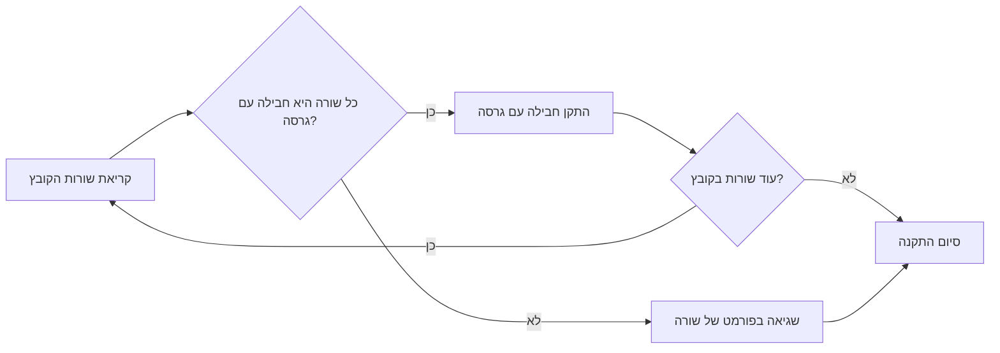

## ניתוח קובץ `requirements.txt`

### 1. <algorithm>
קובץ `requirements.txt` אינו מכיל קוד לוגי שדורש תרשים זרימה סטנדרטי. במקום זאת, הוא מפרט רשימה של חבילות Python ותלויות גרסאות עבור הפרויקט.

התהליך הוא פשוט:
1. קריאה של הקובץ שורה אחר שורה.
2. כל שורה מייצגת חבילה עם שם וגרסה. לדוגמה, `beautifulsoup4==4.12.3`.
3. כאשר מתקינים את החבילות, מנהל החבילות `pip` יתקין את החבילות והגרסאות הספציפיות.

### 2. <mermaid>

**הסבר תלויות:**
אין תלויות מיובאות בקובץ זה, מכיוון שהוא קובץ טקסט פשוט המכיל רשימת חבילות.

### 3. <explanation>

**תיאור הקובץ `requirements.txt`:**
קובץ זה הוא חלק סטנדרטי בכל פרויקט Python, והוא משמש לציון רשימה של תלויות חיצוניות הנדרשות להרצת הפרויקט. כל שורה בקובץ מציינת חבילה (library) עם גרסה ספציפית. כאשר מתקינים את התלויות האלה בעזרת `pip install -r requirements.txt`, pip מוריד ומתקין את הגרסאות המדויקות של החבילות שצוינו.

**ייבואים (Imports):**
אין ייבוא ישיר של קוד בקובץ זה. עם זאת, החבילות המפורטות כאן הן תלויות חיצוניות, שחלקים מהן עשויים להיות מיובאים ישירות בקוד הפרויקט.

**דוגמאות לחבילות והשימוש שלהן:**

*   `beautifulsoup4`: משמש לניתוח HTML ו-XML.
*   `requests`: משמש לשליחת בקשות HTTP.
*   `google-ai-generativelanguage` , `google-api-core`, `google-api-python-client`, `google-auth`, `google-generativeai`: חבילות הקשורות לשירותי Google API, כמו מודלים של שפה גנרטיבית.
*   `pydantic`, `pydantic_core`: משמשות לתיקוף וסכימה של מידע (data validation)
*  `pytest`: מסגרת לבדיקות אוטומטיות של הקוד.
*   `tqdm`: ספריה להצגת סרגלי התקדמות במהלך משימות ארוכות.

**מחלקות (Classes):**
אין מחלקות בקובץ זה.

**פונקציות (Functions):**
אין פונקציות בקובץ זה.

**משתנים (Variables):**
אין משתנים בקובץ זה. כל שורה היא מחרוזת המייצגת חבילה ותלויות גרסה.

**בעיות אפשריות או תחומים לשיפור:**
*   **עדכון גרסאות:** חשוב לעדכן את הגרסאות של החבילות מעת לעת על מנת להנות מתיקוני באגים ושיפורי ביצועים.
*   **ניגודי גרסאות:**  לעיתים קיימות ניגודי גרסאות בין חבילות, דבר שעלול להוביל לבעיות התקנה או הפעלה. יש לפתור ניגודים אלו על ידי בחירה זהירה של גרסאות מתאימות.
* **אבטחה:** יש לשים לב לגרסאות של החבילות המותקנות, ולוודא שאין חבילות עם פגיעויות אבטחה ידועות.

**שרשרת קשרים עם חלקים אחרים בפרויקט:**
קובץ `requirements.txt` הוא הבסיס לכל הפרויקט. הוא מגדיר את הסביבה שבה הקוד אמור לרוץ. כאשר מריצים את הפרויקט, קוד הפרויקט עשוי לייבא ולהשתמש בחבילות המפורטות בקובץ זה.

במילים אחרות, קוד הפרויקט תלוי בערכים המוגדרים בקובץ זה כדי לפעול כראוי.