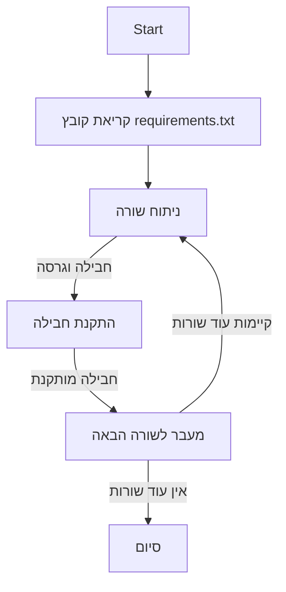

## ניתוח קובץ requirements.txt

### 1. <algorithm>

קובץ `requirements.txt` זה הוא רשימה של חבילות Python (ספריות) וגרסאות ספציפיות שלהן, אשר נדרשות לפרויקט. קובץ זה משמש בדרך כלל יחד עם `pip` (מנהל החבילות של Python) כדי להתקין את כל התלויות הנדרשות לסביבת הפיתוח.

1. **קריאת הקובץ**: `pip` קורא את קובץ `requirements.txt`.
2. **ניתוח שורות**: `pip` מנתח כל שורה בקובץ. כל שורה מייצגת חבילה ושדה גרסה (אופציונלי).
   - דוגמה: `requests==2.32.3` - מתקין את החבילה `requests` בגרסה `2.32.3`.
   - דוגמה: `tqdm==4.67.1` - מתקין את החבילה `tqdm` בגרסה `4.67.1`.
3. **התקנת חבילות**: `pip` מוריד ומתקין את כל החבילות שצוינו עם הגרסאות המתאימות.
   - אם לא מצוינת גרסה, `pip` מתקין את הגרסה העדכנית ביותר הזמינה.
   - אם החבילה כבר מותקנת, `pip` מוודא שהגרסה תואמת את הגרסה המצוינת בקובץ.
4. **סיום**: לאחר התקנת כל החבילות הנדרשות, סביבת הפיתוח מוכנה להרצת הפרויקט.

**זרימת נתונים:**

אין כאן זרימת נתונים בין פונקציות/מחלקות, אלא זרימת נתונים של שמות חבילות וגרסאות מתוך הקובץ אל מנהל החבילות `pip`.

### 2. <mermaid>

התרשים מתאר את התהליך של `pip` בקריאה וניתוח קובץ `requirements.txt`. אין תלויות חיצוניות מלבד הפונקציונליות הבסיסית של `pip`.

### 3. <explanation>

**ייבואים (Imports):**

קובץ `requirements.txt` אינו כולל ייבוא של מודולים. הוא משמש כמקור ל-`pip` כדי להתקין את התלויות הנדרשות עבור הפרויקט. כל החבילות המופיעות בקובץ הן ספריות חיצוניות אשר מספקות פונקציונליות לפרויקט.

**מחלקות (Classes):**

אין מחלקות בקובץ `requirements.txt`. הוא מכיל רק רשימה של חבילות.

**פונקציות (Functions):**

אין פונקציות בקובץ `requirements.txt`. הוא מכיל רק רשימה של חבילות.

**משתנים (Variables):**

אין משתנים בקובץ `requirements.txt`. הוא מכיל רק רשימה של חבילות.

**הסברים מפורטים:**

*   **annotated-types==0.7.0**: חבילה לטיפוסים מוערים.
*   **beautifulsoup4==4.12.3**: חבילה לניתוח קוד HTML ו-XML.
*   **cachetools==5.5.0**: חבילה ליישום מטמון (cache).
*   **certifi==2024.12.14**: חבילה של אישורי SSL.
*   **charset-normalizer==3.4.0**: חבילה לנירמול קידוד תווים.
*   **colorama==0.4.6**: חבילה לשימוש בצבעים בקונסולה.
*   **google==3.0.0**: חבילה לשימוש ב-Google API.
*   **google-ai-generativelanguage==0.6.10**: חבילה לשימוש ב-Google AI Generative Language API.
*   **google-api-core==2.24.0**: חבילה של תשתית ל-Google APIs.
*   **google-api-python-client==2.156.0**: חבילה לשימוש ב-Google APIs ב-Python.
*   **google-auth==2.37.0**: חבילה לאימות עם Google APIs.
*   **google-auth-httplib2==0.2.0**: חבילה לאימות עם Google APIs באמצעות httplib2.
*  **google-generativeai==0.8.3**: חבילה לשימוש ב-Google Generative AI API.
*   **googleapis-common-protos==1.66.0**: חבילה של פרוטוקולי protobuf משותפים ל-Google APIs.
*   **grpcio==1.68.1**: חבילה של gRPC (מערכת RPC).
*   **grpcio-status==1.68.1**: חבילה של סטטוסי gRPC.
*   **httplib2==0.22.0**: חבילה של לקוח HTTP.
*   **idna==3.10**: חבילה לטיפול ב-IDN (שמות דומיין בינלאומיים).
*   **iniconfig==2.0.0**: חבילה לקריאת קבצי INI.
*   **packaging==24.2**: חבילה לטיפול בגרסאות חבילות.
*   **pluggy==1.5.0**: חבילה למערכות פלאגינים.
*   **proto-plus==1.25.0**: חבילה של תוספות ל-protobuf.
*   **protobuf==5.29.2**: חבילה של פרוטוקול protobuf.
*   **pyasn1==0.6.1**: חבילה לטיפול ב-ASN.1.
*   **pyasn1_modules==0.4.1**: חבילה של מודולי ASN.1.
*   **pydantic==2.10.4**: חבילה לתיקוף נתונים.
*   **pydantic_core==2.27.2**: חבילת הליבה של Pydantic.
*   **pyparsing==3.2.0**: חבילה לניתוח טקסט.
*   **pytest==8.3.4**: חבילה להרצת בדיקות אוטומטיות.
*   **requests==2.32.3**: חבילה לביצוע בקשות HTTP.
*   **rsa==4.9**: חבילה לטיפול ב-RSA (אלגוריתם הצפנה).
*   **soupsieve==2.6**: חבילה של סלקטור CSS עבור BeautifulSoup4.
*   **tqdm==4.67.1**: חבילה ליצירת סרגלי התקדמות.
*   **typing_extensions==4.12.2**: חבילה של תוספות לטיפוסי Python.
*   **uritemplate==4.1.1**: חבילה לטיפול בתבניות URI.
*   **urllib3==2.3.0**: חבילה לטיפול ב-HTTP.

**בעיות אפשריות ותחומים לשיפור:**

*   **גרסאות חבילות:**  חלק מהחבילות משתמשות בגרסאות ספציפיות. יש לוודא שהגרסאות הללו תואמות זו לזו ושהן עדיין נתמכות על ידי הספריות עצמן. ניתן לשקול עדכון גרסאות בעת הצורך.
*   **ריבוי תלויות:** הפרויקט מסתמך על מספר גדול של חבילות. יש לשקול אפשרות להפחית תלויות לא הכרחיות כדי להקל על תחזוקת הפרויקט.
*   **חוסר התאמה:** לעיתים גרסאות שונות של ספריות יכולות ליצור קונפליקטים. יש לוודא שכל החבילות עובדות יחד בצורה תקינה.
*   **תחזוקה:** חשוב לעקוב אחר עדכונים של החבילות השונות ולעדכן אותן בהתאם כדי לשמור על ביצועים ואבטחה.

**שרשרת קשרים:**

הקובץ `requirements.txt` הוא קובץ הגדרות לסביבת הפיתוח של הפרויקט. הוא קשור לכל קוד המשתמש בספריות אלו, כלומר לכל קוד שנכתב בתוך הפרויקט.

בסופו של דבר, קובץ זה מאפשר למפתחים ליצור סביבת פיתוח זהה על ידי התקנת כל החבילות הנכונות ובכך להבטיח שהקוד יפעל כראוי.