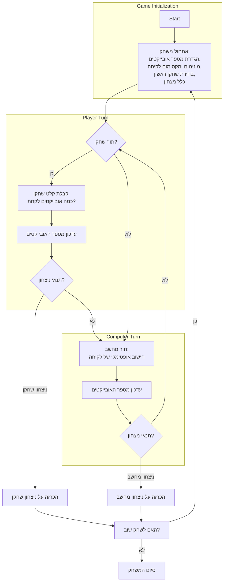

## <algorithm>

1. **אתחול המשחק:**
   - המשחק מתחיל עם מספר מוגדר של אובייקטים (לדוגמה, 20 מטבעות).
     - דוגמה: `num_objects = 20`
   - מגדירים מראש את המספר המינימלי והמקסימלי של אובייקטים שניתן להסיר בכל תור.
     - דוגמה: `min_take = 1`, `max_take = 3`
   - השחקן בוחר מי יתחיל את המשחק: הוא או המחשב.
     - דוגמה: `first_player = 1` (שחקן) או `first_player = 2` (מחשב)
   - מגדירים את כלל הניצחון:
      - אפשרות 1: מנצח מי שלוקח את האובייקט האחרון.
      - אפשרות 2: מנצח מי שלא לוקח את האובייקט האחרון.
       - דוגמה: `win_rule = 1` או `win_rule = 2`

2. **לולאת המשחק הראשית:**
   - השחקן והמחשב משחקים בתורות, ולוקחים בין 1 ל-M אובייקטים.
     - דוגמה: שחקן לוקח 2 אובייקטים, `num_objects` הופך ל-18.
   - בסוף כל תור, התוכנית בודקת:
     - אם נשאר אובייקט אחד, מי שלקח אותו מפסיד (אם נבחרה אפשרות 2).
       - דוגמה: `num_objects == 1`, אם `win_rule = 2` השחקן הנוכחי מפסיד.
     - אם נשארו 0 אובייקטים, מי שלקח את האובייקט האחרון מנצח (אם נבחרה אפשרות 1).
       - דוגמה: `num_objects == 0`, אם `win_rule = 1` השחקן הנוכחי מנצח.

3. **אלגוריתם למחשב:**
   - המחשב מבצע את התור שלו על סמך אסטרטגיה, מנסה להשאיר את השחקן במצב הכי קשה:
     - משתמשים באריתמטיקה מודולרית כדי לחשב את התור האופטימלי.
       - דוגמה: אם `max_take = 3`, אז המודול הוא 4.
     - אם מספר האובייקטים שנותרו הוא כפולה של (M+1), המחשב ישאף להשאיר את המספר הזה לשחקן.
       - דוגמה: אם `num_objects = 16` ו-`max_take = 3`, אז המחשב ייקח 1 כדי להשאיר 15.

4. **חישוב מנצח:**
   - כאשר מספר האובייקטים על השולחן מגיע ל-1, המשחק מסתיים.
     - דוגמה: `num_objects == 1`, המשחק מסתיים.
   - התוכנית מציגה את התוצאה:
     - אם השחקן לא לקח את האובייקט האחרון (אפשרות 2):
       ```
       "ברכות! ניצחת!"
       ```
     - אם השחקן לקח את האובייקט האחרון (אפשרות 1):
       ```
       "חבל, הפסדת!"
       ```

5. **סיום המשחק:**
   - לאחר סיום המשחק, התוכנית תשאל האם לשחק שוב.
     - דוגמה: "האם תרצה לשחק שוב? (כן/לא)"

## <mermaid>



## <explanation>

**ייבואים (Imports):**
- אין ייבוא ספציפי בקוד הזה. מדובר בתיאור מילולי של המשחק, ולא בקוד ממשי.

**מחלקות (Classes):**
- אין מחלקות בקוד הזה.

**פונקציות (Functions):**
- אין פונקציות בקוד הזה.

**משתנים (Variables):**
- `num_objects`: מספר האובייקטים הכולל במשחק.
- `min_take`: מספר מינימלי של אובייקטים שניתן לקחת בתור.
- `max_take`: מספר מקסימלי של אובייקטים שניתן לקחת בתור.
- `first_player`: מציין מי השחקן הראשון (1 = שחקן, 2 = מחשב).
- `win_rule`: כלל הניצחון (1 = מנצח שלוקח אחרון, 2 = מנצח שלא לוקח אחרון).

**הסברים מפורטים:**

- המסמך מתאר את כללי המשחק "Butnum" (קרב המספרים) ותהליך המימוש שלו.
- המשחק הוא משחק אסטרטגי בין שחקן למחשב, שבו כל אחד מהם בתורו מסיר אובייקטים מערימה.
- האסטרטגיה העיקרית של המחשב היא להשאיר את השחקן במצב בו מספר האובייקטים שנותרו הוא כפולה של (max_take + 1), או מספר הקטן ב-1 ממנה.
- המשחק משתמש באריתמטיקה מודולרית כדי לחשב את המהלך הטוב ביותר עבור המחשב.
- התיאור כולל גם דוגמאות קלט/פלט להדגים את מהלך המשחק.
- קיימות אפשרויות שונות לניצחון, בהתאם לכללי המשחק שנבחרו.
- המשחק מסתיים כאשר נשאר אובייקט אחד בלבד, או כאשר הערימה ריקה.

**בעיות אפשריות או תחומים לשיפור:**
- המסמך מתאר רק את חוקי המשחק ולא כולל מימוש קוד, כך שצריך לכתוב קוד ממשי כדי להפוך את המשחק לפעיל.
- אין טיפול בשגיאות קלט של המשתמש (למשל, הכנסת מספר לא חוקי של אובייקטים).
- אפשר להוסיף רמות קושי שונות למחשב.
- אפשר להוסיף אפשרות לבחור את מספר האובייקטים ההתחלתי.

**שרשרת קשרים עם חלקים אחרים בפרויקט (אם רלוונטי):**
- מכיוון שמדובר בתיאור מילולי בלבד, אין שרשרת קשרים ישירה לקבצים אחרים.
- כאשר ימומש הקוד, הוא עשוי להשתלב עם מודולים אחרים של משחקי AI, כמו מודול קלט/פלט או מודול אסטרטגיות משחק.