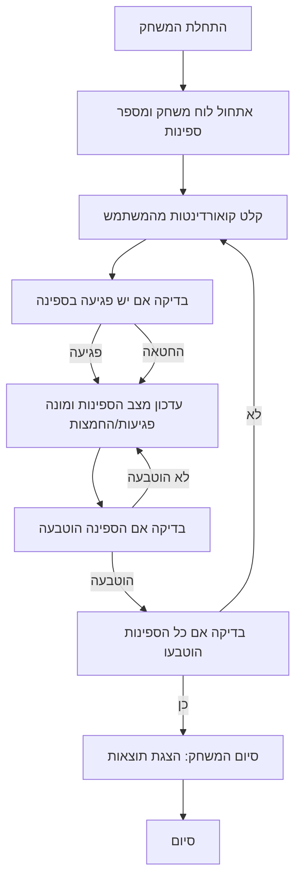

## ניתוח קוד: משחק קרב ימי

### <algorithm>
1.  **התחלת המשחק:**
    -   משחק מאותחל עם לוח משחק בגודל 6x6.
    -   שישה ספינות ממוקמות באופן אקראי:
        -   2 משחתות (2 תאים).
        -   2 סיירות (3 תאים).
        -   2 נושאות מטוסים (4 תאים).
    -   דוגמה: לוח המשחק יכול להיות מיוצג כמטריצה דו ממדית, לדוגמה: `[['-', '-', '-', 'S', 'S', '-'], ['-', '-', '-', '-', '-', '-'], ['-', 'S', 'S', 'S', '-', '-'], ...]`, כאשר `S` מייצג ספינה ו-`-` מייצג תא ריק.

2.  **קלט מהמשתמש:**
    -   המשתמש מזין קואורדינטות (טור, שורה) כדי לירות.
    -   לדוגמה: "3,4" (טור 3, שורה 4).

3.  **בדיקת פגיעה:**
    -   הקואורדינטות מושווות למיקומי הספינות.
    -   אם יש פגיעה:
        -   אם זו פגיעה ראשונה על ספינה, התגובה תהיה "Hit!".
        -   אם הפגיעה גורמת להטבעת ספינה, התגובה תהיה "Sunk!".
    -   אם אין פגיעה, התגובה תהיה "Splash!".
        -   דוגמה: אם המשתמש ירה ב "3,4" ובתא זה נמצאה ספינה, התגובה תהיה "Hit!" או "Sunk!".

4.  **עדכון מצב:**
    -   מעודכן מצב הספינות (פגיעה או הטבעה).
    -   מעודכן לוח המשחק של המשתמש עם סימון פגיעות.
    -   מונה הפגיעות (Hits) וההחמצות (Splash) גדל.
    -   דוגמה: אם ב"2,5" פגעה הספינה, תא זה יסומן כפגיעה בלוח המשחק של המשתמש.

5.  **המשך המשחק:**
    -   המשחק ממשיך עד שכל הספינות הוטבעו.
        -   דוגמה: המשתמש ימשיך לירות עד שכל תאי הספינות יהיו מסומנים כפגיעה בלוח המשחק שלו.

6.  **סיום המשחק:**
    -   מוצגות תוצאות: מספר הפגיעות, מספר ההחמצות ויחס פגיעות/החמצות.
        -   דוגמה: לאחר הטבעת כל הספינות, המערכת תדפיס: "Hits: 15, Splash: 9, Splash/Hit ratio: 9/15 (0.6)".

### <mermaid>

### <explanation>
**הסברים מפורטים:**

-   **אלגוריתם:**
    -   הקוד מתחיל באתחול המשחק, בו נוצר לוח משחק וספינות ממוקמות באופן אקראי. לאחר מכן, המשחק נכנס ללולאה שבה המשתמש מזין קואורדינטות ירי. הקוד בודק אם יש פגיעה בספינה, ומעדכן את מצב המשחק בהתאם. לבסוף, המשחק מסתיים כאשר כל הספינות הוטבעו.
-   **ייבואים (Imports):**
    -   אין ייבוא מפורש בקוד זה, מכיוון שהוא מוגבל להוראות טקסטואליות. אולם, בקוד האמיתי, ייתכן שיהיו ייבוא של ספריות לניהול מטריצות או ליצירת מספרים אקראיים.
-   **מחלקות (Classes):**
    -   אין מחלקות בקוד זה, אך ייצוג של לוח משחק וספינות יכול להתבצע באמצעות מחלקות. לדוגמה, מחלקה ללוח משחק שתכיל מטריצה ומחלקה לספינה שתכיל את מיקום הספינה ואת מצבה.
-   **פונקציות (Functions):**
    -   אין פונקציות ספציפיות בקוד זה, אך בקוד אמיתי, יהיו פונקציות לאתחול המשחק, לבדיקת פגיעה, לעדכון מצב המשחק, ולקבלת קלט מהמשתמש.
        -   דוגמה: `initialize_game()` - לאתחול המשחק, `check_hit(x, y)` - לבדיקת פגיעה בנקודה (x,y), `update_board(x,y,status)` - לעדכון הלוח, `get_input()` - לקבלת קלט מהמשתמש.
-   **משתנים (Variables):**
    -   הקוד יכיל משתנים כמו מטריצת הלוח, רשימת ספינות, מונים לפגיעות והחמצות, ומשתנה המציין את סיום המשחק.
        -   דוגמה: `board = [['-' for _ in range(6)] for _ in range(6)]`, `ships = [ship1, ship2, ...]`, `hits = 0`, `splash = 0`, `game_over = False`.

**בעיות אפשריות ותחומים לשיפור:**

-   **בדיקת קלט:** הקוד צריך לכלול בדיקת תקינות לקלט המשתמש (האם הקואורדינטות בתוך טווח הלוח).
-   **שיפור לוגיקת המשחק:** ניתן לשפר את הלוגיקה כך שתהיה מורכבת יותר, לדוגמה, להוסיף אסטרטגיות של AI.
-   **עיצוב:** ניתן לשפר את עיצוב המשחק על ידי שימוש בממשק גרפי.
-   **ניהול ספינות:** ניתן לשפר את ניהול הספינות כך שיכלול מצב פגיעות, הטבעות וכו'.
-   **התייחסות להרצה מחדש:** כרגע, המשחק לא יכול לרוץ שוב אחרי שנגמר, צריך לאפשר זאת.

**שרשרת קשרים עם חלקים אחרים בפרויקט (אם רלוונטי):**
-   הקוד הזה עשוי להיות חלק מחבילה גדולה יותר של משחקי AI, כאשר הוא משמש כדוגמה למשחק קלאסי.
-   ייתכן שיהיה לו קשר עם מודולים אחרים לניהול קלט/פלט של משתמש, ניהול משחקים וחישוב תוצאות.