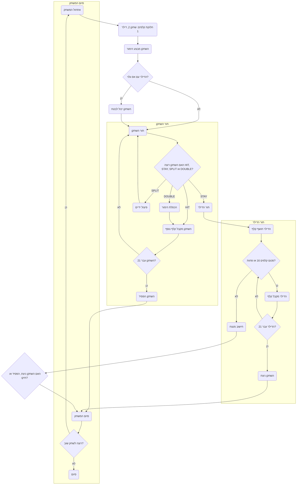

## ניתוח קוד משחק בלק ג'ק (BLKJAK)

### <algorithm>

הקוד מתאר את כללי משחק הבלאק ג'ק. להלן תרשים זרימה של שלבי המשחק:

1.  **אתחול המשחק:**
    *   המחשב מחלק שתי קלפים לשחקן וקלף אחד לדילר (כאשר הקלף של הדילר גלוי).
        *   דוגמא: השחקן מקבל קלף 10 ו-7, הדילר מקבל אס (גלוי).
    *   השחקן מבצע הימור ראשוני.
        *   דוגמא: השחקן מהמר 50$.
    *   במידה וקלף הדילר גלוי הוא אס, השחקן יכול לרכוש ביטוח.
        *   דוגמא: השחקן בוחר לרכוש ביטוח.

2.  **מהלך המשחק:**
    *   **תור השחקן:**
        *   השחקן מסתכל על הקלפים שלו ומחליט:
            *   **HIT:** לקחת קלף נוסף.
                *   דוגמא: השחקן בוחר לקחת קלף נוסף ומקבל קלף 2, הסכום עכשיו הוא 19.
            *   **STAY:** להישאר עם הקלפים הנוכחיים.
                *   דוגמא: השחקן בוחר להישאר עם הסכום 19.
            *   **SPLIT:** לפצל את הזוג קלפים לשתי ידיים אם הם זהים.
                *   דוגמא: אם לשחקן יש 8,8 הוא יכול לפצל לשתי ידיים.
            *   **DOUBLE:** להכפיל את ההימור ולקבל קלף אחד נוסף בלבד.
                *  דוגמא: השחקן מהמר 100$ ובסוף התור יקבל רק קלף נוסף אחד.
        *   אם השחקן עובר 21 נקודות, הוא מפסיד.
            *   דוגמא: אם השחקן מקבל קלף 7, הסכום יהיה 26, השחקן מפסיד.
    *   **תור הדילר:**
        *   הדילר חושף את הקלף השני שלו.
        *   אם סכום הקלפים של הדילר הוא 16 או פחות, הוא לוקח קלף נוסף.
            *   דוגמא: אם לדילר יש 10 ו-6 (סכום 16), הוא יקבל קלף נוסף.
        *   אם סכום הקלפים של הדילר הוא 17 או יותר, הוא נשאר עם הקלפים.
            *   דוגמא: אם לדילר יש 10 ו-7 (סכום 17), הוא יסיים את תורו.
        *   אם סכום הקלפים של הדילר עובר 21, השחקן מנצח.
            *   דוגמא: הדילר לוקח עוד קלף והסכום עכשיו הוא 22, השחקן מנצח.

3.  **חישוב המנצח:**
    *   אם הדילר עבר 21, השחקן מנצח.
    *   אם סכום הקלפים של השחקן גבוה משל הדילר (עד 21) השחקן מנצח.
    *   אם סכום הקלפים של השחקן והדילר שווה, המשחק מסתיים בתיקו.

4.  **סיום המשחק:**
    *   לאחר המשחק, השחקן מקבל אפשרות לשחק שוב או לסיים.

### <mermaid>

**הסבר התרשים:**

*   **Start:** תחילת המשחק.
*   **DealCards:** חלוקת הקלפים הראשונית לשחקן ולדילר.
*   **PlaceBet:** השחקן מבצע את ההימור הראשוני.
*   **InsuranceCheck:** בדיקה האם הקלף הגלוי של הדילר הוא אס.
*  **InsuranceOffer:** אם הדילר קיבל אס השחקן רשאי לרכוש ביטוח.
*   **PlayerTurn:** תחילת תור השחקן.
*  **PlayerChoice:** השחקן בוחר את האופציה הבאה שלו
*   **PlayerHit:** השחקן לוקח קלף נוסף.
*   **PlayerBustCheck:** בדיקה האם השחקן עבר 21.
*   **PlayerLose:** השחקן הפסיד.
*   **SplitHands:** השחקן פיצל את הזוג קלפים לשתי ידיים
*   **DoubleBet:** השחקן הכפיל את ההימור
*   **DealerTurn:** תחילת תור הדילר.
*   **DealerReveal:** הדילר חושף את הקלף השני שלו.
*   **DealerSumCheck:** בדיקה אם סכום הקלפים של הדילר הוא 16 או פחות.
*   **DealerHit:** הדילר מקבל קלף נוסף.
*   **DealerBustCheck:** בדיקה האם הדילר עבר 21.
*   **PlayerWin:** השחקן ניצח.
*   **WinnerCheck:** בדיקה מי ניצח על פי סכום הקלפים.
*  **CheckResult:** בדיקת תוצאות המשחק.
*  **GameOver:** סיום המשחק.
*  **PlayAgain:** שואל אם השחקן מעוניין לשחק שוב
*   **End:** סיום המשחק.

### <explanation>

הקוד מתאר את כללי משחק הבלאק ג'ק בצורה טקסטואלית. הוא מפרט את השלבים השונים במשחק: אתחול, מהלכי השחקן והדילר, חישוב מנצח וסיום המשחק.

*   **ייבוא (Imports):** אין ייבוא בקוד זה.
*   **מחלקות (Classes):** אין מחלקות בקוד זה. הקוד מציג הסבר טקסטואלי בלבד.
*   **פונקציות (Functions):** אין פונקציות בקוד זה.
*   **משתנים (Variables):** אין משתנים בקוד זה. המשתנים (כמו כסף השחקן, הימור, קלפים) יהיו מוגדרים בפועל בקוד המשחק עצמו.

**בעיות אפשריות או תחומים לשיפור:**

*   הקוד אינו ניתן להרצה כיוון שהוא מתאר את כללי המשחק בלבד, ולא את הקוד עצמו.
*   חסר את האלמנט של קבלת החלטות מתוך הקוד, אין קוד לוגיקה לאיך שהמשחק מתנהל.
*  הקוד לא מראה איך הקלפים מחולקים בצורה אקראית.

**שרשרת קשרים עם חלקים אחרים בפרויקט:**

*   הקוד מתקשר לחלקים אחרים בפרויקט דרך הקריאה לפונקציות (במציאות). לדוגמה: קוד שמשתמש בהגרלת קלפים אקראית, קוד שמטפל בפקודות השחקן (HIT, STAY, SPLIT, DOUBLE), וקוד שמבצע את פעולות הדילר.
*   הקוד מתקשר לממשק המשתמש, שמציג לשחקן את הקלפים שלו, של הדילר, ומאפשר לו להמר ולקבל החלטות.
*   חלק זה הוא ה"מנוע" של המשחק. כלומר, הוא מגדיר את כללי המשחק, אבל לא מבצע אותו בפועל.