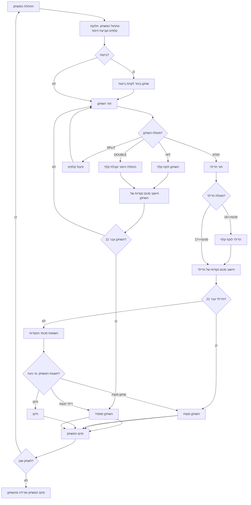

## ניתוח קוד המשחק "בלאק ג'ק"

### <algorithm>

1. **אתחול המשחק:**
   - המחשב מחלק שתי קלפים לשחקן וקלף אחד לדילר (גלוי).
   - השחקן מבצע הימור ראשוני.
     - דוגמה: השחקן מהמר 50$, והקלפים מחולקים.
   - אם הקלף הגלוי של הדילר הוא אס, השחקן יכול לבקש ביטוח.
     - דוגמה: הדילר מראה אס, השחקן בוחר לקחת ביטוח.

2. **לולאת המשחק הראשית:**

   - **תור השחקן:**
     1. השחקן בוחן את הקלפים שלו ומחליט:
        - **HIT:** לקחת עוד קלף.
          - דוגמה: השחקן בוחר לקחת עוד קלף.
        - **STAY:** להישאר עם סכום הנקודות הנוכחי.
          - דוגמה: השחקן בוחר לא לקחת יותר קלפים.
        - **SPLIT:** לפצל זוג קלפים זהים ולשחק בשתי ידיים.
          - דוגמה: השחקן מחזיק שני קלפי 7 ובוחר לפצל אותם.
        - **DOUBLE:** להכפיל את ההימור ולקבל קלף אחד נוסף.
          - דוגמה: השחקן מכפיל את ההימור ומקבל קלף נוסף.
     2. אם סכום הנקודות של השחקן עולה על 21, הוא מפסיד מיד.
       - דוגמה: סכום הקלפים של השחקן הוא 22 - הוא מפסיד.

   - **תור הדילר:**
      1. הדילר חושף את הקלף השני שלו.
        - דוגמה: הדילר חושף קלף 6.
      2. אם סכום הנקודות של הדילר הוא 16 או פחות, הוא לוקח קלף נוסף. אם הסכום 17 או יותר, הוא נשאר.
       - דוגמה: אם סכום הנקודות של הדילר הוא 15, הוא לוקח עוד קלף.
      3. אם סכום הנקודות של הדילר עולה על 21, השחקן מנצח.
        - דוגמה: סכום הקלפים של הדילר הוא 22, השחקן מנצח.

3. **חישוב המנצח:**
   - אם סכום הנקודות של הדילר עולה על 21, השחקן מנצח.
   - אם סכום הנקודות של השחקן גבוה יותר מסכום הנקודות של הדילר, והוא לא עולה על 21, השחקן מנצח.
   - אם סכום הנקודות של השחקן והדילר שווים, המשחק נחשב לתיקו.
     - דוגמה: סכום הנקודות של השחקן ושל הדילר הוא 18, המשחק מסתיים בתיקו.

4. **סיום המשחק:**
    - השחקן מקבל הצעה לשחק שוב או לצאת מהמשחק.
    - דוגמה: השחקן בוחר לשחק שוב.

### <mermaid>

התרשים מתאר את זרימת המשחק, החל מאתחול המשחק, דרך תורות השחקן והדילר, ועד לקביעת המנצח וסיום המשחק.

**הסבר התלויות בייבוא (אם רלוונטי):**

במקרה הזה, אין ייבוא של קבצים נוספים, כלומר אין תלויות מיובאות.

### <explanation>

**ייבוא (Imports):**
- אין ייבוא. המשחק בנוי רק באמצעות תיאור מילולי ודוגמאות.

**מחלקות (Classes):**
- אין מחלקות בקוד זה, מאחר והוא תיאור מילולי של המשחק.

**פונקציות (Functions):**
- אין פונקציות ספציפיות, מאחר והקוד הוא תיאור מילולי של המשחק, לא קוד ממשי.

**משתנים (Variables):**
- בתיאור המשחק מופיעים משתנים מסוגים שונים, כגון:
  - `הימור`: מספר שלם המייצג את סכום הכסף שהשחקן מהמר.
  - `סכום נקודות`: מספר שלם המייצג את סכום הנקודות של השחקן או הדילר.
  - `קלפים`: מערך/רשימה של קלפים המוחזקים על ידי השחקן או הדילר.
  - `סכום כסף`: סכום הכסף שיש לשחקן.

**הסברים מפורטים:**

- התיאור מספק הסבר מפורט של חוקי המשחק "בלאק ג'ק", כולל כללי התחלה, אפשרויות פעולה עבור השחקן והדילר, וכללים לקביעת המנצח.
- התהליך מוסבר באופן לוגי וברור, כך שניתן להבין את הזרימה של המשחק.
- יש דוגמאות הממחישות את התרחישים השונים במשחק.

**בעיות אפשריות או תחומים לשיפור:**

- מכיוון שהקוד הוא תיאור מילולי, אין בעיות קוד ממשיות.
- חוסר ביישום אמיתי: תיאור זה דורש יישום קוד בפועל כדי שיוכל לרוץ ולהיות משחק פעיל.
- אפשרות להוסיף אפשרויות נוספות: אפשר לשפר את התיאור על ידי הוספה של אפשרויות משחק נוספות כגון כניעה (Surrender) או אפשרויות הימור מורכבות יותר.

**שרשרת קשרים עם חלקים אחרים בפרויקט (אם רלוונטי):**

במקרה הזה, אין קשרים עם חלקים אחרים בפרויקט כרגע, מכיוון שזהו רק תיאור של המשחק ולא קוד. במידה ויישמו את המשחק בפועל, נצטרך לבדוק את הקשרים עם שאר חלקי הפרויקט.