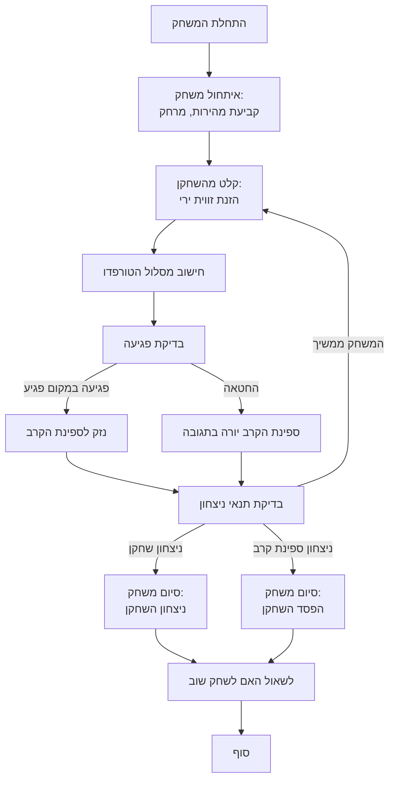

## <algorithm>

1. **התחלת המשחק:**
   - המשחק מתחיל בהודעת פתיחה "ברוכים הבאים למשחק BOAT!".
   - מהירות ספינת הקרב נקבעת (לדוגמה, 17.18 קשרים).
   - המרחק בין הצוללת לספינת הקרב נקבע (לדוגמה, 5136.84 יארד).
   - השחקן מתבקש להזין זווית ירי.
   - לדוגמה:
     ```
     ברוכים הבאים למשחק BOAT!
     מהירות ספינת הקרב: 17.18 קשרים.
     מרחק: 5136.84 יארד.
     הזן זווית: 70
     ```

2. **תור השחקן:**
   - השחקן מזין זווית ירי.
   - התוכנית מחשבת את מסלול הטורפדו והאם הוא פוגע בספינת הקרב.
   - אם הפגיעה היא במקום פגיע, נגרם נזק לספינת הקרב.
     - לדוגמה:
       ```
       הטורפדו שוגר... פגיעה במקום פגיע!
       גרמת נזק לספינת הקרב.
       ```
   - אם הטורפדו לא פוגע, ספינת הקרב יורה חזרה.
     - לדוגמה:
       ```
       החטאת. ספינת הקרב פותחת באש!
       ```
   - הנתונים זורמים מהקלט של השחקן (זווית) לפונקציית החישוב, ומשם ללוגיקה של פגיעה/החטאה.

3. **תור ספינת הקרב:**
   - אם השחקן החטיא, ספינת הקרב יורה אוטומטית.
   - המשחק הופך לחילופי אש עד שאחת הספינות טובעת.

4. **חישוב מנצח:**
   - המשחק מסתיים כשאחת הספינות טובעת.
   - המנצח הוא מי שהצליח לפגוע בספינה השנייה מספר פעמים מבלי להחטיא.

5. **סיום המשחק:**
   - לאחר טביעת ספינה, המשחק מסתיים.
   - השחקן נשאל האם הוא רוצה לשחק שוב.
     - לדוגמה:
       ```
       הטבעת את ספינת הקרב!
       ברכות, ניצחת!
       רוצה לשחק שוב? (כן/לא)
       ```

## <mermaid>



**ניתוח תלויות (אין ייבוא בקוד שסופק)**

אין תלויות מיובאות בקוד הזה. זהו תיאור טקסטואלי של חוקי המשחק, ולכן אין צורך לייבא מודולים חיצוניים. התרשים מציג את הזרימה הלוגית של המשחק.

## <explanation>

**ייבואים (Imports):**
אין ייבוא מודולים. התיאור הוא של לוגיקת משחק ולא קוד בפועל.

**מחלקות (Classes):**
אין מחלקות בקוד זה, אלא תיאור של כללי המשחק. אם היה מיושם בקוד, סביר להניח שהיו מחלקות כמו `Ship` (ספינה), `Torpedo` (טורפדו) וכו'.

**פונקציות (Functions):**
אין פונקציות ספציפיות בתיאור זה, אך אם היה קוד ממשי, היו פונקציות כמו:
- `init_game()` - לאתחול המשחק (מהירות ספינה, מרחק).
- `player_turn()` - לביצוע תור השחקן (קלט זווית, חישוב פגיעה).
- `ship_turn()` - לביצוע תור הספינה (ירי אוטומטי).
- `calculate_trajectory()` - לחישוב מסלול הטורפדו.
- `check_hit()` - לבדיקה האם הפגיעה הצליחה.
- `check_win_condition()` - לבדיקה האם יש מנצח.
- `game_over()` - לסיים את המשחק.

**משתנים (Variables):**
המשתנים המרכזיים יהיו:
- `ship_speed` - מהירות ספינת הקרב (מסוג float).
- `distance` - מרחק בין הצוללת לספינת הקרב (מסוג float).
- `angle` - זווית הירי של הטורפדו (מסוג int).
- `player_damage` - כמות הנזק שנגרם לספינת הקרב.
- `ship_damage` - כמות הנזק שנגרם לצוללת.

**הסברים מפורטים:**

1.  **משחק BOAT:** המשחק מדמה קרב ימי בין צוללת לספינת קרב, בו השחקן צריך לחשב את זווית הירי של הטורפדו שלו.
2.  **אתחול:** בתחילת המשחק, המהירות והמרחק בין הצוללת לספינת הקרב נקבעים, ועל השחקן להזין זווית ירי.
3.  **לוגיקה:** לוגיקת המשחק מחולקת לתור השחקן ותור הספינה, כאשר ישנה בדיקה האם הטורפדו פגע או לא. במקרה של החטאה, הספינה יורה חזרה.
4.  **סיום:** המשחק מסתיים כאשר אחת הספינות טובעת, והמנצח הוא מי שהצליח לפגוע בספינה השנייה מספר פעמים.

**בעיות אפשריות ושיפורים:**

- **פשטות יתר:** חוקי המשחק פשוטים מאוד, והוא עלול להפוך משעמם במהירות. אפשר להוסיף אלמנטים מורכבים יותר, כמו סוגי טורפדו שונים או יכולת תמרון.
- **תגובת הספינה:** תגובת הספינה לירי היא אוטומטית, ואין בה שום אלמנט של אסטרטגיה. אפשר להוסיף רמה כלשהי של בינה מלאכותית.
- **חישוב פגיעה:** יש להוסיף חישוב ריאלי יותר של מסלול הטורפדו והסיכוי לפגוע. כרגע, כל הפגיעות מתרחשות אוטומטית לאחר החישוב.
- **ממשק משתמש:** אין ממשק משתמש, ולכן המשחק הוא יותר תיאור של חוקים מאשר קוד.

**שרשרת קשרים עם חלקים אחרים בפרויקט:**

בהנחה שהמשחק הוא חלק מפרויקט גדול יותר, ניתן לקשר אותו למערכת ניהול משחקים, גרפיקה, וכן הלאה. אך בקוד שסופק אין אזכור לקשרים כאלה.