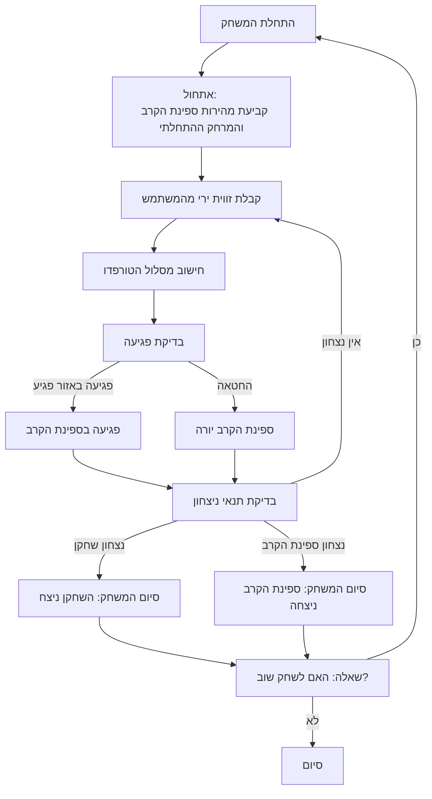

## <algorithm>

1. **אתחול המשחק:**
   - המשחק מתחיל בהגדרת מהירות ספינת הקרב (`battle_ship_speed`, לדוגמה: 17.18 קשרים) ומרחק התחלתי בינה לבין הצוללת (`initial_distance`, לדוגמה: 5136.84 יארד).
   - המשתמש מתבקש להזין זווית שיגור טורפדו.
   - *דוגמה*: `battle_ship_speed` = 17.18, `initial_distance` = 5136.84, `user_angle` = 70.

2. **לולאה ראשית של המשחק:**
   - **תור השחקן:**
     - המשתמש מזין את זווית הירי.
     - התוכנית מחשבת את מסלול הטורפדו והאם הוא פוגע בספינת הקרב.
       - *דוגמה*: אם `user_angle` הוא 70, ייתכן חישוב המראה שפגיעה באזור הפגיע.
     - אם הטורפדו פוגע באזור פגיע, נגרם נזק לספינת הקרב.
     - אם הטורפדו לא פוגע, ספינת הקרב יורה חזרה.
   - **תור ספינת הקרב:**
     - אם השחקן החטיא, ספינת הקרב יורה על הצוללת.
     - המשחק הופך לסיבובים של ירי בין שני הצדדים עד שאחד מהם טובע.
       - *דוגמה*: אם השחקן מחטיא, ספינת הקרב יורה והופכת את המשחק לקרב.

3. **קביעת מנצח:**
   - המשחק מסתיים כאשר אחת הספינות טובעת.
   - השחקן שניצח הוא זה שחישב נכון את זווית הירי ופגע בספינת הקרב מספר פעמים.

4. **סיום המשחק:**
   - לאחר הטבעת ספינה, המשחק מסתיים והשחקן נשאל אם הוא רוצה לשחק שוב.
     - *דוגמה*: שאלה למשתמש: "האם תרצה לשחק שוב? (כן/לא)".

**זרימת נתונים:**
   - נתונים התחלתיים (`battle_ship_speed`, `initial_distance`) מוגדרים בתחילת המשחק.
   - זווית הירי (`user_angle`) מתקבלת מהמשתמש.
   - מחושב מסלול הטורפדו בהתבסס על הזווית והמרחק.
   - נקבע האם יש פגיעה, ואם כן, נגרם נזק לספינה.
   - אם השחקן מחטיא, ספינת הקרב יורה חזרה, ומתבצע מעבר נתונים בין תורי השחקן והאויב עד לסיום המשחק.
   - תוצאת המשחק מוצגת למשתמש.

## <mermaid>

**ניתוח תלויות:**
- אין תלויות מיובאות. הקוד מתאר את חוקי המשחק עצמו ולא את יישום הקוד.

## <explanation>

**ייבואים (Imports):**
- אין ייבואים בקוד זה, מכיוון שהוא מתאר את חוקי המשחק ולא את קוד היישום.

**מחלקות (Classes):**
- אין מחלקות בקוד זה, מכיוון שהוא מתאר את חוקי המשחק ברמה הלוגית ולא קוד ה-OOP.

**פונקציות (Functions):**
- לא מוגדרות פונקציות באופן ישיר, אך ניתן להניח שפונקציות יישומיות יכללו:
  - **`initialize_game()`**: לאתחול המשתנים של המשחק (מהירות, מרחק).
  - **`get_user_angle()`**: לקבלת זווית ירי מהמשתמש.
  - **`calculate_trajectory(angle, distance)`**: לחישוב מסלול הטורפדו.
  - **`check_hit(trajectory)`**: לבדיקה האם הטורפדו פגע בספינת הקרב.
  - **`damage_battle_ship(hit_location)`**: לגרימת נזק לספינת הקרב בהתאם לאזור הפגיעה.
  - **`battle_ship_fire()`**: לתגובה של ספינת הקרב בירי.
  - **`check_win_condition()`**: לבדיקה האם אחד הצדדים ניצח.
  - **`play_again()`**: שאלה למשתמש האם לשחק שוב.

**משתנים (Variables):**
- `battle_ship_speed` (מספרי): מהירות ספינת הקרב בקשרים (למשל: 17.18).
- `initial_distance` (מספרי): המרחק בין הצוללת לספינת הקרב ביארדים (למשל: 5136.84).
- `user_angle` (מספרי): זווית הירי שהמשתמש הזין.
- `trajectory` (מספרי או מבנה נתונים): מסלול הטורפדו שחושב.
- `hit_location` (מחרוזת או מספר): המיקום בו הטורפדו פגע בספינת הקרב (אזור פגיע או לא).
- `player_wins` (בוליאני): האם השחקן ניצח.
- `battle_ship_wins` (בוליאני): האם ספינת הקרב ניצחה.

**בעיות אפשריות ושיפורים:**
- חוסר פירוט בנוגע לאופן חישוב מסלול הטורפדו ובדיקת הפגיעה, שצריכים להיות מוגדרים בצורה ברורה בקוד היישום.
- המשחק כפי שתואר הוא די פשוט ויכול להיות יותר מורכב. לדוגמה, הוספת מספר אזורי פגיעה עם נזק שונה.
- כרגע אין שום אלמנט של אסטרטגיה, והמשחק הופך מהר מאוד לחילופי ירי.
- אין התייחסות לאילוצים על זווית הירי או למרחקים המקסימליים והמינימליים.

**שרשרת קשרים עם חלקים אחרים בפרויקט:**
- הקוד הנוכחי מתאר את לוגיקת המשחק, אך הוא לא מקושר באופן ישיר לקוד.
- בפועל, הוא יהיה תלוי בפונקציות ליישום המשתנים, חישובים, פלט למסך וקלט מהמשתמש.
- לוגיקת המשחק תצטרך להיות ממומשת בקוד (בפייתון או שפה אחרת) תוך שימוש בפונקציות ובמשתנים שהוזכרו כאן.