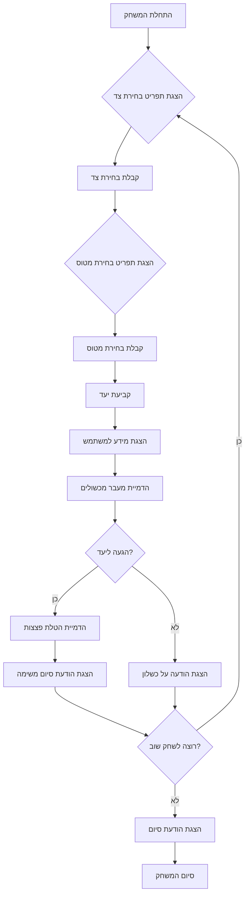
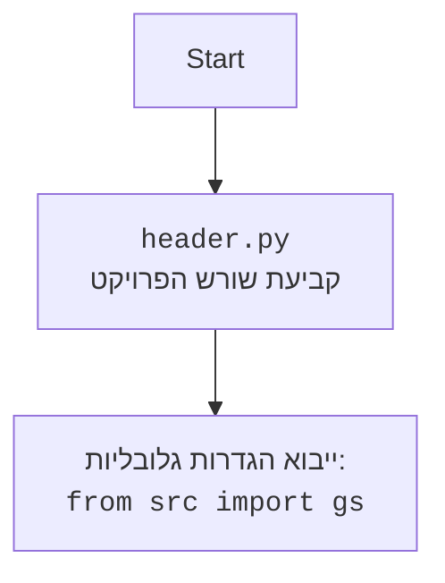

## <algorithm>

1. **אתחול המשחק:**
   - הצגת מסך פתיחה עם כותרת המשחק "BOMBER".
   - הצגת תפריט בחירת צד (איטליה, בעלות הברית, יפן, גרמניה).
     - דוגמה: `print("בחר צד:\n1. איטליה\n2. בעלות הברית\n3. יפן\n4. גרמניה")`
   - קבלת קלט מהמשתמש לבחירת צד.
     - דוגמה: `side = input("> ")`
   - הצגת תפריט בחירת סוג מטוס (B-29, לנקסטר, B-17).
     - דוגמה: `print("בחר סוג מטוס:\n1. B-29\n2. Lancaster\n3. B-17")`
   - קבלת קלט מהמשתמש לבחירת סוג מטוס.
     - דוגמה: `plane = input("> ")`
   - קביעת יעד למשימה באופן אוטומטי או על ידי בחירה.
     - דוגמה: `target = "פלושט"`
   - הצגת מידע למשתמש על הבחירות שלו והיעד.
     - דוגמה: `print(f"בחרת ב{side}, טסת במטוס {plane}. מטרתך היא {target}")`

2. **לולאת משחק עיקרית:**
   - הדמיית מעבר מכשולים (ירי נ"מ, מטוסי אויב).
     - דוגמה: `print("עברת בהצלחה את האש נגד מטוסים")`
   - הצגת הודעה על הגעה ליעד.
     - דוגמה: `print("הגעת ליעד! תתכונן להטלת פצצות")`
   - הדמיית הטלת פצצות והשמדת היעד.
     - דוגמה: `print("השמדת בהצלחה את המטרה!")`
   - הצגת הודעה על סיום המשימה והחזרה לבסיס.
     - דוגמה: `print("השלמת בהצלחה את המשימה! המטוס חוזר לבסיס")`

3. **בדיקת סיום המשחק:**
   - הצגת שאלה אם המשתמש רוצה לשחק שוב.
     - דוגמה: `play_again = input("האם תרצה לשחק שוב? (כן/לא)\n")`
   - אם התשובה "כן", חזור לצעד 1.
   - אם התשובה "לא", הצגת הודעת סיום וסגירת המשחק.
     - דוגמה: `print("להתראות!")`

4. **תרחיש כישלון:**
   - אם המשתמש נכשל בזמן המשחק (למשל, הופל על ידי האויב):
     - דוגמה: `print("הופלת על ידי האויב. אנא נסה שוב")`
   - חזור לצעד 1 או הצג אפשרות לסיים את המשחק.

**זרימת נתונים:**
- קלט משתמש (בחירת צד, מטוס, תגובה לשחק שוב) --> משתנים (side, plane, play_again) --> לוגיקת המשחק --> פלט משתמש (הודעות, שאלה לשחק שוב)
- לוגיקת המשחק משתמשת בערכים שהמשתמש בחר כדי להתאים את חווית המשחק (למשל, יעד המשימה, סוג המטוס).

## <mermaid>

- **תלות מיובאת:** אין תלויות מיובאות בקוד הזה. הקוד הוא תיאור מילולי של המשחק ולא קוד בפועל, ולכן אין צורך לייבא מודולים.
- **שמות משתנים מוסברים:**
  - `A`: התחלת המשחק
  - `B`: הצגת תפריט בחירת צד
  - `C`: קבלת בחירת צד
  - `D`: הצגת תפריט בחירת מטוס
  - `E`: קבלת בחירת מטוס
  - `F`: קביעת יעד
  - `G`: הצגת מידע למשתמש
  - `H`: הדמיית מעבר מכשולים
  - `I`: הגעה ליעד?
  - `J`: הדמיית הטלת פצצות
  - `K`: הצגת הודעת סיום משימה
  - `L`: רוצה לשחק שוב?
  - `M`: הצגת הודעת סיום
   - `N`: הצגת הודעה על כשלון
  - `O`: סיום המשחק

## <explanation>

**ייבואים (Imports):**
- אין ייבואים בקוד זה, מכיוון שהוא תיאור מילולי של המשחק ולא קוד פייתון.

**מחלקות (Classes):**
- אין מחלקות בקוד זה.

**פונקציות (Functions):**
- אין פונקציות מוגדרות בקוד זה, כיוון שהוא מתאר את הלוגיקה הכללית של המשחק.

**משתנים (Variables):**
- `side`: סוג מחרוזת, המייצג את הצד שבחר השחקן (איטליה, בעלות הברית, יפן, גרמניה).
- `plane`: סוג מחרוזת, המייצג את סוג המטוס שבחר השחקן (B-29, לנקסטר, B-17).
- `target`: סוג מחרוזת, המייצג את היעד של המשימה (למשל, "פלושט").
- `play_again`: סוג מחרוזת, המכיל את התשובה של השחקן אם הוא רוצה לשחק שוב ("כן" או "לא").

**הסברים מפורטים:**

- הקוד מספק תיאור מילולי של משחק ה"BOMBER", שבו השחקן משחק טייס מפציץ במלחמת העולם השנייה. הוא מתאר את שלבי המשחק השונים, החל מבחירת צד ומטוס, דרך המשימה עצמה, ועד לסיום המשחק.
- ההוראות מחולקות לשלבים ברורים: אתחול המשחק, לולאת המשחק העיקרית, ספירת ניצחון וסיום המשחק. בכל שלב, הקוד מפרט מה אמור לקרות, כולל הדוגמאות של הודעות למשתמש.
- **בעיות אפשריות או תחומי שיפור:**
   - הקוד חסר מימוש בפועל, הוא רק תיאור. צריך לממש אותו בשפת תכנות (למשל, פייתון).
   - אין טיפול מפורט בכישלון במהלך המשחק (למשל, פגיעה במטוס).
   - חסרה אינטראקציה מורכבת, כגון בחירת יעד על ידי המשתמש, או אפשרות להשתמש בפצצות שונות.
   - חסרים אלמנטים גראפיים או ממשק משתמש, שמשפרים את חווית המשחק.

**שרשרת קשרים עם חלקים אחרים בפרויקט (אם רלוונטי):**
- הקוד הזה כרגע הוא עצמאי, אך הוא יכול לשמש כבסיס לפיתוח משחק בפועל בפרויקט "hypotez". הוא יכול להיות מחובר למודולים אחרים שאחראים על קלט, פלט, גרפיקה ולוגיקת משחק.
- הוא יכול להשתמש במודולים של הפרויקט "src." כדי לייבא הגדרות גלובליות או להשתמש בממשקי משתמש קיימים בפרויקט.