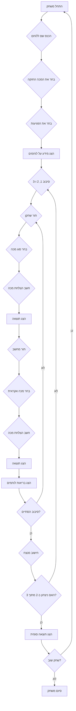

## ניתוח קוד: משחק האיגרוף

### <algorithm>
**תרשים זרימה של משחק האיגרוף:**

1. **אתחול המשחק:**
    -   שחקן מכניס שם ללוחם שלו.
        *דוגמה: "הכנס שם ללוחם שלך: ג'ו".*
    -   שחקן בוחר את המכה החזקה של הלוחם (1-הוק, 2-אפרקוט, 3-ג'ב).
        *דוגמה: "בחר את המכה החזקה שלך (1-הוק, 2-אפרקוט, 3-ג'ב): 2".*
    -   שחקן בוחר את הפגיעות של הלוחם (1-ראש, 2-גוף, 3-רגליים).
        *דוגמה: "בחר את הפגיעות שלך (1-ראש, 2-גוף, 3-רגליים): 1".*
    -   המשחק מציג את המידע של הלוחם והיריב (השם של השחקן, המכה החזקה והפגיעות, והשם של היריב).
        *דוגמה: "הלוחם שלך הוא ג'ו, המכה החזקה שלו היא אפרקוט והפגיעות שלו היא ראש. היריב: סופרמן".*

2.  **מחזור משחק עיקרי (3 סיבובים):**
    -   לכל סיבוב (סיבוב 1, 2 ו-3):
        -   כל סיבוב מורכב ממספר מהלכים.
        -   השחקן והמחשב מבצעים מהלכים לסירוגין.
        -   השחקן בוחר סוג מכה (1-הוק, 2-אפרקוט, 3-ג'ב).
            *דוגמה: "בחר סוג מכה (1-הוק, 2-אפרקוט, 3-ג'ב): 2".*
        -   המשחק מחשב את ההצלחה של המכה של השחקן (על סמך הכוח של המכה, הפגיעות של היריב והאקראיות).
        -   המשחק מציג את תוצאת המכה של השחקן.
            *דוגמה: "הנחתת אפרקוט! סופרמן חוסם!".*
        -   המחשב בוחר מכה.
        -   המשחק מחשב את ההצלחה של המכה של המחשב (על סמך הכוח של המכה, הפגיעות של השחקן והאקראיות).
        -   המשחק מציג את תוצאת המכה של המחשב.
            *דוגמה: "סופרמן מכה בהוק. אתה חוסם!".*
        -   בסוף הסיבוב, המשחק מציג את מצב הבריאות של שני הלוחמים.

3.  **חישוב המנצח:**
    -   אחרי כל סיבוב, המשחק מחשב את כמות המכות שהונחתו ושהתקבלו.
    -   המנצח נקבע על סמך מי ניצח בשני מתוך שלושת הסיבובים.
    -   אם יש תיקו, הסיבוב חוזר על עצמו.

4.  **סיום המשחק:**
    -   המשחק מציג את התוצאה הסופית של המשחק והמנצח.
        *דוגמה: "מזל טוב! סופרמן ניצח!".*
    -   המשחק שואל האם לשחק שוב (כן/לא).
        *דוגמה: "רוצה לשחק שוב? (כן/לא)".*
    -   אם כן, המשחק מתחיל מההתחלה. אם לא, המשחק מסתיים.
        *דוגמה: "ביי!".*

### <mermaid>

**הסבר תלויות:**
*   התרשים מתאר את זרימת העבודה של משחק האיגרוף.
*   הוא לא משתמש בתלויות חיצוניות כמו ספריית יבוא, מאחר והוא רק מתאר את הלוגיקה של המשחק.

### <explanation>

**ייבואים (Imports):**
הקוד המובא אינו כולל יבוא של מודולים חיצוניים, מכיוון שהוא תיאור מילולי של משחק ולא קוד ממשי. כאשר המשחק ימומש בפועל, ייתכן ויהיה צורך לייבא מודולים כגון `random` (ליצירת אקראיות) או `time` (לשליטה בזמן).

**מחלקות (Classes):**
הקוד אינו כולל הגדרות של מחלקות. במימוש עתידי, ניתן יהיה ליצור מחלקות כמו `Fighter` (לוחם) עם מאפיינים כמו שם, מכה חזקה, פגיעות, ושיטות לביצוע מהלכים.

**פונקציות (Functions):**
הקוד אינו כולל הגדרות של פונקציות. במימוש עתידי, ניתן יהיה ליצור פונקציות כמו:
*   `initialize_game()`: לאתחול המשחק והקלטת נתוני השחקן.
*   `play_round()`: להפעלה של סיבוב יחיד.
*   `player_turn()`: לביצוע מהלך על ידי השחקן.
*   `computer_turn()`: לביצוע מהלך על ידי המחשב.
*   `calculate_damage()`: לחישוב הנזק שנגרם ממכה.
*   `determine_winner()`: לקביעת המנצח.
*   `display_results()`: להצגת תוצאות המשחק.
    דוגמאות שימוש:
    *   `initialize_game()` תקרא בתחילת המשחק כדי להכין את הלוחמים.
    *   `play_round()` תקרא בכל תחילת סיבוב.
    *   `calculate_damage()` תקרא לאחר כל מהלך של שחקן או מחשב.
    *   `determine_winner()` תקרא בסוף הסיבוב השלישי כדי לקבוע את המנצח.
    *   `display_results()` תקרא בסוף המשחק כדי להציג את התוצאה הסופית.

**משתנים (Variables):**
*   `player_name` (string): שם הלוחם של השחקן.
*   `player_strong_attack` (integer): סוג המכה החזקה של השחקן (1, 2 או 3).
*   `player_weakness` (integer): הפגיעות של השחקן (1, 2 או 3).
*   `computer_name` (string): שם הלוחם של המחשב.
*   `player_health` (integer): כמות הבריאות של השחקן.
*   `computer_health` (integer): כמות הבריאות של המחשב.
*   `round_number` (integer): מספר הסיבוב הנוכחי.
*   `player_wins` (integer): מספר הניצחונות של השחקן.
*   `computer_wins` (integer): מספר הניצחונות של המחשב.
*   `player_attack` (integer): סוג המכה של השחקן בסיבוב הנוכחי.
    המשתנים ישמשו לשמירת נתונים במהלך המשחק ולחישוב התוצאות.

**בעיות אפשריות או תחומים לשיפור:**

*   **אקראיות:** יש להוסיף אלמנט אקראי (בשימוש ב-`random` ב-Python) לחישוב הצלחת המכות, כדי להפוך את המשחק למעניין יותר.
*   **איזון:** יש לאזן את החוזק של המכות השונות ואת הפגיעות השונות, כדי למנוע מצב בו מכה או פגיעות אחת הופכת לחזקה מידי.
*   **משוב:** כדאי להוסיף פידבק ויזואלי יותר למשחק, כגון אנימציה של מכות או סרגל בריאות משתנה.
*   **ממשק משתמש:** כדאי ליצור ממשק משתמש נוח יותר מהכנסת מספרים, למשל שימוש בכפתורים או תפריט טקסטואלי.
*   **בינה מלאכותית:** ניתן לשפר את ההתנהגות של המחשב על ידי שימוש באלגוריתמים חכמים יותר לבחירת המהלכים.

**קשר עם חלקים אחרים בפרויקט:**
הקוד שמוצג כאן מייצג את לוגיקת המשחק עצמו. הוא יכול להיות חלק ממערכת גדולה יותר, לדוגמא:
*   **ממשק משתמש:**  הקוד יכול להיות מחובר לממשק משתמש גרפי (GUI) או טקסטואלי (TUI) שיציג את המשחק בצורה ידידותית יותר.
*   **מערכת ניהול משחקים:**  הקוד יכול להיות חלק ממערכת המנהלת משחקים שונים, עם אפשרות לשמירת תוצאות וסטטיסטיקות.
*   **ספריית משחקים:** הקוד יכול להיות מודול עצמאי בספרייה של משחקים, המאפשרת שימוש חוזר במכניקות משחק.