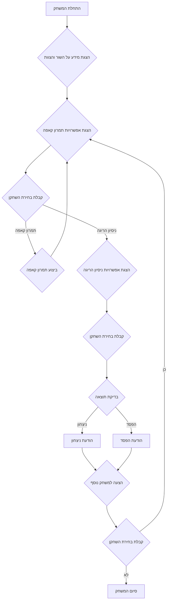

## ניתוח קוד: משחק "בול" (BULL)

### 1. <algorithm>
הקוד מתאר משחק טקסטואלי בשם "בול" (BULL) בו השחקן משחק בתור מטאדור ונלחם בשור. המשחק מתחיל בהצגת מידע על השור והסיטואציה, ואז השחקן בוחר בין תמרונים עם הקאפה או ניסיון להרוג את השור. המשחק נמשך עד שהשחקן הורג את השור או נהרג על ידו.

**תרשים זרימה:**

1.  **התחלה**:
    *   הצגת הודעת פתיחה למשחק.
    *   הצגת מידע על השור ועל תפקוד הצוות (פיקאדורים וטוריאדורים).
    *   **דוגמה**:
        ```
        "ברוכים הבאים למשחק בול! אתה המטאדור.
        על הזירה הופיע שור."
        ```
2.  **לולאת משחק:**
    *   **בחירת תמרון:**
        *   הצגת אפשרויות תמרון עם הקאפה (ורוניקה, תנועה חיצונית, סיבוב רגיל).
        *   קבלת קלט מבחירת השחקן (מספר המייצג את התמרון).
        *   **דוגמה**:
            ```
            "איזה תמרון תרצה לבצע עם הקאפה?
            0 - ורוניקה
            1 - תנועה חיצונית פחות מסוכנת
            2 - סיבוב רגיל"
            ```
    *   **בדיקת בחירה:**
        *   אם השחקן בחר תמרון, ממשיכים לביצוע התמרון.
        *   אם השחקן בחר להרוג את השור, עוברים לשלב הבא.
    *   **ביצוע תמרון קאפה:**
        *   הצגת הודעה על התמרון שבוצע.
        *   **דוגמה**:
            ```
            "ביצעת תנועה חיצונית פחות מסוכנת. השור ממשיך לתקוף."
            ```
    *   **בחירת ניסיון הריגה:**
        *   הצגת אפשרויות לניסיון הריגה (דרך הקרניים או בחזה).
        *   קבלת קלט מבחירת השחקן (מספר המייצג את האפשרות).
        *   **דוגמה**:
             ```
            "האם תרצה לנסות להרוג את השור?
             4 - דרך הקרניים
             5 - בחזה"
             ```
3. **ניסיון הריגה:**
    * בדיקת תוצאה (בהתאם לבחירת השחקן והסיכויים המוגדרים).
     * **דוגמה**:
      * השחקן בחר להרוג את השור דרך החזה.
      * הקוד מחליט רנדומלית אם השחקן מצליח או נכשל.
       
4.  **סיום המשחק:**
    *   **ניצחון:**
        *   אם השחקן הרג את השור, מוצגת הודעת ניצחון.
        *   **דוגמה**:
            ```
            "ברכות, הרגת את השור!"
            ```
    *   **הפסד:**
        *   אם השחקן נהרג על ידי השור, מוצגת הודעת הפסד.
        *   **דוגמה**:
            ```
            "לצערך, השור הכה בך. המשחק נגמר."
            ```
    *   **הצעה למשחק נוסף:**
        *   הצגת שאלה אם השחקן רוצה לשחק שוב.
        *   קבלת קלט מבחירת השחקן (כן/לא).
        *   אם כן - חוזרים ללולאת המשחק.
        *   אם לא - מסיימים את המשחק ומציגים הודעת סיום.
         *   **דוגמה**:
            ```
            "האם תרצה לשחק שוב? (כן/לא)"
            ```

### 2. <mermaid>


**ניתוח תלויות:**
*   **אין תלויות חיצוניות** לקוד זה, מכיוון שהוא מתאר את הלוגיקה של המשחק בלבד. לא מבוצעים ייבוא של מודולים חיצוניים או שימוש בספריות.

### 3. <explanation>

**תיאור כללי:**
הקוד המתואר הוא למעשה תיאור של משחק טקסטואלי בסיסי ולא קוד ממשי. הקוד מתאר את הלוגיקה והשלבים של משחק "בול", בו השחקן משחק בתור מטאדור ונלחם בשור. המשחק כולל אפשרויות תמרון שונות עם קאפה, ניסיון להרוג את השור, והכרעה אם השחקן ניצח או הפסיד.

**ייבוא (Imports):**
אין ייבוא של ספריות חיצוניות.

**מחלקות (Classes):**
אין שימוש במחלקות.

**פונקציות (Functions):**
אין פונקציות מוגדרות באופן מפורש, אבל ניתן להגדיר פונקציות שיממשו כל אחד מהשלבים:
* `start_game()`: התחלת המשחק, הצגת מידע, ואפשרויות ראשוניות.
* `get_cape_maneuver()`: הצגת תמרוני קאפה וקבלת בחירת השחקן.
* `perform_cape_maneuver()`: ביצוע תמרון קאפה והצגת הודעה.
* `get_kill_attempt()`: הצגת אפשרויות לניסיון הריגה וקבלת בחירת השחקן.
* `check_kill_attempt()`: בדיקת תוצאת ניסיון ההריגה.
* `end_game()`: סיום המשחק, הצגת ניצחון/הפסד, והצעה למשחק נוסף.

**משתנים (Variables):**
למשתנים ישמשו לאחסון:
* `player_choice`: בחירת השחקן (מספר המייצג את התמרון או אפשרות ההריגה).
* `game_state`: מצב המשחק (למשל, האם השחקן ניצח או הפסיד).
* `play_again`: בחירת השחקן האם לשחק שוב (כן/לא).

**בעיות אפשריות:**
1.  **חוסר במימוש קוד:** הקוד הוא תיאור של משחק ולא מימוש קוד ממשי.
2.  **רנדומיות פשוטה:** השימוש באקראיות פשוטה (כמו לבדיקת הצלחת ההריגה) עלול להפוך את המשחק לבלתי צפוי ופחות מהנה.
3.  **ממשק טקסטואלי בסיסי:** הממשק טקסטואלי בסיסי וייתכן שיהיה צורך בממשק משתמש מתקדם יותר.
4.  **חוסר במורכבות:** אין מורכבות משמעותית בלוגיקה של המשחק, מה שעלול לגרום לו להפוך משעמם לאחר מספר משחקים.

**תחומים לשיפור:**
1.  **שימוש בפונקציות**: פיצול הקוד לפונקציות נפרדות (כפי שהוצע בסעיף הפונקציות) יגרום לקוד להיות מאורגן יותר, קריא יותר, וקל יותר לתחזוקה.
2.  **הוספת מורכבות**: ניתן להוסיף מורכבות נוספת על ידי הוספת מאפיינים לשור (כמו כוח או מהירות), או הוספת אפשרויות נוספות לשחקן (כמו שימוש בחרב).
3.  **שימוש במחלקות**: ניתן להשתמש במחלקות כדי לייצג את השחקן, את השור, ואת הזירה, ועל ידי כך להפוך את הקוד למובנה יותר.
4.  **איכות רנדומיות**: שימוש באלגוריתמים מתקדמים יותר ליצירת אקראיות (למשל, באמצעות שימוש בהתפלגויות שונות) יכול להפוך את המשחק למעניין יותר.
5.  **ממשק משתמש מתקדם**: ניתן לפתח ממשק משתמש גרפי (GUI) או ממשק טקסטואלי מתקדם יותר (למשל, באמצעות curses) כדי להפוך את המשחק לידידותי ומושך יותר.

**שרשרת קשרים:**
אין קשרים ישירים לקוד אחר בפרויקט. עם זאת, ניתן לחבר קוד זה עם:
* `header.py` (אם קיים) כדי להגדיר משתנים גלובליים וקונפיגורציה של המשחק.
* מודולים אחרים בפרויקט (אם קיימים) כדי לממש את כללי המשחק, מערכת הניקוד, או ממשק המשתמש.