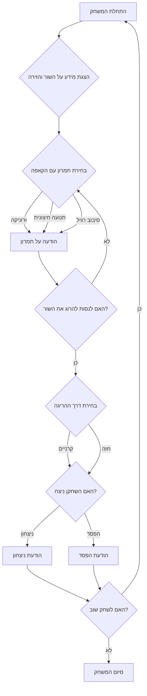

## ניתוח קוד המשחק "BULL"

### 1. <algorithm>
   הקוד מתאר משחק טקסטואלי פשוט בשם "BULL" (מלחמת שוורים) שבו השחקן משחק כמתאדור. המשחק מורכב מרצף של אירועים שהשחקן מגיב אליהם באמצעות בחירת פעולות. הנה תרשים זרימה של תהליך המשחק:

   1. **אתחול המשחק:**
      - הצגת הודעת פתיחה למשחק.
      - הצגת מידע על השור ועל תנאי הזירה (למשל, עבודת הפיקאדורים והטוראדורים).
      - הצגת אפשרויות פעולה ראשוניות: תמרונים עם הקאפה או ניסיון להרוג את השור.
      *דוגמה:*
         ```
         ברוכים הבאים למשחק מלחמת שוורים!
         אתה המתאדור. השור מופיע בזירה.
         איזה תמרון אתה רוצה לבצע עם הקאפה?
         0 - ורוניקה
         1 - תנועה חיצונית פחות מסוכנת
         2 - סיבוב רגיל של הקאפה
         ```

   2. **לולאת המשחק:**
      - השחקן בוחר תמרון עם הקאפה (ורוניקה, תנועה חיצונית, סיבוב רגיל).
      - אם השחקן בוחר תמרון עם הקאפה, המשחק מגיב בהודעה וחוזר לשלב הבחירה.
      *דוגמה:*
         ```
         ביצעת תנועה חיצונית פחות מסוכנת. השור ממשיך לתקוף.
         האם אתה רוצה לנסות להרוג את השור?
         (4 - דרך הקרניים, 5 - בחזה)
         ```
      - השחקן יכול לבחור לנסות להרוג את השור (דרך הקרניים או בחזה).
      *דוגמה:*
         ```
         > 5
         ```
      - המשחק קובע את תוצאת הפעולה (הצלחה או כישלון) בצורה אקראית.
      - אם השחקן מצליח להרוג את השור, המשחק מסתיים בניצחון.
      - אם השחקן נהרג על ידי השור, המשחק מסתיים בהפסד.
        *דוגמה:*
           ```
          הרגת את השור. ניצחת!
          ```
           או
           ```
          השור פגע בך. הפסדת!
          ```
   3. **סיום המשחק:**
      - הצגת הודעת סיום (ניצחון או הפסד).
      - שאלה האם השחקן רוצה לשחק שוב.
      - אם השחקן בוחר לשחק שוב, המשחק חוזר לשלב האתחול. אחרת, המשחק מסתיים.
      *דוגמה:*
         ```
        האם ברצונך לשחק שוב? (כן/לא)
        ```

### 2. <mermaid>

הסבר:
- תרשים הזרימה מתאר את הלוגיקה של המשחק בצורה גרפית.
- כל קופסה מייצגת שלב או החלטה במשחק.
- החצים מראים את הזרימה של התהליך, כאשר התהליך מתחיל ב"התחלת המשחק" ועובר בין שלבים בהתאם לבחירות השחקן ולתוצאות אקראיות.
- שמות המשתנים ב-mermaid הם תיאוריים ומסבירים את מהות כל שלב בתהליך.

### 3. <explanation>
- **ייבואים:**
  אין ייבוא מפורש בתיאור המשחק, אך ניתן להניח שקיימים ייבואים של מודולים סטנדרטיים של פייתון כמו `random` (אם מבוצעת בחירה אקראית של תוצאות הפעולות) ו- `input` (לקבלת קלט מהמשתמש).
- **מחלקות:**
  אין שימוש במחלקות בתיאור המשחק. המשחק בנוי על פונקציות ומשתנים.
- **פונקציות:**
    - לא מוגדרות פונקציות בתיאור המשחק. אולם, ניתן להסיק קיום של פונקציות עיקריות שיבצעו את השלבים הבאים:
        -  **`initialize_game()`**: אתחול המשחק, הצגת הודעות פתיחה, מידע על השור והזירה, הצגת אפשרויות הפעולה הראשוניות.
        -  **`handle_cape_maneuver(choice)`**: טיפול בתמרון עם הקאפה, בחירת התמרון, הצגת הודעות מתאימות.
        -  **`attempt_kill(choice)`**: טיפול בניסיון להרוג את השור, בחירת דרך ההריגה, קביעת תוצאה אקראית (הצלחה או כישלון), סיום המשחק בהתאם לתוצאה.
        -  **`play_again()`**: שאילת השחקן אם הוא רוצה לשחק שוב.
        -  **`main()`**: הפונקציה הראשית שתנהל את הלוגיקה של המשחק, תשתמש בפונקציות האחרות.
- **משתנים:**
    -  `player_choice` (מספר שלם): הבחירה של השחקן (תמרון עם הקאפה או ניסיון להרוג את השור).
    - `game_over` (בוליאני): סימן סיום המשחק (True אם המשחק הסתיים, False אם לא).
    - `bull_killed` (בוליאני): סימן אם השור נהרג (True אם השור נהרג, False אם לא).
    - `result` (מחרוזת): תוצאת המשחק (ניצחון או הפסד).
    - `play_again_choice` (מחרוזת): תשובת השחקן האם הוא רוצה לשחק שוב.

**בעיות אפשריות ותחומים לשיפור:**

- **אקראיות פשוטה:** המשחק משתמש באקראיות פשוטה לקביעת תוצאות הפעולות, מה שעשוי להפוך אותו לפחות מעניין אחרי כמה משחקים.
- **מבנה לא מודולרי:** תיאור המשחק מצביע על קוד לא מודולרי עם פונקציות שאינן מוגדרות בצורה מפורשת, מה שמקשה על קריאות הקוד ועל הרחבתו.
- **אינטראקציה מוגבלת:** המשחק מוגבל לאינטראקציה טקסטואלית בלבד, מה שהופך אותו לפחות מרתק.

**שרשרת קשרים עם חלקים אחרים בפרויקט:**

- אין קשר מפורש עם חלקים אחרים בפרויקט. אולם, הקוד יכול להשתלב בחלק גדול יותר של משחקים מבוססי טקסט.