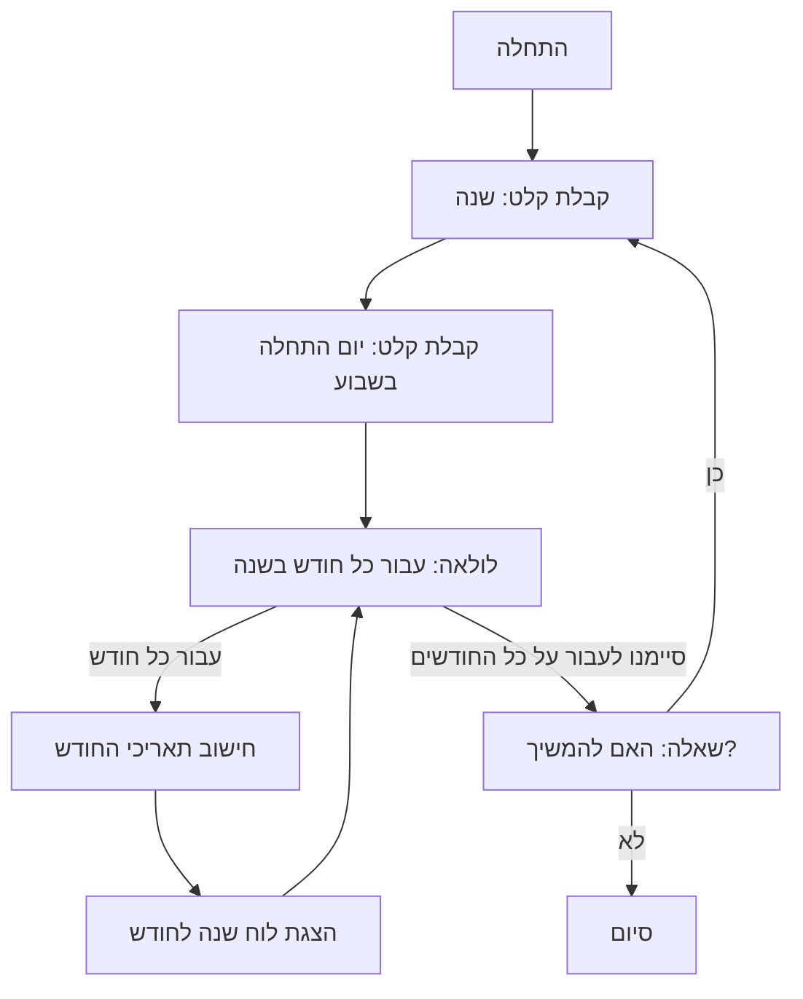

## ניתוח קוד: משחק CALNDR (לוח שנה תמידי)

### 1. <algorithm>

הקוד מתאר את הפונקציונליות של משחק CALNDR, שהוא תוכנית המציגה לוח שנה עבור שנה נתונה. התהליך מפורט בשלבים הבאים:

1.  **אתחול המשחק:**
    *   התוכנית מבקשת מהמשתמש להזין שנה ושבוע שבו השנה מתחילה.
        *   דוגמה: משתמש מזין `2024` לשנה ו`-1` לשבוע שבו השנה מתחילה (יום שני).

2.  **לולאה מרכזית:**
    *   התוכנית יוצרת לולאה שעוברת על כל חודש בשנה.
        *   דוגמה: לולאה רצה 12 פעמים, פעם אחת עבור כל חודש בשנה.
    *   עבור כל חודש, התוכנית מחשבת את תאריכי החודש ומציגה אותם בפורמט של לוח שנה.
        *   דוגמה: עבור חודש ינואר 2024, התוכנית תציג את הימים מה-1 עד ה-31, עם ימים מתאימים בשבוע.
    *   התוכנית מדפיסה את שם החודש והשנה, ואז מדפיסה את הימים בשבוע (ראשון, שני וכו').
        *   דוגמה: פלט יתחיל עם "ינואר 2024" ואז הכותרות "א  ב  ג  ד  ה  ו  ש".
    *   התוכנית ממשיכה להדפיס את תאריכי החודש, כאשר כל שורה מייצגת שבוע בלוח השנה.
        *   דוגמה: שורת הפלט הראשונה עשויה להיות "1  2  3  4  5  6  7", כאשר כל מספר מייצג את היום בחודש, ומיקום המספר תואם את היום בשבוע.

3.  **סיום המשחק:**
    *   התוכנית שואלת את המשתמש אם הוא רוצה להציג לוח שנה לשנה אחרת.
        *   דוגמה: "האם תרצה להציג לוח שנה לשנה אחרת? (כן/לא)"
    *   אם המשתמש מזין "כן", התוכנית חוזרת לשלב 1. אחרת, התוכנית מסתיימת.
        *   דוגמה: אם המשתמש מזין "לא", התוכנית תדפיס הודעת סיום ותסתיים.

### 2. <mermaid>

הקוד אינו כולל ייבוא `header.py`, לכן אין צורך בתרשים זרימה של `header.py`.

### 3. <explanation>

*   **ייבואים (Imports):** אין ייבואים בקוד זה מכיוון שהתיאור ממוקד בעיקר בלוגיקה של המשחק ולא ביישום בפועל.
*   **מחלקות (Classes):** אין שימוש במחלקות בקוד זה.
*   **פונקציות (Functions):**
    *   אין פונקציות מוגדרות בקוד הזה, אבל התיאור מרמז על קיום פונקציה שתחשב את הימים בכל חודש, ופונקציה שתציג את לוח השנה.
*   **משתנים (Variables):**
    *   `year`: משתנה מספרי שלם שמייצג את השנה שהמשתמש הזין.
    *   `start_day`: משתנה מספרי שלם שמייצג את יום השבוע שבו השנה מתחילה.
    *   לולאות ומשתנים פנימיים שמשמשים לעיבוד חודשים, ימים ותאריכים (לדוגמה, משתנה שיספור את מספר הימים בחודש).

**הסברים מפורטים:**

*   הקוד מתאר תהליך לחישוב והצגה של לוח שנה עבור כל שנה נתונה. זה מבוסס על לולאה שעוברת על כל חודש, חישוב ימי החודש, והצגתם במבנה טבלאי.
*   התוכנית תלויה בקלט המשתמש עבור השנה ויום התחלה בשבוע, ועליה לבדוק תקינות קלט זה.
*   בעיות אפשריות:
    *   הקוד לא מטפל בשנים מעוברות (שנה מעוברת), דבר שידרוש לוגיקה נוספת.
    *   הקוד לא מטפל בבדיקת תקינות קלט המשתמש (לדוגמה, הכנסת מספר שגוי עבור יום התחלה בשבוע).
*   תחומים לשיפור:
    *   הוספת תמיכה בשנים מעוברות.
    *   הוספת טיפול שגיאות בקלט.
    *   יצירת פונקציות נפרדות לחישוב ופלט, דבר שיגרום לקוד להיות מודולרי יותר.

**שרשרת קשרים עם חלקים אחרים בפרויקט:**

*   הקוד הזה משתמש בהגדרות ופונקציות מהמשחק `WEKDAY` לצורך חישוב יום השבוע של 1 בינואר, מה שמראה שהוא תלוי בו. ייתכן וישנה אינטראקציה גם עם חלקים אחרים בפרויקט כמו ממשק משתמש או עיצוב גרפי, אך אלו לא מצוינים בתיאור.