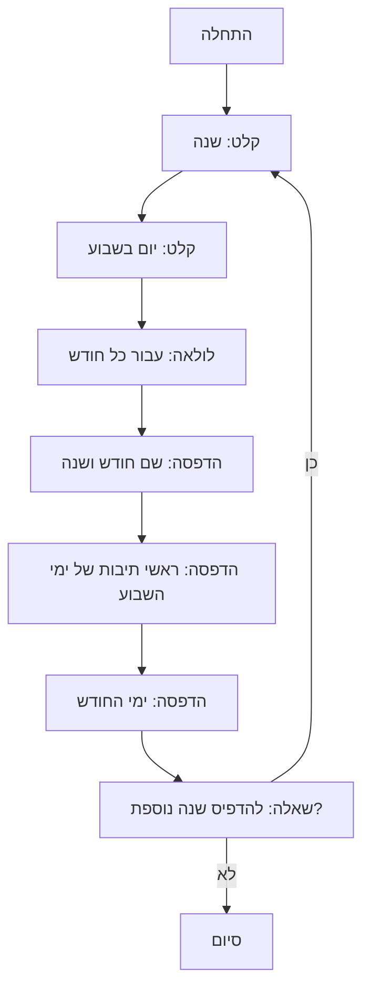

## ניתוח קוד המשחק CALNDR

### 1. <algorithm>

הקוד המתואר הוא תיאור מילולי של המשחק "CALNDR", המשמש ליצירת לוח שנה עבור שנה נתונה. להלן תיאור תהליך העבודה של המשחק צעד-אחר-צעד:

1.  **אתחול המשחק:**
    *   המשחק מתחיל בהצגת הודעת פתיחה למשתמש.
    *   המשתמש מתבקש להזין את השנה הרצויה.
        *   לדוגמה, המשתמש מזין `2024`.
    *   המשתמש מתבקש להזין את היום בשבוע שבו מתחילה השנה (0 עבור יום ראשון, -1 עבור יום שני, וכן הלאה).
        *   לדוגמה, המשתמש מזין `-1` (יום שני).
2.  **לולאה ראשית של המשחק:**
    *   המשחק עובר על כל חודש בשנה שהוזנה.
        *   לדוגמה, מתחיל בינואר וממשיך עד דצמבר.
    *   עבור כל חודש, המשחק מדפיס את שם החודש והשנה.
        *   לדוגמה, מדפיס "ינואר 2024".
    *   המשחק מדפיס את ראשי התיבות של ימי השבוע (בדרך כלל, שני עד ראשון).
    *   המשחק מדפיס את ימי החודש, תוך התאמת היום בשבוע.
        *   לדוגמה, אם החודש מתחיל ביום שני, המספר 1 יודפס מתחת ל"שני".
        *   כל שבוע יודפס בשורה נפרדת.
3.  **סיום המשחק:**
    *   לאחר הדפסת כל החודשים, המשחק שואל את המשתמש אם הוא רוצה להדפיס לוח שנה עבור שנה אחרת.
        *   לדוגמה, השאלה: "האם תרצה להדפיס לוח שנה עבור שנה אחרת? (כן/לא)"
    *   אם המשתמש משיב "כן", המשחק חוזר לשלב 1.
    *   אם המשתמש משיב "לא", המשחק מסתיים בהודעת תודה.

**זרימת נתונים:**

1.  **קלט משתמש:** השנה והיום בשבוע שבו מתחילה השנה מוזנים על ידי המשתמש.
2.  **עיבוד:** המשחק משתמש במידע זה כדי לחשב את הימים בכל חודש.
3.  **פלט:** המשחק מדפיס את לוח השנה.

### 2. <mermaid>

**הסבר:**

*   `Start`: תחילת המשחק.
*   `InputYear`: קליטת השנה מהמשתמש.
*   `InputDay`: קליטת היום בשבוע שבו מתחילה השנה מהמשתמש.
*   `LoopMonths`: לולאה שעוברת על כל חודשי השנה.
*   `PrintMonth`: הדפסת שם החודש והשנה.
*   `PrintDaysOfWeek`: הדפסת ראשי התיבות של ימי השבוע.
*   `PrintDaysOfMonth`: הדפסת ימי החודש בהתאמה לימי השבוע.
*   `CheckContinue`: בדיקה אם המשתמש מעוניין להדפיס לוח שנה עבור שנה נוספת.
*   `End`: סיום המשחק.

**הערות:**

*   התרשים מתאר את הזרימה הכללית של המשחק, ללא התייחסות לפרטים טכניים כמו חישובים או ניהול תאריכים.
*   התרשים כולל שמות משמעותיים למשתנים כדי להקל על ההבנה.

### 3. <explanation>

**הסברים מפורטים:**

*   **ייבואים (Imports)**: אין ייבוא משום שהקוד הוא תיאור מילולי של המשחק ולא קוד פועל.
*   **מחלקות (Classes)**: אין מחלקות משום שהקוד הוא תיאור מילולי של המשחק ולא קוד פועל.
*   **פונקציות (Functions)**: אין פונקציות מוגדרות באופן מפורש בקוד התיאור, אבל באופן עקרוני התוכנית תשתמש בפונקציות פנימיות או בספריות חיצוניות לשם ביצוע פעולות הדפסה, קליטת קלט וחישובי תאריכים.
*   **משתנים (Variables)**:
    *   `year`: משתנה שלם שמייצג את השנה שהמשתמש הזין.
    *   `start_day`: משתנה שלם שמייצג את היום בשבוע שבו מתחילה השנה.
    *   `month`: משתנה שמייצג את החודש הנוכחי בלולאה.
    *   `day`: משתנה שמייצג את היום בחודש הנוכחי.

**בעיות אפשריות או תחומים לשיפור:**

1.  **קלט לא תקין:** הקוד לא מטפל במקרים שבהם המשתמש מזין קלט לא תקין (למשל, מחרוזת במקום מספר).
2.  **חישוב תאריכים:** הקוד לא מספק הסבר מפורט על האופן שבו מחושבים התאריכים והימים בשבוע. מידע זה יהיה קריטי ליישום בפועל.
3.  **שנה מעוברת:** הקוד מציין כי יש צורך בשינויים נוספים כדי להתמודד עם שנים מעוברות, אך לא מספק פרטים כיצד ליישם זאת.
4.  **הפרדה בין לוגיקה לתצוגה:** הקוד מערבב בין הלוגיקה של המשחק לבין אופן ההצגה של לוח השנה. רצוי להפריד בין החישובים לבין עיצוב הפלט.
5.  **אין קוד מימוש:** הקוד הוא רק תיאור מילולי, ואין קוד מימוש בפועל. יהיה צורך לתרגם את התהליך הזה לקוד תוכנה.

**שרשרת קשרים עם חלקים אחרים בפרויקט:**

*   הקוד לא כולל קשר ישיר עם חלקים אחרים בפרויקט, מכיוון שהוא תיאור מילולי של משחק. עם זאת, כאשר ייושם, הוא עשוי להשתמש בספריות חיצוניות לחישוב תאריכים ולניהול קלט/פלט.
*   בנוסף, המשחק עשוי להיות חלק ממערכת משחקים כוללת, במקרה כזה יהיו לו קשרים לממשק משתמש של המערכת.

**סיכום:**

התיאור המילולי של המשחק "CALNDR" מספק תמונה ברורה של הפעולות הנדרשות כדי להדפיס לוח שנה. עם זאת, הוא חסר פרטים לגבי האופן שבו החישובים מבוצעים. כמו כן, יש צורך לטפל במקרים קצה כמו קלט שגוי, שנים מעוברות, וכן להפריד בין הלוגיקה של המשחק לבין עיצוב הפלט.