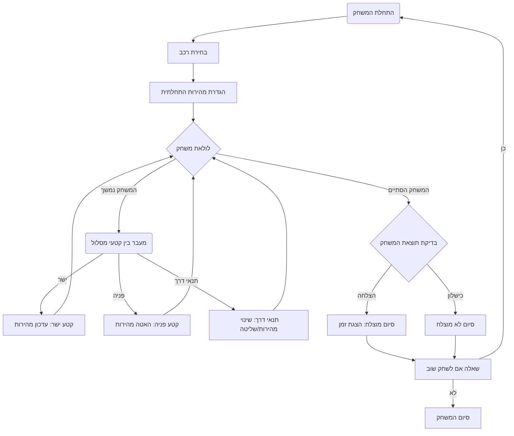

## <algorithm>

1. **התחלת המשחק:**
   - הצגת הודעת פתיחה למשתמש, לדוגמה: "ברוכים הבאים למרוצי CAN-AM!".
   - בחירת רכב מתוך רשימה, לדוגמה: "בחר את הרכב שלך (McLaren, Lola ועוד): McLaren".
   - הגדרת מהירות התחלתית, לדוגמה: "המירוץ מתחיל! המהירות שלך היא 100 מייל לשעה".
   - **דוגמה:** `game_start = True; selected_car = "McLaren"; current_speed = 100`

2. **לולאת המשחק הראשית:**
   - כל עוד המשחק לא הסתיים:
     - מעבר בין קטעי מסלול שונים (ישרים, פניות, תנאי דרך).
       - **קטע ישר:**
         - הצגת הודעה על קטע ישר ועדכון מהירות.
         - **דוגמה:** `track_section = "straight"; current_speed = 150; display_message("ישר. מהירות: 150 מייל לשעה.")`
       - **פניה:**
         - הצגת הודעה על פניה והאטה במהירות.
         - **דוגמה:** `track_section = "turn"; current_speed = 50; display_message("פניה 1. האטה ל-50 מייל לשעה.")`
       - **תנאי דרך (שמן, גשם):**
         - הצגת הודעה על תנאי הדרך והתאמת המהירות או השליטה.
         - **דוגמה:** `track_condition = "oil"; display_message("זהירות, שמן על המסלול!"); apply_condition_effect(condition="oil")`
     - חישוב זמן המשחק (ניתן להשתמש בטיימר).
   - **דוגמה:** `while game_running: track_section = next_track_section(); if track_section == "straight": ... elif track_section == "turn": ... elif track_section == "condition": ... ; update_timer()`

3. **סיום המשחק:**
   - בדיקה האם המשתמש סיים את המירוץ בהצלחה או התרסק.
   - אם המשתמש סיים בהצלחה:
     - הצגת הודעה על סיום מוצלח וזמן המשחק.
     - **דוגמה:** `if race_completed: display_message("סיימת בהצלחה את המרוץ ב 2:35!");`
   - אם המשתמש התרסק:
     - הצגת הודעה על כישלון.
     - **דוגמה:** `if crash_occured: display_message("התרסקת. נסה שוב!");`
   - שאלה אם המשתמש רוצה לשחק שוב.
   - **דוגמה:** `replay = ask_replay(); if replay: start_new_game(); else: display_message("תודה ששיחקת!")`

4. **לולאת שיחזור:**
   - אם המשתמש בוחר לשחק שוב, המשחק חוזר לשלב 1 (התחלת המשחק).
   - **דוגמה:** `if replay == "yes": game_start = True;`

## <mermaid>

## <explanation>

**ייבואים (Imports):**
אין ייבוא מפורש בקוד שסופק, אבל אם היו, הם היו כוללים:
- `time`: לחישוב זמן משחק.
- `random`: לשימוש באירועים רנדומליים כמו תנאי דרך.
- `src.gs`: אם הפרויקט כולל `src.gs` זה יכיל הגדרות גלובליות או משתנים שונים המשמשים את כל חלקי הפרויקט.

**מחלקות (Classes):**
- אין מחלקות מוגדרות בקוד שסופק. אם היו, המחלקות היו יכולות לכלול:
    - `Car`: לייצג את הרכב, עם מאפיינים כמו מהירות, דגם וכו'.
    - `Track`: לייצג את המסלול, עם שיטות לחישוב קטעי מסלול.
    - `Game`: לניהול כלל המשחק, אינטראקציה בין הרכב והמסלול, מצב המשחק, וכו'.
- המאפיינים של מחלקות היו יכולים להיות:
    - `Car`: `speed`, `model`, `control`.
    - `Track`: `length`, `sections`, `weather`.
    - `Game`: `status`, `player_car`, `track`.
- האינטראקציות היו כוללות קריאה לשיטות של המחלקות האחרות, למשל, `Game` יקרא לשיטות של `Track` ו-`Car`.

**פונקציות (Functions):**
- **`start_game()`**:
  - **פרמטרים**: אין.
  - **ערך מוחזר**: אין.
  - **מטרה**: לאתחל את המשחק, להציג הודעת פתיחה, לבחור רכב ולהגדיר מהירות התחלתית.
  - **דוגמה:** `start_game()` תציג הודעה למשתמש, תאפשר לו לבחור רכב ותגדיר מהירות התחלתית.
- **`next_track_section()`**:
  - **פרמטרים**: אין.
  - **ערך מוחזר**: `str` - שם קטע המסלול הבא (`straight`, `turn`, `condition`).
  - **מטרה**: להחזיר את קטע המסלול הבא כדי לעדכן את מצב המשחק.
  - **דוגמה:** `track_section = next_track_section()`.
- **`update_speed(track_section, current_speed)`**:
  - **פרמטרים**: `track_section` מסוג `str`, `current_speed` מסוג `int`.
  - **ערך מוחזר**: `int` - מהירות מעודכנת.
  - **מטרה**: לעדכן את המהירות בהתאם לקטע המסלול.
  - **דוגמה:** `current_speed = update_speed(track_section="turn", current_speed=150)`.
- **`apply_condition_effect(condition)`**:
  - **פרמטרים**: `condition` מסוג `str` - תנאי הדרך (`oil`, `rain`).
  - **ערך מוחזר**: אין.
  - **מטרה**: ליישם את ההשפעה של תנאי הדרך על הרכב.
  - **דוגמה:** `apply_condition_effect(condition="oil")` תגרום לאיבוד שליטה או האטה.
- **`display_message(message)`**:
  - **פרמטרים**: `message` מסוג `str` - ההודעה להצגה.
  - **ערך מוחזר**: אין.
  - **מטרה**: להציג הודעה למשתמש.
  - **דוגמה:** `display_message("זהירות, שמן על המסלול!")`.
- **`ask_replay()`**:
  - **פרמטרים**: אין.
  - **ערך מוחזר**: `str` - `yes` או `no`.
  - **מטרה**: לשאול את המשתמש אם הוא רוצה לשחק שוב.
  - **דוגמה:** `replay = ask_replay()` תשאל את המשתמש "האם אתה רוצה לשחק שוב?" ותחזיר את התשובה שלו.

**משתנים (Variables):**
- `selected_car`: מסוג `str`, שומר את הרכב שבחר המשתמש.
- `current_speed`: מסוג `int`, שומר את המהירות הנוכחית של הרכב.
- `track_section`: מסוג `str`, שומר את קטע המסלול הנוכחי.
- `game_running`: מסוג `bool`, שומר את מצב המשחק (האם המשחק רץ או הסתיים).
- `replay`: מסוג `str`, שומר את תשובת המשתמש לשאלה אם לשחק שוב.

**בעיות אפשריות ותחומים לשיפור:**
- אין יישום מפורט של הלוגיקה של המשחק, רק תיאור.
- אין ממשק משתמש, המשחק מתואר באמצעות טקסט בלבד.
- חסרה התייחסות מפורטת למנגנון הניקוד או הזמן.
- אין טיפול מפורט באפשרויות כמו תנאי דרך מורכבים או אינטראקציות בין שחקנים.
- אין מנגנון לטיפול בשגיאות (למשל, קלט לא תקין).

**שרשרת קשרים:**
- המשחק מבוסס על אינטראקציה בין המשתמש (בחירת רכב, החלטה לשחק שוב) לבין הלוגיקה של המשחק (מעבר בין קטעי מסלול, עדכון מהירות, בדיקת תוצאה).
- אם היו מחלקות, הקשרים היו נבנים על בסיס אינטראקציה בין אובייקטים שונים, לדוגמה `Game` משתמש ב`Car` וב`Track`.
- ייתכן שרשרת קשרים נוספת אם יש ממשק משתמש, או אם יש אלמנטים של רשת למשחק מרובה משתתפים.