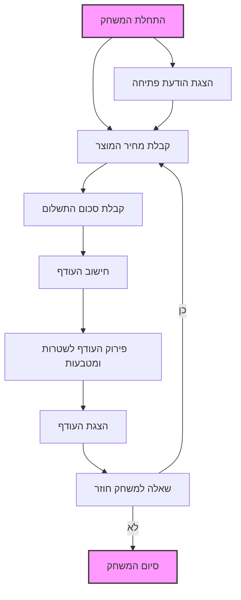

## `<algorithm>`:
1. **התחלה**:
   - התחל את המשחק "CHANGE".
   - הצג הודעת פתיחה לשחקן.
   - לדוגמה: `Добро пожаловать в игру CHANGE!`

2. **קלט נתונים**:
   - קבל מהשחקן את מחיר המוצר.
     - לדוגמה: `4.59` דולר.
   - קבל מהשחקן את סכום התשלום.
     - לדוגמה: `10.00` דולר.

3. **חישוב עודף**:
   - חשב את ההפרש בין סכום התשלום למחיר המוצר.
     - לדוגמה: `10.00 - 4.59 = 5.41` דולר.

4. **פירוק העודף למטבעות ושטרות**:
   - אתחל רשימת סוגי שטרות ומטבעות זמינים לשימוש (למשל: 5 דולר, 1 דולר, 25 סנט, 10 סנט, 5 סנט, 1 סנט).
   - בצע לולאה על כל אחד מסוגי המטבעות והשטרות:
     - קבע כמה יחידות מסוג זה ניתן להחזיר כעודף:
       - לדוגמה: אם העודף הוא 5.41 דולר, וכעת נבדק השטר של 5 דולר, נחזיר 1 שטר של 5 דולר. העודף שנותר הוא 0.41 דולר.
       - לדוגמה: אם העודף שנותר הוא 0.41 דולר, ובודקים את המטבע של 25 סנט, נחזיר 1 מטבע של 25 סנט. העודף שנותר הוא 0.16 דולר.
       - וכן הלאה.
     - עדכן את העודף הנותר.

5. **הצגת העודף**:
   - הצג את סכום העודף הכולל.
   - הצג את פירוט העודף לפי סוגי המטבעות והשטרות שהוחזרו.
     - לדוגמה:
        ```
        Сдача: $5.41
        1 пятидолларовая купюра
        1 четверть
        1 десять центов
        1 никель
        1 пенни
        ```

6. **שאלה למשחק חוזר**:
    - שאל את השחקן אם הוא רוצה לשחק שוב.
      - לדוגמה: `Хотите сыграть снова? (да/нет)`
    - אם התשובה חיובית, חזור לשלב 2.
    - אם התשובה שלילית, עבור לשלב 7.

7. **סיום**:
    - הצג הודעת סיום.
      - לדוגמה: `Спасибо за игру!`

## `<mermaid>`:


## `<explanation>`:

**הסבר כללי:**
המשחק "CHANGE" מדמה קופה רושמת בה השחקן מזין את מחיר המוצר וסכום התשלום, והתוכנית מחשבת ומציגה את העודף בחלוקה לשטרות ומטבעות.

**פירוט השלבים:**

1.  **התחלה (Start):**
    -   המשחק מתחיל בהצגת הודעת פתיחה למשתמש.
    -   לאחר מכן, התוכנית עוברת לשלב קבלת הנתונים מהמשתמש.

2.  **קלט נתונים (InputProductCost, InputPaymentAmount):**
    -   המשתמש מתבקש להזין את מחיר המוצר וסכום התשלום.
    -   הנתונים נשמרים בזיכרון כדי להשתמש בהם בשלבים הבאים.

3.  **חישוב עודף (CalculateChange):**
    -   התוכנית מחשבת את ההפרש בין סכום התשלום למחיר המוצר.
    -   התוצאה היא סכום העודף שיש להחזיר למשתמש.
    -   לדוגמה: אם מחיר המוצר הוא 4.59 דולר וסכום התשלום הוא 10 דולר, העודף יהיה 5.41 דולר.

4.  **פירוק העודף לשטרות ומטבעות (DecomposeChange):**
    -   התוכנית משתמשת ברשימת שטרות ומטבעות זמינים (לדוגמה: 5 דולר, 1 דולר, 25 סנט, 10 סנט, 5 סנט, 1 סנט).
    -   היא עוברת על הרשימה מהערך הגדול לקטן ומוציאה את מספר השטרות/מטבעות המקסימלי מכל סוג שאפשר להחזיר עד שהעודף מתאפס.
    -   לדוגמה: עבור עודף של 5.41 דולר, התוכנית תחזיר שטר אחד של 5 דולר, רבע אחד (25 סנט), מטבע של 10 סנט, מטבע של 5 סנט, ומטבע של 1 סנט.

5.  **הצגת העודף (DisplayChange):**
    - התוכנית מציגה את סכום העודף הכולל.
    - לאחר מכן, היא מציגה את פירוט העודף: כמה שטרות ומטבעות מכל סוג יוחזרו.

6.  **שאלה למשחק חוזר (PlayAgainQuestion):**
    - התוכנית שואלת את המשתמש האם הוא רוצה לשחק שוב.
    - אם המשתמש משיב "כן", המשחק חוזר לתחילת שלב 2 (קלט נתונים).
    - אם המשתמש משיב "לא", המשחק מסתיים.

7.  **סיום (End):**
    -   התוכנית מציגה הודעת סיום.

**בעיות אפשריות ושיפורים:**
-   **טיפול בשגיאות:** הקוד לא כולל בדיקות תקינות לקלט המשתמש. לדוגמה, מה יקרה אם המשתמש יזין מחרוזת במקום מספר? או אם סכום התשלום נמוך ממחיר המוצר?
-   **גמישות:** רשימת השטרות והמטבעות מוגדרת מראש. אפשר לשפר את הקוד על ידי הגדרת רשימה כזו באופן דינמי.
-   **ממשק משתמש:** המשחק פשוט מאוד מבחינת ממשק המשתמש. אפשר לשפר אותו ולהוסיף אלמנטים ויזואליים.

**שרשרת קשרים עם חלקים אחרים בפרויקט:**
מאחר שמדובר בתיאור של כללי המשחק, אין כאן תלות בקוד ממשי. כאשר נכתוב קוד ממשי, הוא יכיל את הלוגיקה הזו וישתמש בשיטות ובמחלקות כדי להשיג את המטרה. הקוד הממשי יכלול שימוש בפונקציות לקבלת קלט, חישוב והצגה של פלט, ובאופן פוטנציאלי גם לולאות כדי לאפשר משחק רציף.