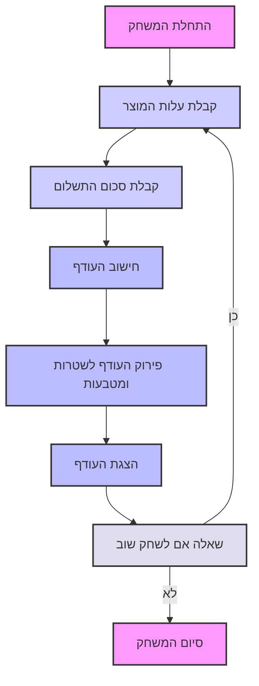

## ניתוח קוד המשחק CHANGE (תוכנית קופה)

### 1. <algorithm>
האלגוריתם של משחק CHANGE מתמקד בסימולציה של תהליך קופה, בו המחשב מחשב את העודף בהתבסס על עלות המוצר וסכום התשלום שהלקוח משלם.

**תרשים זרימה שלבי:**

1.  **התחלת משחק:**
    *   המשחק מברך את המשתמש ("ברוכים הבאים למשחק CHANGE!").
    *   דוגמה: `console.log("ברוכים הבאים למשחק CHANGE!")`
2.  **קבלת קלט:**
    *   המשחק מבקש מהמשתמש להזין את עלות המוצר.
        *   דוגמה: `let productCost = prompt("הכנס את עלות המוצר:");`
    *   המשחק מבקש מהמשתמש להזין את סכום התשלום.
        *   דוגמה: `let paymentAmount = prompt("הכנס את סכום התשלום:");`
3.  **חישוב העודף:**
    *   המחשב מחשב את ההפרש בין סכום התשלום לעלות המוצר.
        *   דוגמה: `let change = paymentAmount - productCost;`
        *   לדוגמה: אם עלות המוצר היא 4.59 דולר וסכום התשלום הוא 10 דולר, העודף יהיה 5.41 דולר.
4.  **פירוק העודף לשטרות ומטבעות:**
    *   המחשב מפרק את העודף לסכומים שונים של שטרות ומטבעות (למשל: 5 דולר, רבע דולר, סנט וכו').
    *   לדוגמה: העודף 5.41 דולר יכול להיות מורכב משטר של 5 דולר, רבע דולר, ניקל ופני.
5.  **הצגת העודף:**
    *   המחשב מציג למשתמש את סכום העודף הכולל.
        *   דוגמה: `console.log("עודף: $" + change);`
    *   המחשב מציג את פירוט העודף לשטרות ומטבעות.
        *   דוגמה:
            ```
            עודף: $5.41
            1 שטר של 5 דולר
            1 רבע דולר
            1 ניקל
            1 פני
            ```
6.  **שאלה אם לשחק שוב:**
    *   המשחק שואל את המשתמש אם הוא רוצה לשחק שוב.
    *   אם המשתמש עונה 'כן', המשחק חוזר לשלב 2.
        *   דוגמה: `let playAgain = prompt("האם תרצה לשחק שוב? (כן/לא)");`
        *   אם `playAgain` שווה ל-'כן', חזרה לשלב 2.
    *   אם המשתמש עונה 'לא', המשחק מסתיים ומציג הודעת סיום ("תודה ששיחקתם!").
        *   דוגמה: `console.log("תודה ששיחקתם!");`

### 2. <mermaid>


**הסבר התרשים:**

התרשים מתאר את הזרימה הלוגית של המשחק.
*   הקוד מתחיל בבלוק `Start`, המסמל את תחילת המשחק.
*   לאחר מכן, התוכנית מבקשת את עלות המוצר `GetProductCost`, ולאחר מכן את סכום התשלום `GetPaymentAmount`.
*   הפונקציה `CalculateChange` מחשבת את העודף.
*   הפונקציה `DecomposeChange` מפרקת את העודף לסכומים שונים של שטרות ומטבעות.
*   העודף מודפס למשתמש בבלוק `DisplayChange`.
*   התוכנית שואלת את המשתמש אם הוא רוצה לשחק שוב ב `PlayAgain`.
*   אם המשתמש עונה 'כן' המשחק חוזר לקבלת עלות המוצר.
*   אם המשתמש עונה 'לא' המשחק מסתיים בבלוק `End`.

### 3. <explanation>

**ייבוא (Imports):**
אין ייבוא חיצוני בקוד הזה. כל הפונקציונליות ממומשת ישירות.

**מחלקות (Classes):**
אין מחלקות מוגדרות בקוד. המשחק מבוסס על לוגיקה פרוצדורלית.

**פונקציות (Functions):**
אין פונקציות מוגדרות בקוד, הקוד מורכב מרצף של פעולות.
*  **הפונקציות בפועל:**
  *   `prompt()`: קולטת קלט מהמשתמש (עלות המוצר, סכום התשלום והאם לשחק שוב).
  *   `console.log()`: מציגה הודעות ונתונים למשתמש (הודעות התחלה וסיום, העודף).
  *   חישובי חיסור: `change = paymentAmount - productCost` - מחשב את העודף.

**משתנים (Variables):**
*   `productCost`: משתנה שמכיל את עלות המוצר שהמשתמש מזין (מסוג מספר או מחרוזת).
*   `paymentAmount`: משתנה שמכיל את סכום התשלום שהמשתמש מזין (מסוג מספר או מחרוזת).
*   `change`: משתנה שמכיל את העודף המחושב (מסוג מספר).
*   `playAgain`: משתנה שמכיל את התשובה של המשתמש אם לשחק שוב (מסוג מחרוזת).

**הסברים נוספים:**

*   הקוד מתבסס על לוגיקה פשוטה של קלט, חישוב ופלט.
*   המשחק מדמה סיטואציה יומיומית של תשלום בקופה, ומאפשר למשתמש לתרגל חישובי עודף.
*   החישוב של פירוק העודף לשטרות ומטבעות מבוצע בצורה מילולית ולא ממומש בקוד. יש צורך לממש את הלוגיקה הזו במידה ורוצים שהמשחק יציג פירוט של שטרות ומטבעות.
*   קיימים חסרונות בקוד הנוכחי:
    *   הקוד לא מטפל במקרים של קלט לא חוקי (למשל, אם המשתמש מכניס מחרוזת במקום מספר).
    *   הקוד לא כולל את המימוש של פירוק העודף לסוגי שטרות ומטבעות.
    *   קוד זה יכול להיות מובנה טוב יותר עם פונקציות מודולריות, שיקלו על הבדיקה והתחזוקה.

**שרשרת קשרים עם חלקים אחרים בפרויקט:**
*   בשלב זה, הקוד אינו מתקשר עם חלקים אחרים בפרויקט. הקוד עומד בפני עצמו ואינו תלוי בקבצים או מודולים חיצוניים.