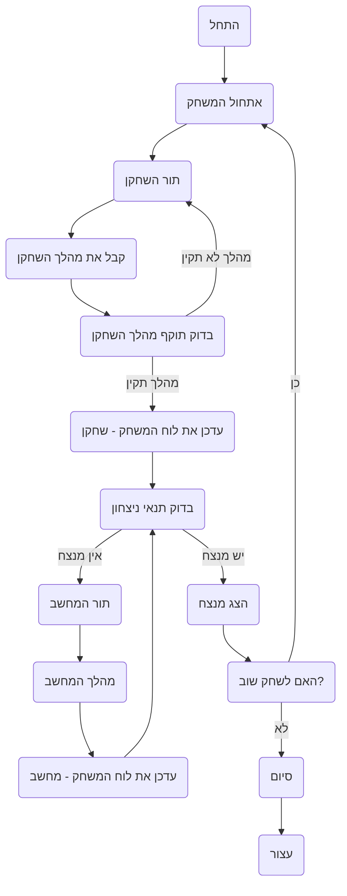

## <algorithm>

1. **אתחול המשחק:**
   - המשחק מתחיל בהצגת הודעת פתיחה: "ברוכים הבאים למשחק שש-בש!".
   - המשתמש מקבל הודעה שהוא משחק בתור "O", והמחשב בתור "X".
   - לדוגמה:
     ```
     ברוכים הבאים למשחק שש-בש!
     אתה משחק בתור "O", המחשב בתור "X".
     ```
   - לוח המשחק מאותחל עם מיקום ראשוני של כלי המשחק.
   - תור השחקן מוגדר כראשון.

2. **לולאת המשחק:**
   - **תור השחקן:**
     - השחקן מתבקש להזין את קואורדינטות הכלי שהוא רוצה להזיז (X,Y). לדוגמה: `3,5`.
     - השחקן מתבקש להזין את קואורדינטות היעד של הכלי (X,Y). לדוגמה: `4,6`.
     - המערכת בודקת אם המהלך חוקי:
       - אם המהלך לא חוקי (למשל, משבצת תפוסה, או מהלך לא חוקי לפי כללי המשחק), השחקן מתבקש להזין מהלך חדש.
       - אם המהלך חוקי, הכלי מוזז בלוח המשחק.
     - לדוגמה:
       ```
       הזן את קואורדינטות הכלי להזזה (X,Y): 3,5
       הזן את משבצת היעד להזזה (X,Y): 4,6
       ```
   - **תור המחשב:**
     - המחשב מבצע מהלך אוטומטי על ידי ניתוח לוח המשחק ובחירת מהלך מיטבי עבורו.
     - לדוגמה:
       ```
       תור המחשב.
       ```
   - **בדיקת ניצחון:**
     - לאחר כל תור, המערכת בודקת אם אחד השחקנים ניצח.
     - הניצחון נקבע כאשר אחד השחקנים איבד את כל כליו או כאשר הכול כלי היריב חסומים.
     - אם יש מנצח, מוצגת הודעה: "ניצחון! אתה השמדת את כל כלי היריב!" או "ניצחון! המחשב השמיד את כל כליך!"
     - לדוגמה:
       ```
       ניצחון! אתה השמדת את כל כלי היריב!
       ```
   - **המשך משחק:**
     - אם אין מנצח, הלולאה חוזרת לתור השחקן.

3. **סיום המשחק:**
   - לאחר סיום המשחק, השחקן מתבקש לבחור האם לשחק שוב (כן/לא).
   - אם השחקן בוחר לשחק שוב, המשחק מתחיל מחדש.
   - אם השחקן בוחר לא לשחק שוב, מוצגת הודעת סיום: "תודה ששיחקת!"
   - לדוגמה:
     ```
     האם לשחק שוב? (כן/לא)
     > לא
     תודה ששיחקת!
     ```

## <mermaid>


הסבר תרשים `mermaid`:

-   **Start**: התחלת המשחק.
-   **InitializeGame**: אתחול המשחק, כולל הצבת כלי משחק.
-   **PlayerTurn**: תחילת תור השחקן.
-   **GetPlayerMove**: קבלת הקלט מהשחקן (קואורדינטות של כלי ומשבצת יעד).
-   **ValidatePlayerMove**: בדיקה אם המהלך של השחקן חוקי.
-   **UpdateBoardPlayer**: עדכון לוח המשחק לאחר מהלך תקין של השחקן.
-   **CheckWinCondition**: בדיקה אם אחד השחקנים ניצח.
-   **ComputerTurn**: תחילת תור המחשב.
-   **ComputerMove**: המחשב מבצע מהלך.
-   **UpdateBoardComputer**: עדכון לוח המשחק לאחר מהלך תקין של המחשב.
-   **DisplayWinner**: הצגת הודעת ניצחון.
-   **PlayAgain**: שאלה האם להתחיל משחק חדש.
-   **End**: סיום המשחק.
-  **Stop**: סיום התוכנית.

התלות היחידה בתרשים היא המעבר בין השלבים השונים במשחק. אין כאן ייבוא של ספריות או קוד נוסף.

## <explanation>

**ייבואים (Imports):**

אין ייבוא של ספריות חיצוניות או מודולים נוספים בקוד שסופק. משמע שהמשחק מיושם באמצעות פונקציות ומבני נתונים בסיסיים של שפת התכנות.

**מחלקות (Classes):**

אין שימוש במחלקות בקוד שסופק. הקוד מתאר את הלוגיקה של המשחק באמצעות תיאור תהליכי, צעד אחר צעד.

**פונקציות (Functions):**

הקוד מתאר את הלוגיקה של המשחק בצעדים, אך לא מוגדרות פונקציות ספציפיות. אפשר להסיק את הפונקציות הבאות:
  - **`InitializeGame()`:** מאתחלת את לוח המשחק, מיקום הכלי המשחק וסדר התורות.
  - **`GetPlayerMove()`:** מקבלת את קואורדינטות הכלי והמשבצת יעד מהשחקן.
  - **`ValidatePlayerMove(move)`:** בודקת אם המהלך של השחקן חוקי.
  - **`UpdateBoard(move, player)`:** מעדכנת את לוח המשחק בהתאם למהלך שבוצע.
  - **`ComputerMove()`:** מבצעת מהלך של המחשב על ידי ניתוח לוח המשחק.
  - **`CheckWinCondition()`:** בודקת אם אחד השחקנים ניצח.
  - **`DisplayWinner(winner)`:** מציגה הודעה על ניצחון השחקן המנצח.
  - **`PlayAgain()`:** שואלת את השחקן אם לשחק שוב ומאתחלת משחק חדש אם הוא מעוניין.

**משתנים (Variables):**

-   **`board`:** מייצג את לוח המשחק כמערך דו-מימדי או רשימה.
-   **`player`:** מייצג את השחקן הנוכחי ("O" או "X").
-   **`move`:** מייצג את המהלך של השחקן או המחשב (קואורדינטות הכלי והמשבצת יעד).
-   **`winner`:** מייצג את המנצח במשחק (במידה ויש).

**בעיות אפשריות או תחומים לשיפור:**

-   **ביצועי AI:** הקוד מתאר שהמחשב מבצע מהלכים, אבל לא מצוין כיצד המהלכים נבחרים. ביצועי הבינה המלאכותית (AI) יכולים להיות משופרים על ידי שימוש באלגוריתמים מתקדמים יותר (לדוגמה, אלגוריתם minimax).
-   **אימות קלט:** הקוד לא מספק אימות מפורט לקלט מהשחקן, כגון טיפול בשגיאות קלט שגוי (למשל, קלט שאינו מספר, או קואורדינטות מחוץ ללוח).
-  **כללי משחק מורכבים:** המשחק מתואר בגרסה פשוטה, ללא אפשרויות כמו "אכילת כלי מרובה" או "קידום כלי למלך", מה שמשפיע על מורכבות ודינמיות המשחק.
-   **מודולריות וקריאות:** הקוד אינו מודולרי, וניתן לשפר את קריאותו על ידי פירוק הפונקציונליות למודולים שונים (למשל, מודול לטיפול בלוח, מודול לטיפול במהלך, מודול לבינה מלאכותית).

**שרשרת קשרים עם חלקים אחרים בפרויקט:**

-   הקוד מתאר את הלוגיקה הבסיסית של המשחק וניתן לשלב אותו בתוך ממשק משתמש (UI) או ליצור מערכת משחקים גדולה יותר. הקוד עצמאי ואינו תלוי בחלקים אחרים בפרויקט, פרט לייצוג גרפי של לוח המשחק.
- הקוד יכול לשמש מודול עצמאי ולהיות מיושם עם ממשק גרפי, או מודול המכיל לוגיקה של המשחק.