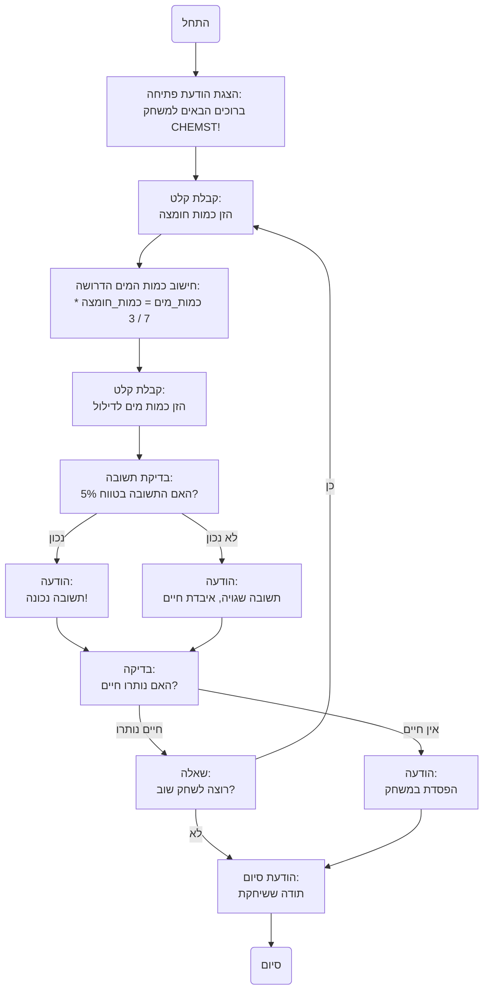

## <algorithm>

1. **הצגת הודעת פתיחה**:
   - המשחק מתחיל בהצגת הודעת פתיחה המודיעה לשחקן על מהות המשחק: "ברוכים הבאים למשחק CHEMST!".
   - מוצגת ההנחיה החשובה - יש לדלל חומצה קריפטוציאנידית ביחס של 7 חלקי מים ל-3 חלקי חומצה.

   *דוגמה:*
   ```
   ברוכים הבאים למשחק CHEMST!
   כדי לדלל חומצה קריפטוציאנידית, שמרו על יחס של 7 חלקי מים ל-3 חלקי חומצה.
   ```

2. **קבלת קלט מהמשתמש**:
   - המשחק מבקש מהשחקן להזין את כמות החומצה שהוא רוצה לדלל, ביחידות ליטרים.

   *דוגמה:*
   ```
   הזן את כמות החומצה שברצונך לדלל (בליטרים): 
   ```
   - לדוגמה, השחקן עשוי להזין "30".

3. **חישוב הכמות הנכונה של מים**:
   - המערכת מחשבת את הכמות המדויקת של מים הדרושה לדילול החומצה בהתאם ליחס הנתון 7:3.
   - החישוב נעשה לפי הנוסחה: `כמות_מים = כמות_חומצה * 7 / 3`.
   - אם השחקן הזין 30 ליטר חומצה, החישוב יהיה: `30 * 7 / 3 = 70`.

4. **קבלת קלט נוסף מהמשתמש**:
   - המשחק מבקש מהשחקן להזין כמה מים לדעתו יש להוסיף.

   *דוגמה:*
    ```
   כמה מים יש להוסיף כדי לדלל 30 ליטר חומצה? (7:3)
   > 
   ```
    - לדוגמה, השחקן עשוי להזין "70".

5. **בדיקת תשובה והתאמה ליחס הנכון**:
   - המשחק בודק האם התשובה שהזין השחקן קרובה מספיק לתשובה הנכונה (בטווח של 5%).
   - החישוב של טווח ה-5% נעשה ע"י: `הפרש_מקסימלי = כמות_מים * 0.05`
   - בודקים האם: `ערך_מוחלט(תשובת_שחקן - כמות_מים) <= הפרש_מקסימלי`

6. **משוב לשחקן**:
   - **אם התשובה נכונה (בתוך טווח 5%)**:
     - המשחק מודיע שהשחקן צדק ("תשובה נכונה! דיללת את החומצה בהצלחה.").
   - **אם התשובה לא נכונה (מחוץ לטווח 5%)**:
     - השחקן מאבד חיים.
     - המשחק מודיע שהשחקן טעה ("תשובה שגויה! איבדת חיים.").

7. **בדיקה אם נותרו חיים**:
   - אם מספר החיים של השחקן הגיע ל-0, המשחק מסתיים בהודעה שהשחקן הפסיד.
   - אחרת, המשחק ממשיך לשאול את השחקן האם ברצונו לשחק שוב.

8. **שחק שוב**:
   - המשחק שואל את השחקן אם הוא רוצה לשחק שוב ("האם ברצונך לשחק שוב? (כן/לא)").
   - **אם השחקן ענה "כן"**:
     - המשחק חוזר לשלב 2, בו השחקן מתבקש להזין כמות חומצה.
   - **אם השחקן ענה "לא"**:
     - המשחק מסתיים בהודעת תודה ("תודה ששיחקתם!").

## <mermaid>



## <explanation>

**ייבואים (Imports):**
- אין ייבוא בפרוייקט הזה.

**מחלקות (Classes):**
- אין מחלקות בפרוייקט הזה.

**פונקציות (Functions):**
- אין פונקציות בפרוייקט הזה.

**משתנים (Variables):**
- **כמות_חומצה** (מספרי): כמות החומצה שהשחקן רוצה לדלל, מוזנת על ידי המשתמש.
- **כמות_מים** (מספרי): כמות המים הדרושה לדילול החומצה בהתאם ליחס 7:3, מחושבת על ידי המערכת.
- **תשובת_שחקן** (מספרי): כמות המים שהשחקן חושב שיש להוסיף.
- **חיים** (מספרי): מספר החיים שנותרו לשחקן.
- **הפרש_מקסימלי** (מספרי): הטווח המקסימלי של טעות מותרת באחוזים, שנקבע כ5%.
- **תשובה_נכונה** (בוליאני): משתנה בוליאני המציין האם התשובה שהזין השחקן נכונה.

**הסברים מפורטים:**

המשחק "CHEMST" הוא משחק פשוט המדמה תרחיש של דילול חומצה. המטרה היא לדלל את החומצה ביחס הנכון (7 חלקי מים ל-3 חלקי חומצה) על מנת לא לאבד חיים. התוכנית מקבלת כקלט כמות חומצה מהמשתמש, מחשבת את כמות המים הנדרשת, ומבקשת מהמשתמש להזין את כמות המים שהוא חושב שצריך להוסיף. אם התשובה של המשתמש קרובה מספיק (בתוך 5%) לתשובה הנכונה, המשחק ממשיך, אחרת המשתמש מאבד חיים. המשחק נמשך עד שהשחקן מאבד את כל חייו או בוחר להפסיק לשחק.

**בעיות אפשריות או תחומים לשיפור:**

1. **אימות קלט**: אין אימות קלט מספק. יש לוודא שקלט המשתמש (כמו כמות החומצה וכמות המים) הוא מספר חוקי (לדוגמה, לא אותיות או מספר שלילי).
2. **ממשק משתמש**: הממשק פשוט וטקסטואלי, אפשר לשפר אותו על ידי הוספת ממשק גרפי.
3. **רמת קושי**: רמת הקושי קבועה ואינה משתנה. ניתן להוסיף אפשרות לשנות את רמת הקושי או להוסיף אלמנטים נוספים שיגדילו את האתגר במשחק.
4. **מערכת ניקוד**: אין מערכת ניקוד, ייתכן שיהיה מעניין לשחקן לראות כמה פעמים הוא דילל את החומצה בהצלחה.
5. **היעדר שימוש בפונקציות:** הקוד יכול להיות מודולרי יותר אם משתמשים בפונקציות נפרדות לפעולות שונות כמו חישוב, קליטת קלט וכו'.
6. **טיפול בשגיאות**: כרגע אין טיפול בשגיאות (למשל, אם המשתמש מזין קלט שאינו מספר).

**שרשרת קשרים עם חלקים אחרים בפרויקט:**
- למשחק הזה אין קשר ישיר לחלקים אחרים בפרויקט, אך ניתן להרחיב אותו בעתיד ולחבר אותו למערכת ניהול משחקים או למערכת ניקוד כללית.