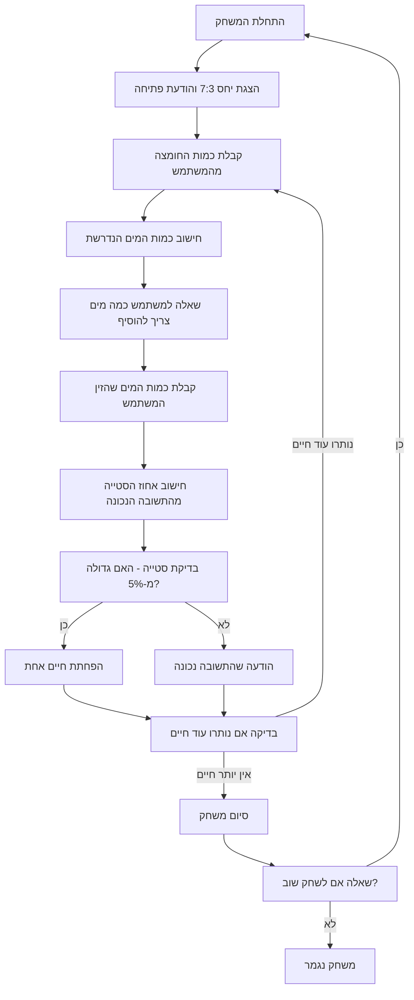

## <algorithm>

1.  **התחלת המשחק:**
    *   הצגת הודעת פתיחה המודיעה על משחק CHEMST והיחס הנדרש של 7:3 (מים:חומצה).
    *   הודעה לשחקן להזין כמות של חומצה.
    *   _דוגמה_: "ברוכים הבאים למשחק CHEMST! עליך לדלל חומצה קריפטוציאנית ביחס של 7:3 (מים:חומצה). הזן את כמות החומצה שברצונך לדלל (בליטרים):"
2.  **לולאת המשחק:**
    *   **קלט מהמשתמש:**
        *   קבלת קלט מהמשתמש - כמות החומצה לדילול.
        *   _דוגמה_: קלט = 30
    *   **חישוב נכון:**
        *   חישוב כמות המים הנדרשת על ידי הכפלת כמות החומצה ב-7/3.
        *   _דוגמה_:  כמות מים נדרשת = 30 \* 7 / 3 = 70
    *   **קלט מהמשתמש:**
        *   הצגת הודעה למשתמש להזין את כמות המים הנדרשת.
        *    _דוגמה_: "כמה מים צריך להוסיף לדילול 30 ליטר חומצה? (7:3)"
        *   קבלת קלט מהמשתמש - כמות המים שהוזנה.
        *    _דוגמה_: קלט = 70
    *   **בדיקת התשובה:**
        *   חישוב אחוז הסטייה בין הקלט של השחקן לבין כמות המים הנכונה.
        *   _דוגמה_: סטייה = |(70 - 70)/70| \* 100% = 0%
        *   אם הסטייה גדולה מ-5%, הפחתת חיים אחת מהמשתמש.
        *   אם הסטייה קטנה או שווה ל-5%, הודעה למשתמש שהתשובה נכונה.
    *   **סיום משחק:**
        *   בדיקה האם מספר החיים הגיע ל-0. אם כן - סיום משחק.
        *   אם לא, חזרה לשלב 2 (לולאת המשחק)
    *   **אפשרות הפסקה:**
       *   אפשרות למשתמש להפסיק לשחק בכל שלב, על ידי הזנת "לא" במקום קלט.
3.  **סיום המשחק:**
    *   הודעה למשתמש שהמשחק הסתיים.
    *   שאלה אם השחקן רוצה לשחק שוב.
    *   אם כן, חזרה לשלב 1 (התחלת המשחק).

## <mermaid>

## <explanation>

**ייבואים (Imports)**:
אין ייבואות בקוד שסופק מכיוון שהקוד הוא תיאור של משחק ולא קוד מימוש. לכן, אין צורך בייבוא ספריות או מודולים.

**מחלקות (Classes)**:
אין מחלקות בקוד שסופק. הקוד מתאר משחק עם לוגיקה ברורה, אך לא מממש אותו במבנה מונחה עצמים.

**פונקציות (Functions)**:
אין פונקציות מוגדרות בקוד שסופק, אך אם היה קוד ממשי, היו נדרשות פונקציות לביצוע המשימות הבאות:
*   `startGame()`: לאתחול המשחק ולהצגת ההודעה הראשונית.
*   `getAcidAmount()`: לקבלת קלט כמות החומצה מהמשתמש.
*   `calculateWaterAmount(acidAmount)`: לחישוב כמות המים הנדרשת בהתאם לכמות החומצה.
*   `getUserWaterAmount()`: לקבלת קלט כמות המים שהמשתמש הזין.
*   `calculateDifference(actualWater, expectedWater)`: לחישוב אחוז הסטייה בין התשובה של המשתמש לבין התשובה הנכונה.
*   `checkAnswer(difference)`: לבדוק אם הסטייה גדולה מ-5% ולהחזיר האם השחקן טעה.
*   `decreaseLife()`: להפחית חיים אחת מהשחקן.
*   `checkLives()`: לבדוק אם נותרו עוד חיים לשחקן.
*   `askToPlayAgain()`: לשאול את השחקן האם הוא מעוניין לשחק שוב.
*   `endGame()`: להציג הודעת סיום משחק.

**משתנים (Variables)**:
*   `acidAmount` (float): כמות החומצה שהשחקן הזין.
*   `waterAmount` (float): כמות המים שהשחקן הזין.
*   `expectedWater` (float): כמות המים הנכונה הנדרשת לדילול.
*   `lives` (int): מספר החיים של השחקן. מתחיל מ-9 ויורד בכל טעות.
*   `difference` (float): אחוז הסטייה בין תשובת השחקן לתשובה הנכונה.
*   `playAgain` (boolean): קובע האם השחקן רוצה לשחק שוב.

**שרשרת קשרים**:
המשחק הזה אינו תלוי ישירות בחלקים אחרים בפרויקט (בהנחה שזה משחק עצמאי), אבל אם היו לו ממשקים עם חלקים אחרים, כמו מערכת ניקוד או ממשק משתמש גרפי, אז זה היה צריך להיראות כך:
*   **ממשק משתמש**: המשחק היה זקוק לממשק משתמש כדי לקבל קלט מהשחקן ולהציג לו הודעות.
*   **מערכת ניקוד**: אם היה קיים מנגנון ניקוד, אז המשחק היה צריך להתממשק איתו על מנת לעקוב אחרי התקדמות השחקן.
*   **מערכת תצוגה**: היה צורך לשתף פעולה עם מערכת תצוגה כדי להציג את המשחק בצורה ויזואלית.

**בעיות אפשריות ותחומים לשיפור**:
1.  **טיפול שגיאות:** הקוד המתואר אינו כולל טיפול בשגיאות קלט (למשל, קלט שאינו מספר).
2.  **שימוש במחלקות:** ניתן לשפר את הקוד על ידי יצירת מחלקה שמייצגת את המשחק (כמו `Game` או `ChemstGame`), דבר שיקל על ניהול מצב המשחק.
3.  **ממשק משתמש**: המשחק מוגבל לקלט טקסטואלי. שימוש בממשק משתמש גרפי היה יכול לשפר את חווית המשתמש.
4.  **אפשרויות משחק מתקדמות**: ניתן להוסיף רמות קושי שונות או סוגי חומרים שונים לדילול כדי להוסיף עניין למשחק.
5.  **תיעוד הקוד**: יש לתעד את הקוד בצורה מפורטת כדי להקל על הבנתו ותחזוקתו.
6.  **בדיקות אוטומטיות**: הוספת בדיקות אוטומטיות יכולה להבטיח שהקוד פועל בצורה תקינה לאחר שינויים.