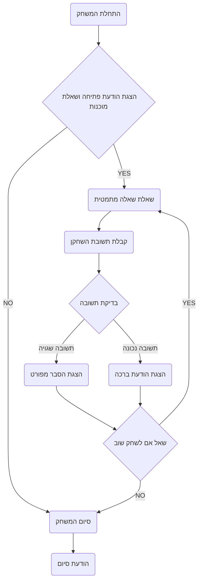

## <algorithm>

1. **התחלת המשחק:**
   - הצגת הודעת פתיחה לשחקן, שואלת אם הוא מוכן לקבל את המבחן.
     - דוגמה: "אני צ'יף המתמטיקה, אלוהי המתמטיקה ההודי הגדול. האם אתה מוכן לקבל את המבחן שלי?"
   - קלט מהמשתמש ("YES" או "NO").
   - אם הקלט הוא "NO", המשחק מסתיים.
     - לדוגמה: משתמש מקליד "NO", המשחק נגמר עם הודעה "תודה ששיחקת!"
   - אם הקלט הוא "YES", המשחק ממשיך לשלב הבא.
     - לדוגמה: משתמש מקליד "YES", המשחק ממשיך לשאלה הראשונה.

2. **לולאת משחק עיקרית:**
   - הצגת שאלה מתמטית לשחקן.
     - דוגמה: "קח מספר, הוסף 3, חלק ב-5, הכפל ב-8, חלק ב-5 והוסף את אותו מספר. הפחת 1. מה התוצאה?"
   - קבלת קלט מהמשתמש (תשובה).
     - דוגמה: משתמש מקליד "6.8".
   - **בדיקת תשובה:**
     - אם התשובה שגויה:
       - הדפס הודעת שגיאה.
       - הדפס הסבר מפורט של השלבים הנכונים לחישוב התשובה.
         - לדוגמה: אם התשובה נכונה היא 6.8, ההסבר יהיה: "(1) 12 ועוד 3 = 15, (2) לחלק ב-5 = 3, (3) כפול 8 = 24, (4) לחלק ב-5 = 4.8, (5) להוסיף 3 = 7.8, (6) להפחית 1 = 6.8"
     - אם התשובה נכונה:
       - הדפס הודעת ברכה.
   - שאל את השחקן אם הוא רוצה לשחק שוב ("YES" או "NO").
     - דוגמה: "רוצה לשחק שוב? (YES/NO)"
   - אם התשובה היא "YES", חזור ללולאת המשחק העיקרית (שלב 2).
     - לדוגמה: אם משתמש מקליד "YES", המשחק ממשיך עם שאלה חדשה.
   - אם התשובה היא "NO", המשחק מסתיים.
     - לדוגמה: אם משתמש מקליד "NO", המשחק נגמר עם הודעה "תודה ששיחקת!"

3. **סיום המשחק:**
   - הדפס הודעת סיום (כאשר השחקן בוחר לא לשחק שוב).
     - דוגמה: "תודה ששיחקת!"

## <mermaid>



## <explanation>

- **ייבואים (Imports)**:
   - אין ייבוא במקרה הזה מכיוון שמדובר בתיאור מילולי של המשחק ולא בקוד. כאשר הקוד יכתב בפועל, סביר להניח שיהיו ייבואים של ספריות רלוונטיות כמו `random` ליצירת שאלות מתמטיות אקראיות, או `input` ו- `print` לקלט ופלט מהמשתמש.

- **מחלקות (Classes)**:
    - אין מחלקות בתיאור זה, אולם כאשר יכתב קוד יהיה רצוי ליצור מחלקה שתנהל את כל ההיגיון של המשחק (הגדרת השאלות, קבלת תשובות, בדיקתן ומתן הסברים).

- **פונקציות (Functions)**:
    - לא מוגדרות פונקציות מפורשות, אך תיאור המשחק מצביע על כמה פונקציות נדרשות:
        - `start_game()`: אתחול המשחק והצגת הודעת הפתיחה.
        - `ask_question()`: הצגת שאלה מתמטית לשחקן.
        - `check_answer(answer, correct_answer)`: קבלת תשובת השחקן ובדיקתה, כולל מתן הסבר מפורט במקרה של תשובה שגויה.
        - `play_again()`: שואלת את השחקן אם הוא רוצה לשחק שוב.
        - `end_game()`: סיום המשחק והצגת הודעת סיום.
        - לדוגמה:
            ```python
            def start_game():
                print("אני צ'יף המתמטיקה, אלוהי המתמטיקה ההודי הגדול.")
                print("האם אתה מוכן לקבל את המבחן שלי?")
            
            def ask_question():
                print("קח מספר, הוסף 3, חלק ב-5, הכפל ב-8, חלק ב-5 והוסף את אותו מספר. הפחת 1. מה התוצאה?")
                return input("> ")

            def check_answer(user_answer, correct_answer):
                if user_answer != correct_answer:
                  print("תשובתך שגויה! בוא נבדוק את השלבים")
                  #הדפסת שלבי הפתרון.
                else:
                  print ("כל הכבוד, זו התשובה הנכונה!")

            def play_again():
                return input("רוצה לשחק שוב? (YES/NO)")

            def end_game():
                print("תודה ששיחקת!")
            ```
- **משתנים (Variables)**:
    - אין משתנים מוגדרים במפורש בתיאור הזה, אך אפשר להסיק שיהיו משתנים מסוג `string` לקלט מהמשתמש ("YES", "NO", תשובה), וכן משתנה מסוג `float` או `int` עבור התשובה הנכונה של השאלה המתמטית.
      - לדוגמה:
        - `user_input` (string) - תשובת המשתמש
        - `correct_answer` (float) - התשובה הנכונה לתרגיל.

- **בעיות אפשריות או תחומים לשיפור:**
    - המשחק כרגע הוא מאוד בסיסי וכולל רק שאלה אחת. ניתן להוסיף שאלות רבות, להשתמש ברמת קושי משתנה, לאפשר למשתמש לבחור נושאים מתמטיים וכן הלאה.
    - המשחק כרגע לא מציג את השלבים לפתרון התרגיל באופן דינאמי, יש צורך להוסיף לוגיקה שמאפשרת לחשב את הפתרון באופן אוטומטי ולא להקליד אותו מראש.
    - כדאי להוסיף תיקוף קלט כדי לוודא שהמשתמש מזין תשובות תקינות.
    - יש להוסיף טיפול בשגיאות כדי למנוע קריסת התוכנית במקרים לא צפויים.

- **שרשרת קשרים עם חלקים אחרים בפרויקט:**
    - אם המשחק יהפוך להיות חלק מפרויקט רחב יותר, יכולים להיות קשרים עם מערכת ניהול משחקים, מערכת ניקוד, מערכת ניהול משתמשים ועוד.