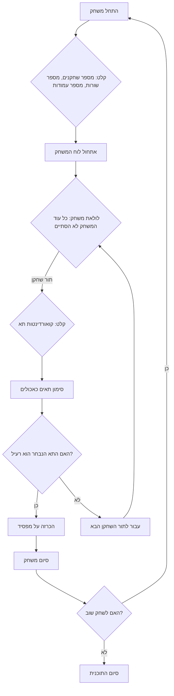

## ניתוח קוד המשחק "CHOMP"

### <algorithm>
1. **אתחול המשחק:**
   - המשתמש מתבקש להזין את מספר השחקנים (לרוב 2).
   - המשתמש מתבקש להזין את גודל לוח המשחק (מספר שורות ועמודות). לדוגמה, 4 שורות ו-7 עמודות.
   - לוח המשחק נוצר באופן וירטואלי (לא מוצג למשתמש) ועליו מסומנות התאים הזמינים.
   
   דוגמה: `players = 2`, `rows = 4`, `cols = 7`

2. **לולאת המשחק:**
   - כל שחקן בתורו מתבקש להזין את קואורדינטות התא שהוא רוצה "לאכול" (לדוגמה: שורה 3, עמודה 4).
   - התוכנית מסמנת את התא הנבחר ואת כל התאים שנמצאים מתחתיו וימינו כ"אכולים".
     - לדוגמה: אם נבחר תא (3,4), התאים (3,4), (3,5), (3,6), (4,4), (4,5), (4,6), וכו' יסומנו כאכולים.
   - התוכנית בודקת אם התא שנבחר הוא התא הרעיל (הפינה השמאלית העליונה של הלוח, בדרך כלל (0,0) או (1,1) אם הספירה מתחילה מ-1).
     - אם התא רעיל, השחקן שהזין אותו מפסיד, והמשחק מסתיים.
   - אם התא לא רעיל, התור עובר לשחקן הבא.
   - הלולאה ממשיכה עד שאחד השחקנים מפסיד (או שהמשחק נקטע על ידי השחקנים).

3. **סיום המשחק:**
   - כאשר שחקן מפסיד, התוכנית מכריזה על המנצח (השחקן שלא אכל את התא הרעיל).
   - התוכנית שואלת את השחקנים אם הם רוצים לשחק שוב.

4. **מחזוריות:**
   - אם השחקנים בוחרים לשחק שוב, התוכנית חוזרת לשלב 1.
   - אם לא, התוכנית מסתיימת.

### <mermaid>

**הסבר התרשים:**
- **A (התחל משחק):**  נקודת ההתחלה של המשחק.
- **B (קלט: מספר שחקנים, מספר שורות, מספר עמודות):** קליטת הנתונים מהמשתמש להגדרת המשחק.
- **C (אתחול לוח המשחק):**  יצירת הייצוג הפנימי של לוח המשחק.
- **D (לולאת משחק: כל עוד המשחק לא הסתיים):**  הלולאה הראשית שמאפשרת את המשחק עד לסיומו.
- **E (קלט: קואורדינטות תא):**  קליטת קואורדינטות התא מהשחקן הנוכחי.
- **F (סימון תאים כאכולים):**  עדכון לוח המשחק על ידי סימון התאים כאכולים.
- **G (האם התא הנבחר הוא רעיל?):**  בדיקה האם התא הנבחר הוא התא הרעיל.
- **H (הכרזה על מפסיד):** אם השחקן אכל את התא הרעיל, מכריזים על הפסד שלו.
- **I (עבור לתור השחקן הבא):**  מעבר לשחקן הבא.
- **J (סיום משחק):** סיום המשחק לאחר שהוכרז מנצח.
- **K (האם לשחק שוב?):** שאלה לשחקנים האם הם רוצים לשחק שוב.
- **L (סיום התוכנית):** סיום התוכנית אם השחקנים לא רוצים לשחק שוב.

### <explanation>
- **ייבואים (Imports):** אין ייבואות חיצוניים, מכיוון שהקוד מסתמך על פעולות בסיסיות בלבד.

- **מחלקות (Classes):** אין שימוש במחלקות. הקוד מסתמך על משתנים, לולאות ותנאים.
- **פונקציות (Functions):**
  - אין שימוש בפונקציות מוגדרות. ניתן לחלק את הקוד לפונקציות לצורך ארגון טוב יותר, כגון פונקציה לאתחול המשחק, פונקציה לביצוע מהלך ופונקציה לסיום המשחק.
- **משתנים (Variables):**
  - `players` (מספר): מספר השחקנים במשחק.
  - `rows` (מספר): מספר השורות בלוח המשחק.
  - `cols` (מספר): מספר העמודות בלוח המשחק.
  - לוח המשחק (מערך דו-ממדי או מבנה נתונים דומה): מייצג את מצב לוח המשחק.
  - קואורדינטות התא הנבחר (זוג מספרים): מייצג את המקום בלוח ששחקן בחר.
  - `game_over` (בוליאני): מציין האם המשחק הסתיים.

- **הסברים מפורטים:**
    - הקוד מממש משחק פשוט שבו שני שחקנים מתחרים על מנת לא "לאכול" תא רעיל.
    - המשחק מתנהל באמצעות קלט מהמשתמש (מספר שחקנים, גודל לוח וקואורדינטות).
    - לוח המשחק מיוצג באופן וירטואלי ולא מוצג למשתמש, והעיקרון הוא סימון תאים כאכולים ולא הצגה גרפית.
    - הקוד מדגים שימוש בלולאות ובתנאים לניהול זרימת המשחק.
    - ניתן להרחיב את המשחק על ידי הוספת תכונות כגון קלט מאומת (למניעת חריגות בנתונים) ואינטרפייס גרפי.

- **בעיות אפשריות או תחומים לשיפור:**
    - הקוד חסר תיעוד, מה שמקשה על הבנה ותחזוקה.
    - אין טיפול בשגיאות (כגון קלט לא תקין).
    - המימוש הנוכחי מורכב מלולאה אחת גדולה, מה שפוגע בקריאות הקוד. מומלץ לפצל את הקוד למספר פונקציות.
    - אין ייצוג ויזואלי של לוח המשחק, מה שעלול להקשות על משתמשים להבין את מצב המשחק.
    - אין אפשרות לשחק נגד המחשב (AI), וזה עשוי להגביר את העניין במשחק.

- **שרשרת קשרים עם חלקים אחרים בפרויקט:**
    - המשחק הזה יכול להיות חלק ממערכת משחקים גדולה יותר, כאשר כל משחק מיוצג על ידי מודול נפרד.
    - ניתן ליצור ממשק משותף למשחקים השונים (לדוגמה, פונקציות לניהול תורות שחקנים, קלט ופלט).