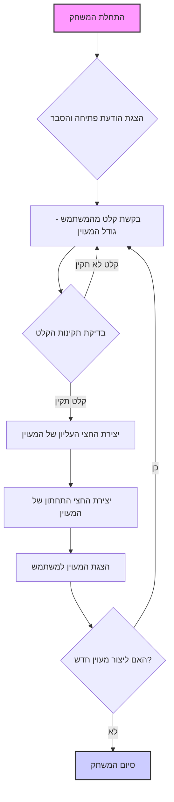

## ניתוח קוד המשחק "DIAMND"

### <algorithm>

1.  **התחלת המשחק:**
    *   המשחק מציג הודעת פתיחה למשתמש ומסביר את כללי המשחק.
    *   **דוגמה:** "ברוכים הבאים למשחק DIAMND! אנא הזן את גודל המעוין (מספר שלם חיובי):"

2.  **קבלת קלט מהמשתמש:**
    *   המשחק מבקש מהמשתמש להזין את גודל המעוין (מספר שלם חיובי).
    *   **דוגמה:** קלט משתמש: "4"

3.  **בדיקת תקינות הקלט:**
    *   המשחק בודק האם הקלט שהתקבל הוא מספר שלם חיובי.
        *   אם הקלט אינו תקין (למשל, מספר שלילי, מחרוזת או מספר לא שלם), מוצגת הודעת שגיאה והמשתמש מתבקש להזין את הגודל שוב.
        *   **דוגמה:** אם המשתמש הזין "-2" או "abc", תוצג הודעת שגיאה.

4.  **יצירת המעוין:**
    *   המשחק יוצר את המעוין על ידי יצירת שורות באופן הדרגתי.
    *   **לולאה עליונה:** יוצרת את החצי העליון של המעוין.
        *   חישוב מספר הרווחים בתחילת השורה: `גודל המעוין - מספר השורה הנוכחית`.
        *   חישוב מספר הכוכביות בשורה: `מספר השורה הנוכחית * 2 - 1`.
        *   הדפסת השורה עם הרווחים והכוכביות.
        *   **דוגמה:** עבור גודל 4, השורה הראשונה תהיה "   *", השניה תהיה "  ***" וכן הלאה.
    *   **לולאה תחתונה:** יוצרת את החצי התחתון של המעוין.
        *   חישוב מספר הרווחים בתחילת השורה: זהה ללולאה העליונה, אך מתבצעת באופן הפוך.
        *   חישוב מספר הכוכביות בשורה: מספר הכוכביות בלולאה העליונה, אך מתבצעת באופן הפוך.
        *   הדפסת השורה עם הרווחים והכוכביות.
        *   **דוגמה:** עבור גודל 4, השורה הראשונה לאחר אמצע המעוין תהיה "  ***", השניה תהיה "   *" וכן הלאה.

5.  **הצגת המעוין:**
    *   המשחק מציג את המעוין שנוצר למשתמש.
    *   **דוגמה:**
        ```
          *
         ***
        *****
       *******
        *****
         ***
          *
        ```

6.  **אפשרות למשחק נוסף:**
    *   המשחק שואל את המשתמש האם הוא רוצה ליצור מעוין חדש.
        *   אם התשובה היא "כן", המשחק חוזר לשלב 2.
        *   אם התשובה היא "לא", המשחק מסתיים עם הודעת סיום.
    *   **דוגמה:** "האם תרצה ליצור מעוין נוסף? (כן/לא):"

### <mermaid>



### <explanation>

*   **ייבואים (Imports)**:
    *   אין ייבוא מיוחד בקוד זה, המשחק משתמש בפונקציות בסיסיות של פייתון.

*   **מחלקות (Classes)**:
    *   אין מחלקות מוגדרות בקוד זה. מדובר ביישום פרוצדורלי פשוט.

*   **פונקציות (Functions)**:
    *   אין פונקציות מוגדרות בקוד זה. מדובר ביישום פרוצדורלי פשוט. ייתכן שבמימוש אמיתי יוגדרו פונקציות כמו:
        *   `get_diamond_size()` - לקבלת גודל המעוין מהמשתמש וביצוע בדיקות תקינות.
        *   `create_diamond_row(row_number, diamond_size)` - ליצירת שורה אחת של המעוין.
        *   `print_diamond(diamond)` - להצגת המעוין שנוצר למסך.

*   **משתנים (Variables)**:
    *   `diamond_size` - משתנה מסוג מספר שלם חיובי, המייצג את גודל המעוין.
    *   `row_number` - משתנה מסוג מספר שלם, המייצג את מספר השורה הנוכחית במהלך יצירת המעוין.
    *   `spaces` - משתנה מסוג מחרוזת, המייצג את הרווחים בתחילת כל שורה במעוין.
    *   `stars` - משתנה מסוג מחרוזת, המייצג את הכוכביות בכל שורה במעוין.

*   **הסברים מפורטים:**
    *   הקוד מתאר משחק שבו המשתמש בוחר גודל למעוין והתוכנה מציירת אותו.
    *   המשחק מבוסס על לולאות שיוצרות את החצי העליון והתחתון של המעוין בצורה הדרגתית.
    *   הקוד מדגים שימוש בסיסי בתנאים, לולאות ומחרוזות בפייתון.
    *   ניתן לשפר את הקוד על ידי הוספת פונקציות נפרדות לכל שלב, מה שיגרום לקוד להיות מודולרי וקריא יותר.
    *   בנוסף, אפשר לאפשר למשתמש לבחור סימן אחר מהכוכבית.

*   **שרשרת קשרים עם חלקים אחרים בפרויקט (אם רלוונטי):**
    *   הקוד הזה עצמאי, ואינו תלוי בקוד אחר בפרויקט. זהו משחק בסיסי, ואין לו ממשקים ישירים עם מודולים אחרים בפרויקט. עם זאת, ייתכן שבפרויקט גדול יותר יהיה קוד משותף, כמו פונקציות קלט או תצוגה, שיוכל לשמש גם את המשחק הזה.