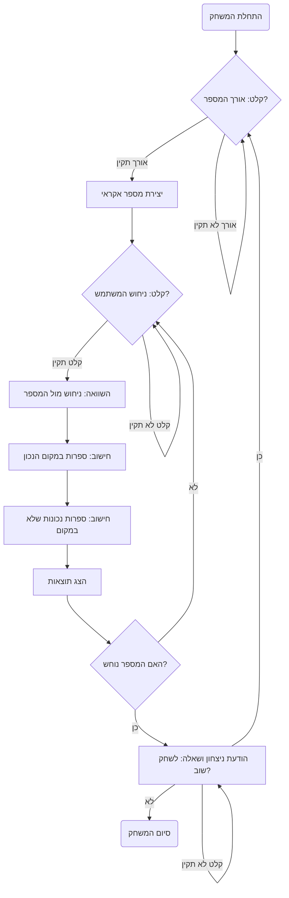

## ניתוח קוד המשחק "DIGITS"

### 1. <algorithm>

**תרשים זרימה:**

1.  **התחלת המשחק:**
    *   הצגת הודעת פתיחה וכללי המשחק.
    *   בקשת קלט מהמשתמש לבחירת אורך המספר (בין 2 ל-5).
    *   לדוגמה: אם המשתמש בוחר 3, אורך המספר יהיה 3 ספרות.
2.  **יצירת מספר רנדומלי:**
    *   יצירת מספר רנדומלי באורך שנבחר עם ספרות ייחודיות.
    *   לדוגמה: אם האורך הוא 3, המספר יכול להיות 543.
3.  **לולאת ניחושים:**
    *   הצגת בקשה למשתמש לנחש את המספר.
    *   קליטת קלט מהמשתמש.
        *   לדוגמה: המשתמש מזין 123.
    *   בדיקת תקינות הקלט:
        *   בדיקה שאורך הקלט תואם לאורך המספר שנוצר.
        *   בדיקה שכל הספרות בקלט ייחודיות.
        *   אם הקלט לא תקין, הצגת הודעת שגיאה וחזרה לשלב 3.
    *   השוואת הקלט למספר שנוצר:
        *   ספירת הספרות שנמצאות במקום הנכון.
            *   לדוגמה: בהשוואה בין 123 ל-543, הספרה 3 במקום הנכון.
        *   ספירת הספרות שנמצאות, אך לא במקום הנכון.
            *   לדוגמה: בהשוואה בין 123 ל-543, אין ספרות נוספות.
    *   הצגת תוצאות ההשוואה:
        *   הצגת מספר הספרות במקום הנכון ומספר הספרות הנכונות במקום שגוי.
        *   לדוגמה: "נמצא במקום הנכון: 1. נמצא, אבל לא במקום: 0".
    *   בדיקה האם המספר נוחש:
        *   אם כל הספרות במקום הנכון, המשחק הסתיים.
            *   הצגת הודעת ניצחון.
            *   מעבר לשלב 4.
        *   אחרת, חזרה לשלב 3.
4.  **סיום המשחק:**
    *   בקשת מהמשתמש האם לשחק שוב (כן/לא).
    *   קליטת תשובה מהמשתמש.
    *   אם התשובה "כן": חזרה לשלב 1.
    *   אם התשובה "לא": סיום התוכנית.
    *   אם קלט לא תקין, הצגת הודעה ושוב שאילתה.

### 2. <mermaid>

**ניתוח תלויות:**

אין תלויות חיצוניות בקוד עצמו. הקוד המדובר הוא תיאור מילולי של אלגוריתם. התרשים נבנה על בסיס התיאור הזה.

### 3. <explanation>

**הסברים מפורטים:**

*   **מטרת המשחק:**
    *   המשחק "DIGITS" הוא משחק ניחוש בו המחשב בוחר מספר אקראי עם מספר מסוים של ספרות ייחודיות, והמשתמש מנסה לנחש את המספר. לאחר כל ניסיון ניחוש, המערכת מעדכנת את המשתמש לגבי מספר הספרות שניחשו במקום הנכון ואת מספר הספרות שניחשו נכון אך לא במקום הנכון.
*   **מבנה המשחק:**
    1.  **אתחול:**
        *   הצגת הודעת פתיחה והסבר על המשחק.
        *   קבלת קלט מהמשתמש לקביעת אורך המספר (2-5).
        *   יצירת מספר אקראי בעל ספרות ייחודיות.
    2.  **תהליך המשחק:**
        *   קבלת ניחוש מהמשתמש.
        *   בדיקת תקינות הקלט:
            *   אורך נכון.
            *   ספרות ייחודיות.
        *   השוואת הניחוש למספר האקראי.
        *   חישוב מספר הספרות במקום הנכון.
        *   חישוב מספר הספרות הנכונות שלא במקום הנכון.
        *   הצגת התוצאות למשתמש.
        *   בדיקה האם המספר נוחש.
            *   אם נוחש, מעבר לשלב הסיום.
            *   אם לא, חזרה לשלב הניחוש.
    3.  **סיום:**
        *   הצגת הודעת ניצחון אם המשתמש ניחש.
        *   שאלה האם המשתמש רוצה לשחק שוב.
        *   אם כן - חזרה לאתחול.
        *   אם לא - סיום המשחק.

*   **יישום פוטנציאלי (Python):**

    *   **`random` module:**
        *   המודול `random` ישמש ליצירת מספר אקראי עם ספרות ייחודיות. לדוגמה, ניתן להשתמש בפונקציה `random.sample` כדי ליצור רשימה של ספרות ייחודיות ואז להמיר אותה למספר שלם.

    *   **קלט ופלט:**
        *   השימוש בפונקציה `input()` לקבלת קלט מהמשתמש.
        *   השימוש בפונקציה `print()` להצגת הודעות והתוצאות למשתמש.

    *   **לולאות ותנאים:**
        *   שימוש בלולאת `while` עבור המשחק כל עוד המשתמש לא ניחש את המספר.
        *   שימוש בתנאי `if` כדי לבדוק את תקינות הקלט ולקבוע את התגובה בהתאם.

    *   **פונקציות:**
        *   ניתן להשתמש בפונקציות מודולריות ליצירת המספר האקראי, בדיקת הניחוש, וכו'.

*   **בעיות אפשריות ושיפורים:**
    *   **בדיקות קלט:** יש לוודא שבדיקת תקינות הקלט מקיפה את כל האפשרויות הלא תקינות, כמו קלט שהוא לא מספר, קלט עם ספרות כפולות, או אורך שגוי.
    *   **ספירת ניסיונות:** אפשר להוסיף ספירת ניסיונות כדי להציג למשתמש את מספר הניסיונות שלקח לו לנחש את המספר.
    *   **טווח ספרות:** אפשר לאפשר למשתמש לבחור את טווח הספרות, לא רק 0-9.
    *   **רמת קושי:** אפשר להוסיף רמות קושי שונות, לדוגמה: רמת קושי גבוהה יותר יכולה להיות עם יותר ספרות, או עם טווח ספרות גדול יותר.
    *   **הודעות מפורטות:** לשפר את הודעות הפלט כך שיהיו יותר אינפורמטיביות.

*   **קשר עם חלקים אחרים בפרויקט:**
    *   המשחק יכול להוות חלק מספרייה של משחקי AI פשוטים.
    *   ניתן להשתמש בממשק משותף בין המשחקים השונים עבור פונקציות כמו קלט ופלט, ובדיקות תקינות קלט.
    *   התוצאות של המשחק (לדוגמה: מספר ניסיונות) יכולות להיות מאוחסנות ולהיות בשימוש עבור ניתוח סטטיסטי, או ליצירת טבלת שיאים.