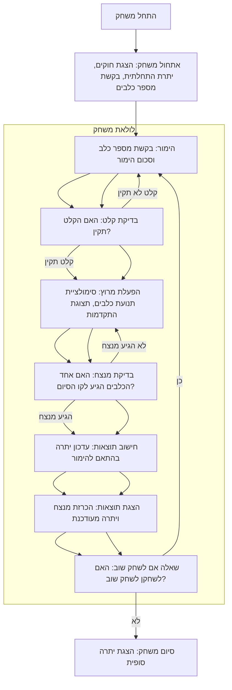

## <algorithm>

1. **התחלת המשחק:**
   - המשחק מציג הודעת פתיחה ומסביר את החוקים.
   - מגדיר את הסכום ההתחלתי של השחקן, לדוגמה 100$.
   - מבקש מהמשתמש לבחור את מספר הכלבים (בין 3 ל-6).
   - דוגמה: `הודעה: ברוכים הבאים למשחק DOGS! יש לך 100$. בחר כמה כלבים ישתתפו (3-6):`
2. **הימור:**
   - לפני תחילת המרוץ, השחקן מבצע הימור.
   - מבקשים מהמשתמש להזין את מספר הכלב עליו רוצה להמר (לדוגמה, 1 עד מספר המשתתפים).
   - מבקשים מהמשתמש להזין את סכום ההימור.
   - בודקים אם הקלט תקין, אם לא (מספר כלב מחוץ לטווח או סכום הימור גדול מהיתרה) - מציגים שגיאה ומבקשים שוב.
    - דוגמה: `הודעה: בחר את מספר הכלב עליו תרצה להמר (1-4): > 2`
   - דוגמה: `הודעה: הזן את סכום ההימור: > 20`
3. **ניהול המרוץ:**
   - המשחק מדמה את התקדמות הכלבים במסלול, כאשר בכל שלב מוסיפים למיקום הכלב מספר אקראי (1-6).
   - מציגים את מיקום כל הכלבים על המסך באמצעות תווי ייצוג (לדוגמה: `=`).
     - לדוגמה:
      ```
      כלב 1: ===>
      כלב 2: ====>
      כלב 3: ==>
      ```
   - התהליך ממשיך עד שאחד הכלבים מגיע לקו הסיום (לדוגמה, 50 צעדים).
4. **תוצאות:**
    - לאחר סיום המרוץ, המשחק מכריז על המנצח (מספר הכלב).
    - אם השחקן הימר על הכלב המנצח, הסכום בחשבון גדל (ההימור כפול מקדם, לדוגמה, 2:1).
   - אם השחקן הפסיד, ההימור יורד מהסכום בחשבון.
   - דוגמה: `הודעה: כלב מספר 2 ניצח! ברכות, ניצחת, יתרתך כעת 120$`
5.  **המשך המשחק:**
    - לאחר סיום המרוץ, המשחק שואל אם השחקן רוצה לשחק שוב (כן/לא).
    - אם השחקן בוחר "כן", המשחק חוזר לשלב ההימור.
    - אם השחקן בוחר "לא", המשחק מסתיים ומציג את הסכום הסופי.
    - דוגמה: `הודעה: האם תרצה לשחק שוב? (כן/לא): > לא`
    - דוגמה: `הודעה: תודה ששיחקת, יתרתך הסופית: 120$`

## <mermaid>


**הסבר תלות:**
- אין תלות בייבוא קבצים או חבילות חיצוניות בתיאור האלגוריתם עצמו. עם זאת, במימוש קוד, סביר להניח שיהיה שימוש במודול `random` של פייתון.

## <explanation>

**ייבואים (Imports):**
- אין ייבוא ספציפי בקוד התיאורי הנוכחי. עם זאת, במימוש ב-Python, יש צורך לייבא את המודול `random` כדי לייצר מספרים אקראיים לסימולציית תנועת הכלבים.
  ```python
   import random # для генерации случайных результатов движения собак
  ```
  - ה `random` ישמש כדי לקבוע כמה צעדים כל כלב מתקדם בכל סיבוב, ומדמה התקדמות לא אחידה.

**מחלקות (Classes):**
- אין שימוש במחלקות בקוד התיאורי הנוכחי. ניתן להשתמש במחלקה כדי לייצג כלב או מרוץ, אם נרצה לממש את הקוד באופן מורכב יותר.

**פונקציות (Functions):**
- בקוד התיאורי אין פונקציות מפורשות, אך ניתן להגדיר פונקציות כדלהלן:
    - `init_game()`: מאתחלת את המשחק, מקבלת כקלט את הסכום ההתחלתי, את מספר הכלבים, את השחקן, ומגדירה את מצב ההתחלה.
    - `make_bet()`: מקבלת כקלט את השחקן, ומבקשת ממנו להזין הימור, כולל בדיקה של הקלט. מחזירה את מספר הכלב עליו המהמר הימר וסכום ההימור.
    - `run_race()`: מדמה את המרוץ, כאשר בכל צעד מקדמת את הכלבים באופן אקראי, ומציגה את המיקום שלהם, עד שאחד מגיע לקו הסיום.
    - `calculate_result()`: מקבלת כקלט את השחקן, את ההימור שלו, ואת המנצח, ומעדכנת את יתרת השחקן בהתאם.
    - `play_again()`: שואלת את השחקן אם הוא מעוניין לשחק שוב, ומחזירה תשובה בוליאנית (כן/לא).
    - דוגמה לשימוש ב `make_bet`: `dog_num, bet_amount = make_bet(player)`.
    - דוגמה לשימוש ב `run_race`: `winner = run_race(dogs)`.
  - כל פונקציה תהיה אחראית על חלק נפרד מהלוגיקה של המשחק.

**משתנים (Variables):**
- `player_balance`: מספר מסוג `int` המייצג את סכום הכסף של השחקן.
- `num_dogs`: מספר מסוג `int` המייצג את מספר הכלבים המשתתפים במרוץ.
- `bet_dog`: מספר מסוג `int` המייצג את מספר הכלב עליו השחקן הימר.
- `bet_amount`: מספר מסוג `int` המייצג את סכום ההימור של השחקן.
- `dog_positions`: רשימה של מספרים מסוג `int` המייצגת את המיקום הנוכחי של כל אחד מהכלבים.
- `winner_dog`: מספר מסוג `int` המייצג את מספר הכלב המנצח.
- משתנים אלה משמשים לאחסון מידע במהלך המשחק.

**בעיות אפשריות ותחומים לשיפור:**
- **בדיקת קלט:** חשוב לוודא שהקלט של המשתמש (מספר כלב וסכום הימור) תקין, כדי למנוע שגיאות. יש לבדוק למשל שהמספר בין 3 ל 6.
- **מרוץ ריאליסטי:** אפשר לשפר את סימולציית המרוץ על ידי שימוש במשקלים שונים לכל כלב, מה שיכול לייצר תוצאות פחות צפויות.
- **ממשק משתמש:** כרגע, ממשק המשתמש הוא בסיסי מאוד. ניתן לשפר אותו על ידי הוספת תצוגה גרפית של המרוץ.
- **הגבלות וסיום:** יש להבטיח שהמשחק לא ימשיך אם לשחקן אין יותר כסף, או שהמשחק יסתיים בצורה ברורה כאשר השחקן רוצה להפסיק.

**שרשרת קשרים עם חלקים אחרים בפרויקט:**
- אין שרשרת קשרים מוגדרת במסמך זה, אבל, אפשר לפתח מודול נפרד שמטפל באינטרקציית משתמש(UI) כגון קלט ופלט, ולהפריד בין הקוד של המשחק עצמו. זה מאפשר גמישות בעתיד, כמו למשל להשתמש בממשק משתמש אחר, או לפתח גרסה גרפית למשחק.