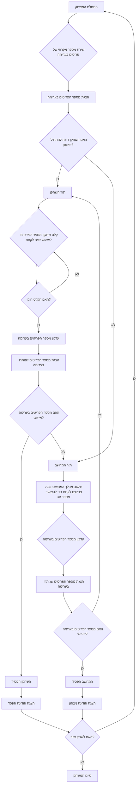

## הוראה:

נתח את הקוד שסופק בפירוט והסבר את הפונקציונליות שלו. התשובה צריכה לכלול שלושה חלקים:

1. **<algorithm>**:
   תאר את תהליך העבודה של הקוד בתרשים זרימה צעד-אחר-צעד.
   - הוסף דוגמאות לכל בלוק לוגי.
   - הצג את הזרימה של נתונים בין פונקציות, מחלקות או שיטות.

2.  **<mermaid>**:
    כתוב את קוד התרשים בפורמט `mermaid`.
    - נתח והסבר את כל התלויות המיובאות ביצירת התרשים.
    **חשוב!**: ודא שכל שמות המשתנים בתרשים `mermaid` הם בעלי משמעות ותיאור. שמות כמו `A`, `B`, `C` אסורים!

   **בנוסף**:
   אם הקוד כולל את השורה `import header`, הוסף תרשים זרימה בפורמט `mermaid` המתאר את `header.py`:
   ```mermaid
   flowchart TD
       Start --> Header[<code>header.py</code><br> קביעת שורש הפרויקט]

       Header --> import[ייבוא הגדרות גלובליות: <br><code>from src import gs</code>]
   ```

3.  **<explanation>**:
    ספק הסברים מפורטים:
    - **ייבואים (Imports)**: המטרה שלהם והקשר שלהם עם חבילות `src.` אחרות.
    - **מחלקות (Classes)**: התפקיד שלהן, המאפיינים, השיטות והאינטראקציה עם חלקים אחרים בפרויקט.
    - **פונקציות (Functions)**: הפרמטרים, הערכים המוחזרים, המטרה ודוגמאות לשימוש.
    - **משתנים (Variables)**: הסוג והשימוש שלהם.
    - ציין בעיות אפשריות או תחומים לשיפור.

בנוסף, צור שרשרת קשרים עם חלקים אחרים בפרויקט (אם רלוונטי).

הדבר מבטיח ניתוח מקיף ומובנה של הקוד.
## פורמט התשובה: `.md` (markdown)
**סוף ההוראה**
```markdown
## <algorithm>

1. **התחלת המשחק:**
   - הדפסת הודעת פתיחה ושם המשחק "EVEN".
   - יצירת מספר אקראי של פריטים בערימה (לדוגמה, בין 10 ל-30).
   - הדפסת מספר הפריטים בערימה.
   - שאילת השחקן האם הוא רוצה להתחיל ראשון.

2. **בחירת תור השחקן:**
   - אם השחקן בוחר להתחיל ראשון, המשחק עובר לתור השחקן.
   - אם השחקן בוחר שהמחשב יתחיל ראשון, המשחק עובר לתור המחשב.

3. **תור השחקן:**
   - השחקן מתבקש להזין את מספר הפריטים שהוא רוצה לקחת (בין 1 ל-3).
   - אם הקלט אינו חוקי (קטן מ-1, גדול מ-3, או גדול ממספר הפריטים בערימה), מוצגת הודעת שגיאה והשחקן מתבקש להזין קלט חדש.
   - מספר הפריטים שנלקחו מופחת ממספר הפריטים בערימה.
   - מספר הפריטים שנותרו בערימה מוצג.

4. **תור המחשב:**
   - המחשב מנסה לבחור את מספר הפריטים שהוא צריך לקחת כדי להשאיר מספר זוגי של פריטים בערימה.
   - אם זה אפשרי, המחשב לוקח את מספר הפריטים המתאים.
   - אם לא, המחשב לוקח מספר אקראי של פריטים בין 1 ל-3.
   - מספר הפריטים שנלקחו מופחת ממספר הפריטים בערימה.
   - מספר הפריטים שנותרו בערימה מוצג.

5. **בדיקת ניצחון:**
   - לאחר כל תור, נבדק האם מספר הפריטים שנותרו בערימה הוא אי-זוגי.
   - אם מספר הפריטים אי-זוגי, השחקן שהשאיר את מספר הפריטים האי-זוגי הפסיד, והמשחק מסתיים.
   - מוצגת הודעת ניצחון/הפסד בהתאם.

6. **משחק מחדש:**
   - לאחר שהמשחק מסתיים, השחקן נשאל האם הוא רוצה לשחק שוב.
   - אם השחקן בוחר לשחק שוב, המשחק מתחיל מחדש (קריאה לשלב 1).
   - אם השחקן בוחר שלא לשחק שוב, המשחק מסתיים והודעת תודה מוצגת.

**דוגמאות:**

- **אתחול המשחק:**
  - מספר אקראי של פריטים בערימה: 23
  - שאלה: "האם אתה רוצה להתחיל ראשון? (כן/לא)"
- **תור השחקן:**
  - קלט שחקן: 2
  - ערימה לאחר מהלך השחקן: 21
- **תור המחשב:**
  - המחשב מחשב: צריך לקחת 1 כדי להשאיר 20
  - ערימה לאחר מהלך המחשב: 20
- **בדיקת ניצחון:**
  - אחרי מהלך השחקן נשארו 15, מה שאומר שהשחקן הפסיד.

## <mermaid>



## <explanation>

**תיאור המשחק:**

המשחק "EVEN" הוא משחק אסטרטגיה פשוט לשני שחקנים (אחד שחקן אנושי והשני מחשב). המטרה היא להשאיר את היריב עם מספר אי-זוגי של פריטים בסוף התור שלך.

**פירוט האלגוריתם:**

1. **אתחול:**
   - המשחק מתחיל עם יצירת כמות אקראית של פריטים בין 10 ל-30.
   - השחקן מתבקש לבחור האם הוא רוצה להתחיל ראשון או שהמחשב יתחיל.

2. **מהלך השחקן:**
   - השחקן מתבקש להזין כמה פריטים הוא רוצה לקחת (בין 1 ל-3).
   - קלט לא תקין גורר בקשה לקלט חדש.
   - מספר הפריטים שנלקחו מופחת מהסך הכולל בערימה.
   - התוכנית מדפיסה את מספר הפריטים שנותרו.

3. **מהלך המחשב:**
   - המחשב מנסה לבחור מספר פריטים כדי להשאיר מספר זוגי של פריטים בערימה.
   - אם זה לא אפשרי, המחשב בוחר באופן אקראי בין 1 ל-3.
   - מספר הפריטים שנלקחו מופחת מהסך הכולל בערימה.
   - התוכנית מדפיסה את מספר הפריטים שנותרו.

4. **בדיקת סיום:**
   - בסוף כל תור, המשחק בודק אם מספר הפריטים שנותרו הוא אי-זוגי.
   - אם כן, השחקן שהשאיר את מספר הפריטים האי-זוגי הפסיד.

5. **משחק מחדש:**
   - בסוף המשחק, השחקן נשאל אם הוא רוצה לשחק שוב.
   - אם כן, המשחק מתחיל מחדש.
   - אם לא, התוכנית מסתיימת.

**מרכיבים עיקריים ושימוש:**

- **משתנים:**
  - `pile_size`: משתנה המכיל את מספר הפריטים הכולל בערימה, משתנה בזמן המשחק.
  - `player_choice`: מחזיק את הבחירה של השחקן אם להתחיל ראשון או לא (מחרוזת).
  - `player_take`: מחזיק את הקלט של השחקן כמה פריטים הוא רוצה לקחת (מספר שלם).

- **פונקציות:**
  - אין פונקציות, כל הלוגיקה מבוצעת בלולאה הראשית.

- **לולאות ותנאים:**
  - נעשה שימוש בלולאות `while` כדי לשמור על המשחק בתהליך עד שהשחקן בוחר לסיים.
  - נעשה שימוש בתנאי `if-else` כדי לנהל את תורות השחקן והמחשב, ובדיקות על תקינות קלט והפסדים/ניצחונות.

**בעיות אפשריות ותחומים לשיפור:**

- אין תמיכה במספר שחקנים.
- אין תיעוד רשמי של הקוד.
- המשחק משתמש רק ברמה אחת של קושי, לא ניתנות אפשרויות לשחקן להגביר את הקושי.
- אין מעקב אחרי מספר הניצחונות של השחקן או המחשב.
- ניתן להוסיף בדיקות נוספות על הקלט של המשתמש (למשל, קלט שהוא לא מספר).

**שרשרת קשרים עם חלקים אחרים בפרויקט:**

- אין קשרים עם חלקים אחרים בפרויקט, הקוד כרגע עומד בפני עצמו.
```