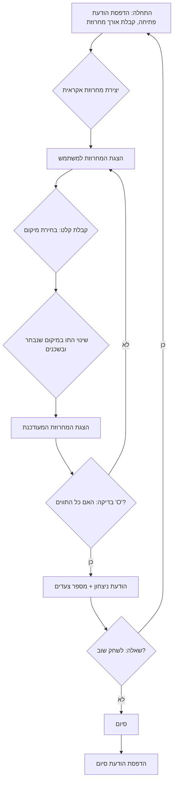

## ניתוח קוד המשחק FIPFOP

### 1. <algorithm>

**תרשים זרימה של המשחק:**

1.  **התחלה**:
    *   הדפסת הודעת פתיחה וכללי המשחק.
    *   קבלת קלט מהמשתמש עבור אורך המחרוזת (בין 5 ל-10).
    *   יצירת מחרוזת רנדומלית של 'X' ו-'O' באורך שצוין.
    *   דוגמה: אורך מחרוזת = 6, מחרוזת התחלתית = "XOXOXO".
2.  **לולאת משחק:**
    *   הצגת המחרוזת הנוכחית למשתמש.
    *   קבלת קלט מהמשתמש עבור מיקום לשינוי (בין 1 לאורך המחרוזת).
    *   דוגמה: מחרוזת = "XOXOXO", מיקום = 3.
    *   שינוי הערך במיקום שנבחר, וגם במיקומים שמשמאלו ומימינו, אם הם קיימים. שינוי מערך 'X' ל-'O', ומערך 'O' ל-'X'.
        *   דוגמה: עבור מיקום 3 ("XOXOXO"):
            *   המיקום 3 משתנה ל-'X' -> 'O': "XO**O**XOXO".
            *   המיקום 2 משתנה ל-'O' -> 'X': "X**X**OXOXO".
            *   המיקום 4 משתנה ל-'X' -> 'O': "XOX**O**XO".
            *   המחרוזת החדשה תהיה: "XOXXO".
    *   הצגת המחרוזת החדשה למשתמש.
    *   בדיקה האם כל התווים במחרוזת הם 'O'.
        *   אם כן, מעבר לשלב הניצחון.
        *   אם לא, חזרה לתחילת לולאת המשחק.
3.  **ניצחון:**
    *   הדפסת הודעת ניצחון עם מספר הצעדים שלקח.
    *   שאלה למשתמש אם הוא רוצה לשחק שוב.
        *   אם "כן", חזרה לשלב ההתחלה.
        *   אם "לא", סיום המשחק.
4.  **סיום:**
    *   הדפסת הודעת סיום.

**זרימת נתונים:**

*   המשתמש מספק קלט (אורך מחרוזת, מיקום לשינוי, בחירה לשחק שוב).
*   התוכנית מייצרת מחרוזת אקראית.
*   התוכנית משנה את המחרוזת בהתבסס על בחירת המשתמש.
*   התוכנית בודקת תנאי ניצחון.
*   התוכנית מדפיסה פלט (הודעות, מחרוזות, מספר צעדים).

### 2. <mermaid>

**ניתוח תלויות:**

הקוד אינו כולל ייבוא ספציפי של ספריות, לכן אין תלויות חיצוניות שצריך לנתח במסגרת `mermaid`. עם זאת, אם היינו מממשים את הקוד בפועל, היינו משתמשים במודול `random` של פייתון לייצור המחרוזת האקראית, ובקלט ופלט סטנדרטיים.

### 3. <explanation>

**ייבואים (Imports):**

*   בתיאור הקוד לא נעשה שימוש בייבוא של ספריות ספציפיות, כמו `random` או `header`. עם זאת, במימוש בפועל נשתמש ב-`random` לייצור המחרוזת ההתחלתית.

**מחלקות (Classes):**

*   בתיאור הקוד לא נעשה שימוש במחלקות. המשחק יכול להיות ממומש בצורה פרוצדורלית באמצעות פונקציות.

**פונקציות (Functions):**

*   הקוד מתאר את הלוגיקה של משחק FIPFOP אך אינו כולל פונקציות ספציפיות. במימוש בפועל נשתמש בפונקציות כמו:
    *   `initialize_game()` - לייצר את המחרוזת ההתחלתית, להציג את ההוראות ולבקש את אורך המחרוזת.
    *   `get_user_input()` - לקבל מהמשתמש את מיקום השינוי.
    *   `toggle_symbols()` - לשנות את הערכים במחרוזת לפי המיקום שניתן.
    *   `check_win_condition()` - לבדוק אם כל התווים במחרוזת הם 'O'.
    *   `display_game_state()` - להציג את המחרוזת הנוכחית.
    *   `play_again()` - לשאול את המשתמש אם הוא רוצה לשחק שוב.
    *  `main()` - פונקציית הניהול הראשית של המשחק, המנהלת את כל שלבי המשחק.

**משתנים (Variables):**

*   `string_length`: מספר שלם המייצג את אורך המחרוזת.
*   `game_string`: מחרוזת המורכבת מ-'X' ו-'O' בלבד, המייצגת את מצב המשחק.
*   `position`: מספר שלם המייצג את המיקום במחרוזת שמשתמש בוחר לשנות.
*   `move_count`: מספר שלם המייצג את מספר הצעדים של השחקן.
*  `play_again_response` - מחרוזת שמייצגת את הבחירה של השחקן, האם הוא רוצה לשחק שוב.

**בעיות אפשריות ותחומים לשיפור:**

*   **קלט לא תקין:** הקוד המתואר אינו כולל בדיקת תקינות קלט. צריך לוודא שהמשתמש מכניס מספרים בטווח הנכון (אורך מחרוזת בין 5 ל-10, מיקום בטווח המחרוזת).
*   **ויזואליזציה:** ניתן להוסיף ויזואליזציה גרפית כדי לשפר את חוויית המשתמש, אך זה לא הכרחי למשחק טקסטואלי פשוט.
*   **הפרדה בין לוגיקה לממשק:** מומלץ להפריד את לוגיקת המשחק מהממשק המשתמש כדי להקל על שינויים עתידיים.

**שרשרת קשרים עם חלקים אחרים בפרויקט:**

מכיוון שזהו משחק עצמאי, אין לו תלות ישירה בחלקים אחרים בפרויקט, אלא אם המשחק הופך לחלק ממערכת גדולה יותר. במקרה כזה, המשחק יכול לתקשר עם רכיבים אחרים כמו מנהל משחקים, שירות ניקוד וכו', אך זה מעבר לתיאור הנוכחי.