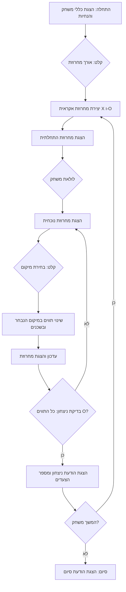

## ניתוח קוד המשחק FIPFOP

### 1. <algorithm>

**תרשים זרימה של המשחק:**

1.  **התחלה:**
    *   הצגת הודעת פתיחה וכללי המשחק.
    *   קבלת אורך מחרוזת מהמשתמש (בין 5 ל-10). לדוגמה, אם המשתמש יזין `6`, אורך המחרוזת יהיה 6.
    *   יצירת מחרוזת אקראית של `X` ו-`O`. לדוגמה, `XOXOXO`.
    *   הדפסת המחרוזת ההתחלתית.

2.  **לולאת המשחק:**
    *   הדפסת המחרוזת הנוכחית.
    *   קבלת קלט מהמשתמש עבור מיקום לשינוי (1 עד אורך המחרוזת). לדוגמה, אם המשתמש יזין `3`, המיקום שנבחר הוא 3.
    *   שינוי התו במיקום הנבחר ואת התווים השכנים (אם קיימים). לדוגמה, אם המחרוזת היא `XOXOXO` והמיקום הוא `3`, המחרוזת תהפוך ל-`XOXXXO`.
    *   עדכון המחרוזת והצגתה לאחר השינוי.
    *   בדיקה האם כל התווים הם `O`. אם כן, המשחק מסתיים. אחרת, המשחק ממשיך.

3.  **סיום המשחק:**
    *   הדפסת הודעת ניצחון ומספר הצעדים שנדרשו. לדוגמה, "ניצחת ב-2 צעדים!".
    *   שאילת המשתמש האם לשחק שוב.
        *   אם "כן", חזרה לשלב 1 עם מחרוזת חדשה.
        *   אם "לא", סיום המשחק והדפסת הודעת סיום.

**דוגמאות לבלוקים לוגיים:**

*   **יצירת מחרוזת אקראית:** אם אורך המחרוזת הוא 6, אז תווצר מחרוזת כמו `XOXOXO` או `OOXXOO` או `XOOXXO`.
*   **שינוי תווים:** אם המחרוזת היא `XOXOXO` והמיקום הוא `3`, התווים במיקומים 2, 3, 4 ישתנו. התוצאה תהיה `XOXXXO`.
*   **בדיקת תנאי ניצחון:** אם המחרוזת היא `OOOOOO`, המשחק יסתיים.

**זרימת נתונים:**
הזרימה מתבצעת כך:

1.  המשתמש קולט קלט (אורך המחרוזת, מיקום לשינוי).
2.  הפונקציות מעבדות את הקלט (יוצרות מחרוזת, משנות מחרוזת).
3.  התוצאות מוצגות למשתמש (המחרוזת הנוכחית, הודעת ניצחון).

### 2. <mermaid>

**ניתוח תלויות:**

התרשים אינו כולל תלויות ייבוא. הוא מתאר את הזרימה הלוגית של המשחק בלבד. כל הקוד נמצא בתוך הקובץ הנוכחי (לא נדרשים ייבוא).

### 3. <explanation>

**ייבואים (Imports):**
אין ייבוא לקבצים או ספריות חיצוניות בקוד המתואר. התרשים מסתמך על פונקציות ופעולות בסיסיות שניתן לממש בשפת תכנות כמו Python. עם זאת, הקוד המוצע מזכיר את השימוש במודול `random` ליצירת מחרוזת אקראית, אשר יידרש בשלב המימוש.

**מחלקות (Classes):**
אין שימוש במחלקות בקוד הנוכחי. הקוד מתואר כסדרה של שלבים או פונקציות שאינן מאורגנות במבנה של מחלקה.

**פונקציות (Functions):**
למרות שאין הגדרה של פונקציות ספציפיות, ניתן להניח את קיומן של הפונקציות הבאות:
   *   `generate_random_string(length)`: מקבלת אורך ומחזירה מחרוזת אקראית של 'X' ו-'O'.
   *   `update_string(string, position)`: מקבלת מחרוזת ומיקום, משנה את התו במיקום זה ואת שכניו, ומחזירה את המחרוזת המעודכנת.
   *   `is_game_won(string)`: מקבלת מחרוזת ומחזירה `True` אם כל התווים הם 'O', אחרת `False`.
   *   `get_user_input()`: מקבלת קלט מהמשתמש ומחזירה אותו.
   *   `print_game_message()`: מדפיסה הודעה למשתמש.

**משתנים (Variables):**
  *   `string_length`: משתנה מסוג שלם (int) שמאחסן את אורך המחרוזת שהמשתמש הגדיר.
  *   `game_string`: משתנה מסוג מחרוזת (string) שמאחסן את מחרוזת המשחק הנוכחית.
  *   `position`: משתנה מסוג שלם (int) שמאחסן את המיקום שהמשתמש בחר לשנות.
  *   `moves_count`: משתנה מסוג שלם (int) שסופר את מספר הצעדים שביצע השחקן.

**בעיות אפשריות:**
*   **טיפול שגיאות:** לא מוגדר טיפול בשגיאות כמו קלט לא חוקי מהמשתמש (למשל, אורך מחרוזת מחוץ לטווח המותר, קלט שאינו מספר עבור המיקום).
*   **חוסר מודולריות:** הקוד לא מובנה לפונקציות נפרדות, מה שהופך אותו קשה יותר לקריאה ולשימוש חוזר.

**תחומים לשיפור:**
*   **יצירת פונקציות נפרדות:** לכל שלב במשחק (יצירת מחרוזת, שינוי תווים, בדיקת ניצחון).
*   **הוספת טיפול בשגיאות:** כדי למנוע קריסות בעת קלט לא תקין.
*   **הוספת תיעוד:** להסביר את תפקיד כל פונקציה ומשתנה.
*   **יישום OOP:** אפשר לממש את המשחק עם מחלקה שמאגדת את נתוני המשחק והפונקציונליות שלו, מה שיקל על תחזוקה והרחבה עתידית.
*   **ממשק משתמש:** לשפר את חוויית המשתמש על ידי הוספת ממשק משתמש אינטראקטיבי יותר.

**שרשרת קשרים:**
*   הקוד עובד באופן עצמאי, הוא לא תלוי בחלקים אחרים בפרויקט. עם זאת, הוא עשוי להשתמש במודולים סטנדרטיים של Python כמו `random`.
*   הוא יכול להיות משולב במערכת משחקים גדולה יותר, אך הוא נשאר מודול עצמאי שאינו תלוי בקבצים אחרים.