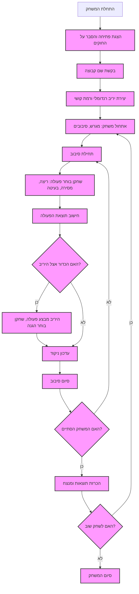

## ניתוח קוד: משחק פוטבול טקסטואלי

### 1. **<algorithm>**

**תרשים זרימה צעד-אחר-צעד:**

1.  **התחלה:** המשחק מתחיל בהצגת הודעת פתיחה והסבר על החוקים.
    *   *דוגמה:* "ברוכים הבאים למשחק FOOTBL!"
2.  **בחירת שם קבוצה:** השחקן מתבקש להזין את שם הקבוצה שלו.
    *   *דוגמה:* "הזן את שם הקבוצה שלך:" > "האריות"
3.  **יצירת יריב:** המשחק יוצר באופן רנדומלי יריב עם רמת קושי מוגדרת (1 עד 3).
    *   *דוגמה:* "היריב שלך: נמרים (רמת קושי: 2)"
4.  **אתחול משחק:** המשחק מאתחל את מצב המשחק, מחלק את המגרש ל-100 יארדים ומגדיר 4 סיבובים (טיימים).
    *   *דוגמה:* מצב התחלתי: 0 יארדים, טים 1.
5.  **תחילת סיבוב:** כל סיבוב מתחיל כאשר לאחת הקבוצות יש את הכדור.
    *   *דוגמה:* "המשחק התחיל! תורך."
6.  **בחירת פעולה:** השחקן בוחר אחת מפעולות אפשריות: ריצה, מסירה, או בעיטה.
    *   *דוגמה:* "בחר פעולה: ריצה, מסירה, בעיטה" > "ריצה"
7.  **חישוב תוצאת הפעולה:** המשחק מחשב את תוצאת הפעולה בהתבסס על רמת הקושי וערכים רנדומליים.
    *   *דוגמה:* ריצה מוצלחת: "התקדמת 5 יארדים."
    *   *דוגמה:* מסירה נכשלה: "הכדור נחטף ע"י היריב."
8.  **הגנה (אם הכדור אצל היריב):** אם הכדור אצל היריב, התוכנית מדמה את פעולות היריב והשחקן בוחר אסטרטגיה הגנתית.
    *   *דוגמה:* היריב מנסה ריצה, שחקן בוחר "לחסום".
9.  **עדכון ניקוד:** המשחק מעדכן את הניקוד בהתאם לתוצאות הפעולות:
    *   טאצ'דאון: 6 נקודות.
    *   בעיטה לשער: 3 נקודות.
    *   המרת נקודה לאחר טאצ'דאון: 1 או 2 נקודות.
    *   *דוגמה:* "טאצ'דאון! קיבלת 6 נקודות."
10. **סיום סיבוב:** אם סיבוב נגמר, יש לבצע מעבר לסיבוב הבא או למצב הסיום של המשחק.
    *   *דוגמה:* "הסתיים סיבוב 1, תחילת סיבוב 2."
11. **בדיקת סיום:** המשחק בודק האם אחד התנאים לסיום המשחק התקיים:
    *   4 סיבובים הסתיימו.
    *   השחקן ביקש לסיים מוקדם.
    *   *דוגמה:* "הסתיים המשחק!"
12. **הכרזת תוצאות:** המשחק מכריז על התוצאה הסופית ועל המנצח.
    *   *דוגמה:* "תוצאה סופית: האריות - 21, נמרים - 14. ניצחת!"
13. **משחק חוזר:** השחקן נשאל אם הוא רוצה לשחק שוב.
    *   *דוגמה:* "האם תרצה לשחק שוב? (כן/לא)"
14. **סיום או חזרה:** אם השחקן ענה "כן", המשחק חוזר לשלב 2. אם "לא", המשחק נגמר.
    *   *דוגמה:* "תודה ששיחקת!"

### 2. **<mermaid>**

**ניתוח תלויות:**

-   אין תלויות מיובאות ישירות בקוד זה. זהו תיאור של משחק טקסטואלי ואינו קוד פעיל.
-   התרשים מדגים את זרימת הלוגיקה של משחק הפוטבול.

**הסבר שמות המשתנים בתרשים:**

-   **Start:** נקודת ההתחלה של המשחק.
-   **Welcome:** הודעת פתיחה ושאלת השחקן את שם הקבוצה שלו.
-  **TeamName**: קליטת שם הקבוצה מהשחקן.
-   **GenerateOpponent:** יצירת היריב ורמת הקושי שלו באופן רנדומלי.
-   **InitializeGame:** אתחול מצב המשחק (מגרש, סיבובים, וכו').
-   **GameStart:** התחלת סיבוב חדש במשחק.
-   **PlayerAction:** השחקן בוחר פעולה (ריצה, מסירה, בעיטה).
-   **CalculateAction:** חישוב תוצאת הפעולה של השחקן (כולל רנדומליות ורמת קושי).
-  **DefensePhase**: האם הקבוצה של היריב היא זאת שמשחקת כרגע.
-   **OpponentAction**:  היריב בוחר פעולה, והשחקן בוחר אסטרטגיה הגנתית.
-   **UpdateScore:** עדכון הניקוד בהתאם לתוצאות המשחק.
-   **EndOfRound:** סיום הסיבוב הנוכחי.
-   **CheckGameEnd:** בדיקה האם תנאי הסיום של המשחק התקיימו.
-   **AnnounceResults:** הכרזה על תוצאות המשחק והמנצח.
-   **PlayAgain:** שאלת השחקן האם הוא רוצה לשחק שוב.
-   **GameEnd:** סיום המשחק.

### 3. **<explanation>**

**ייבואים (Imports):**

-   אין ייבוא ישירות בתיאור זה, מכיוון שזהו תיאור של לוגיקה המשחק ולא קוד ממשי.
-   אם היה קוד ממשי, היה צפוי לייבא את המודול `random` לטובת חישוב תוצאות פעולות אקראיות, בהתאם לתיאור.

**מחלקות (Classes):**

-   אין מחלקות בתיאור הזה. אם זה היה קוד ממשי, ייתכן שהיו מחלקות כמו `Team`, `Player`, `Game` ועוד.

**פונקציות (Functions):**

-   אין פונקציות בתיאור הזה. אם זה היה קוד ממשי, היו פונקציות ל:
    -   `initialize_game()`: לאתחול המשחק.
    -   `get_player_action()`: לקבל את פעולת השחקן.
    -   `calculate_action_result()`: לחישוב תוצאת הפעולה.
    -   `update_score()`: לעדכון הניקוד.
    -   `check_game_end()`: לבדוק אם המשחק צריך להסתיים.
    -   `announce_results()`: להכרזה על התוצאות.
    -   `play_again()`: לבדוק אם השחקן רוצה לשחק שוב.

**משתנים (Variables):**

-   **`team_name`:** שם הקבוצה של השחקן (מחרוזת).
-   **`opponent_name`:** שם הקבוצה היריבה (מחרוזת).
-   **`difficulty_level`:** רמת הקושי של היריב (מספר שלם בין 1 ל-3).
-   **`field_position`:** המיקום של הכדור במגרש (מספר שלם בין 0 ל-100).
-   **`current_round`:** מספר הסיבוב הנוכחי (מספר שלם בין 1 ל-4).
-   **`player_score`:** הניקוד של השחקן (מספר שלם).
-   **`opponent_score`:** הניקוד של היריב (מספר שלם).
-    **`action`**: הפעולה שהשחקן בוחר (מחרוזת בין ריצה, מסירה ובעיטה).
-    **`result`**: תוצאת הפעולה (מחרוזת).
-    **`defense_action`**: פעולת ההגנה שהשחקן בוחר (מחרוזת).

**שרשרת קשרים עם חלקים אחרים בפרויקט (אם רלוונטי):**

-   תיאור זה אינו מכיל קשרים לחלקים אחרים של פרויקט מכיוון שהוא תיאור רעיוני בלבד של המשחק.

**בעיות אפשריות ותחומים לשיפור:**

-   המשחק פשוט מדי, חסרים בו אלמנטים כמו טעויות, פציעות או מהלכים מורכבים יותר.
-   רמת הקושי כרגע מאוד בסיסית.
-   אין מערכת לניהול שחקנים, קבוצות והיסטוריית משחקים.
-   המשחק כרגע טקסטואלי בלבד. יש לשפר את חווית המשתמש בעזרת ממשק גרפי או אנימציות.
-   חסרה מערכת חוקים מורכבת יותר, כגון חוקי ה-Offside או חוקי החלפת שחקנים.