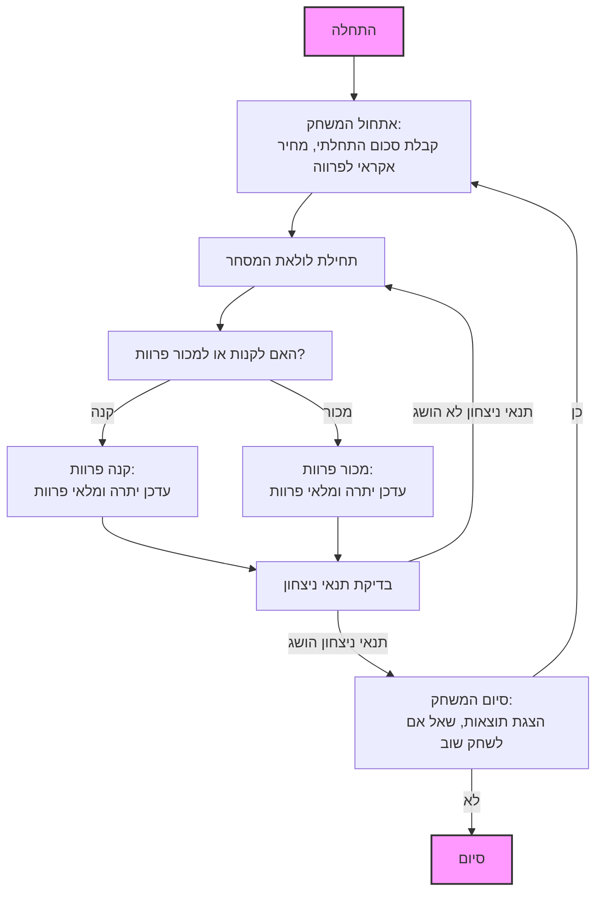

## ניתוח קוד המשחק "פרוות"

### <algorithm>

1. **אתחול המשחק:**
   - המשחק מתחיל בהצגת הודעת פתיחה וכללי המשחק לשחקן.
   - השחקן מקבל סכום התחלתי, למשל 100 דולר.
   - מחוללים מחירי פרוות אקראיים בהתאם לשוק (לדוגמה, 15-30 דולר).
   - השחקן בוחר את מספר הסוחרים שהוא רוצה לשחק מולם (לדוגמה, 2-5).

   *דוגמה:*
    - הודעה: "ברוכים הבאים למשחק פרוות! יש לך 100 דולר."
    - מחיר אקראי לפרווה: 22 דולר.
    - בחירת מספר סוחרים: 3.
2. **לולאת המשחק:**
   - השחקן מבצע פעולות קנייה או מכירה של פרוות:
     - השחקן רואה את מחיר הפרווה הנוכחי.
     - השחקן בוחר כמה פרוות לקנות או למכור.
     - אם השחקן קונה פרוות, סכום הכסף שלו יורד, ומלאי הפרוות שלו גדל.
     - אם השחקן מוכר פרוות, סכום הכסף שלו עולה, ומלאי הפרוות שלו יורד.
     - התוכנית מעדכנת את יתרת הכסף ואת מלאי הפרוות של השחקן.
   *דוגמה:*
     - מחיר פרווה: 20 דולר.
     - שחקן קונה 3 פרוות: עלות 60 דולר, יתרה: 40 דולר, מלאי פרוות: 3.
     - מחיר פרווה: 25 דולר.
     - שחקן מוכר 2 פרוות: רווח 50 דולר, יתרה: 90 דולר, מלאי פרוות: 1.

3. **תנאי ניצחון:**
   - המשחק מסתיים כאשר השחקן מגיע ליעד מסוים, כמו סכום כסף מוגדר או מספר פרוות מוגדר.
   - המנצח הוא השחקן שהשיג את סכום הכסף או מספר הפרוות הגדול ביותר.
   *דוגמה:*
    - המשחק מסתיים כאשר השחקן צובר 500 דולר או יותר.
    - השחקן שהגיע ראשון ליעד הזה מנצח.

4. **המשך המשחק:**
    - בתום המשחק, מוצע לשחקן לשחק שוב.
    - אם השחקן בוחר לשחק שוב, המשחק מתחיל מחדש עם אתחול חדש.
    - אם השחקן בוחר לא לשחק שוב, המשחק מסתיים.
    *דוגמה:*
     - הודעה: "האם תרצה לשחק שוב? (כן/לא)"
     - אם השחקן מזין "כן" המשחק מתחיל שוב.

### <mermaid>

### <explanation>

**ייבואים (Imports):**
  - התוכנית תצטרך לייבא את המודול `random` כדי לייצר מחירים אקראיים של הפרוות וכדי להוסיף אלמנט של אי וודאות לשוק המשחק.

**מחלקות (Classes):**
  - אין שימוש במחלקות בקוד שסופק, אך אם היו משתמשים במחלקות, לדוגמה, מחלקה `Player` הייתה יכולה לאחסן את הנתונים של השחקן כמו כסף ומלאי פרוות. מחלקה `Market` יכלה לנהל את מחירי הפרוות ולעדכן אותם באופן אקראי.

**פונקציות (Functions):**
- הפונקציות שצריכות להיות מיושמות:
    - `init_game()`: אתחול המשחק (כסף התחלתי, מחיר פרווה אקראי).
    - `display_rules()`: הצגת חוקי המשחק.
    - `get_player_choice()`: קבלת החלטת השחקן (לקנות או למכור).
    - `buy_furs(num_furs)`: קניית פרוות, עדכון יתרת השחקן ומלאי הפרוות.
    - `sell_furs(num_furs)`: מכירת פרוות, עדכון יתרת השחקן ומלאי הפרוות.
    - `check_win()`: בדיקת תנאי ניצחון.
    - `display_result()`: הצגת תוצאות המשחק.
    - `play_again()`: שואל אם לשחק שוב, מאתחל משחק חדש אם כן.

**משתנים (Variables):**
  - `player_money`: כמות הכסף שיש לשחקן (מסוג `int`).
  - `player_furs`: כמות הפרוות שיש לשחקן (מסוג `int`).
  - `fur_price`: מחיר הפרווה הנוכחי (מסוג `float`).
  - `num_traders`: מספר הסוחרים במשחק (מסוג `int`).
  - `win_condition`: תנאי הניצחון (סכום כסף או מספר פרוות, מסוג `int`).

**בעיות אפשריות או תחומים לשיפור:**
- חוסר התייחסות למצב שבו השחקן מנסה לקנות יותר פרוות מה שיש לו כסף, או למכור יותר פרוות ממה שיש לו.
- אין מערכת מורכבת לניהול שוק דינמי, שיכולה להוסיף עניין לאורך זמן.
- חוסר בגרפיקה או ממשק משתמש ידידותי.

**שרשרת קשרים עם חלקים אחרים בפרויקט:**
- אין קשר ישיר עם חלקים אחרים בפרויקט מכיוון שהמשחק בפני עצמו ולא קשור למשחקים אחרים, הוא יותר מודול עצמאי.