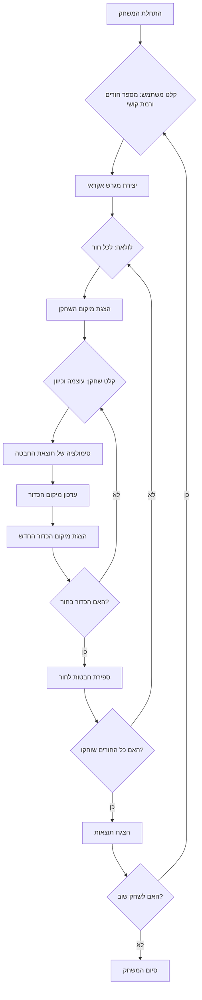

## ניתוח קוד משחק גולף

### 1. <algorithm>

**תיאור תהליך המשחק:**

1. **אתחול המשחק:**
   - קבלת פנייה משתמש והסבר על חוקי המשחק.
   - שאילת המשתמש לגבי מספר החורים (9 או 18) ורמת קושי (מתחיל, חובב, מקצוען).
   - יצירת מגרש גולף אקראי עם מיקומי חורים אקראיים.

   *דוגמה*: המשתמש בוחר 9 חורים ורמת קושי "חובב".

2. **לולאת משחק (לכל חור):**
   - הצגת מיקום הנוכחי של השחקן והמרחק לחור.
   - **קלט שחקן:**
     - קבלת בחירת עוצמת החבטה (1-10).
     - קבלת בחירת כיוון החבטה.
   - **חישוב תוצאת החבטה:**
     - סימולציה של תוצאת החבטה על סמך העוצמה, הכיוון ומכשולים.
     - עדכון מיקום הכדור על המגרש.
   - הצגת מיקום הכדור החדש למשתמש.

   *דוגמה*: השחקן בוחר עוצמה 7 והכדור נע 80 יארד.

3. **ספירת נקודות:**
    - ספירת מספר החבטות לכל חור.
    - צבירת סך החבטות בסוף המשחק.
    - ניקוד נמוך יותר מצביע על ביצועים טובים יותר.

   *דוגמה*: חור אחד הושלם ב-2 חבטות, והשחקן עבר לחוור הבא.

4. **סיום משחק:**
   - הצגת תוצאות המשחק (סך החבטות).
   - שאלה האם להתחיל משחק חדש.
   - סיום המשחק אם המשתמש בוחר שלא לשחק שוב.

   *דוגמה*: השחקן מסיים את המשחק עם 36 נקודות ומחליט שלא לשחק שוב.

**זרימת נתונים:**



### 2. <mermaid>

```mermaid
flowchart TD
    subgraph אתחול המשחק
        A[התחלת המשחק] --> B{קלט משתמש: מספר חורים (numHoles) ורמת קושי (difficulty)};
        B --> C[יצירת מגרש אקראי (gameBoard) עם מיקומי חורים (holePositions)];
    end
    C --> D{לולאה: לכל חור (holeNumber) ב-numHoles};
    subgraph משחק בכל חור
         D --> E[הצגת מיקום השחקן (playerPosition)];
        E --> F{קלט שחקן: עוצמת חבטה (swingPower) וכיוון (swingDirection)};
        F --> G[סימולציה של תוצאת החבטה (shotResult) בהתבסס על swingPower, swingDirection והמגרש (gameBoard)];
        G --> H[עדכון מיקום הכדור (ballPosition) על סמך shotResult];
        H --> I[הצגת מיקום הכדור החדש (ballPosition)];
         I --> J{האם הכדור בחור (isBallInHole)?};
         J -- לא --> F;
        J -- כן --> K[ספירת חבטות לחור (strokesPerHole)];
    end
    K --> L{האם כל החורים שוחקו (allHolesPlayed)?};
     L -- לא --> D;
    L -- כן --> M[ספירת סך החבטות (totalStrokes)];
    M --> N[הצגת תוצאות (totalStrokes) ושאלה אם לשחק שוב];
    N --> O{קלט שחקן: לשחק שוב (playAgain)?};
    O -- כן --> B;
    O -- לא --> P[סיום המשחק];
```

**ניתוח תלויות:**

- אין תלויות מיובאות ישירות בקוד הזה, מכיוון שהוא תיאור של אלגוריתם המשחק ולא קוד ממשי.

### 3. <explanation>

**הסברים מפורטים:**

- **ייבואים (Imports):**
  אין ייבוא מפורש מכיוון שהקוד אינו קוד פייתון אלא תיאור מפורט של המשחק. במימוש, המודול `random` יהיה מיובא לצורך יצירת מיקומים אקראיים של חורים ומכשולים.
  
- **מחלקות (Classes):**
  לא מוגדרות מחלקות ישירות. עם זאת, ניתן לממש את המשחק באמצעות מחלקות כמו `GolfGame`, `Player`, `Course`, `Hole`.

- **פונקציות (Functions):**
  -  `init_game()`: אתחול המשחק, קבלת קלט מהמשתמש וייצור מגרש.
  -  `play_hole()`: ניהול מהלכים בכל חור, קבלת קלט, סימולציה של החבטה ועדכון המיקום.
  -  `calculate_shot_result()`: חישוב תוצאות החבטה, תוך התחשבות בעוצמה, כיוון ומכשולים.
  - `update_ball_position()`: עדכון מיקום הכדור במגרש.
  - `count_score()`: חישוב ועדכון תוצאות המשחק.
   - `end_game()`: הצגת תוצאות המשחק, שאלה אם לשחק שוב וסיום המשחק.

- **משתנים (Variables):**
  - `numHoles` (int): מספר החורים במשחק (9 או 18).
  - `difficulty` (str): רמת הקושי של המשחק (מתחיל, חובב, מקצוען).
  - `gameBoard` (array): ייצוג של מגרש הגולף עם מיקומי חורים ומכשולים.
  - `holePositions` (array): מיקומי החורים במגרש.
  - `playerPosition` (tuple): מיקום השחקן הנוכחי.
  - `swingPower` (int): עוצמת החבטה שנבחרה על ידי השחקן (1-10).
  - `swingDirection` (float): כיוון החבטה.
  - `shotResult` (tuple): תוצאת החבטה (מרחק וכיוון).
  - `ballPosition` (tuple): מיקום הכדור במגרש.
  - `strokesPerHole` (int): מספר החבטות שבוצעו לחור הנוכחי.
  - `totalStrokes` (int): סך החבטות בכל המשחק.
  - `playAgain` (str): בחירה של המשתמש האם לשחק שוב.

**בעיות אפשריות ושיפורים:**

- **פיזיקה פשוטה:** מודל הפיזיקה של החבטה הוא פשוט מאוד. ניתן להוסיף חישובים מורכבים יותר, כמו השפעת הרוח, גובה פני השטח וסיבוב הכדור.
- **מכשולים:** ניתן להוסיף סוגי מכשולים רבים יותר עם השפעות שונות על מסלול הכדור, כמו חול, מים ועצים.
- **ממשק משתמש:** ממשק המשתמש הוא טקסטואלי בלבד. אפשר לשפר את חוויית המשתמש על ידי הוספת גרפיקה.
- **רמות קושי:** אפשר להוסיף רמות קושי עם מגרשים וסוגי מכשולים שונים.

**שרשרת קשרים עם חלקים אחרים בפרויקט:**

- קובץ זה מתאר את הלוגיקה של משחק הגולף, ויכול להוות חלק ממערכת משחקי AI רחבה יותר, הממומשת ב-Python. ייתכן שיהיה קשר למודולים אחרים שקשורים למשחקים אחרים או למערכת ליצירת גרפיקה.

המשחק יכול להיות מורחב בעתיד כדי לכלול תכונות נוספות כמו משחק מרובה משתתפים, לידרבורד ועוד.