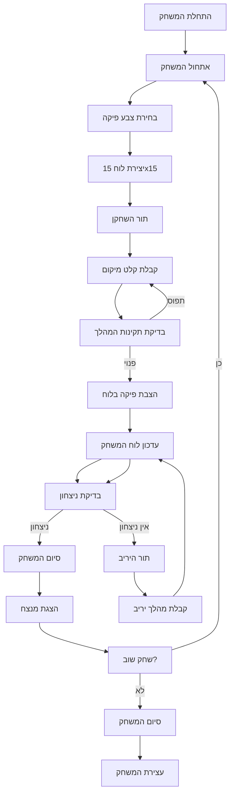

## ניתוח קוד: גומוקו (Gomoku)

### <algorithm>
1.  **אתחול המשחק:**
    *   הצגת הודעת פתיחה ושאלת השחקן איזה צבע הוא רוצה לשחק.
    *   יצירת לוח משחק ריק בגודל 15x15.
    *   דוגמה:
        ```
        הודעת פתיחה: "ברוכים הבאים לגומוקו!"
        בחירת צבע: "בחר צבע: (שחור/לבן)" -> שחור
        יצירת לוח: לוח ריק 15x15
        ```
2.  **תהליך המשחק:**
    *   **תור השחקן:**
        1.  קבלת קלט מהשחקן לגבי מיקום הפיקה (למשל, "D4").
        2.  בדיקה אם המשבצת פנויה.
            *   אם המשבצת תפוסה, בקש מיקום חדש.
            *   אם המשבצת פנויה, הצב את הפיקה.
        3.  עדכון לוח המשחק.
        4.  דוגמה:
            ```
            קלט מהשחקן: "D4"
            בדיקת מיקום D4 -> פנוי
            הצבת פיקה ב-D4 (X לדוגמה)
            ```
    *   **תור היריב:**
        1.  יריב (מחשב/שחקן שני) מבצע מהלך.
        2.  עדכון לוח המשחק.
        3.  דוגמה:
            ```
             מהלך יריב: "F5"
             עדכון לוח: הצבת פיקה ב-F5 (O לדוגמה)
            ```
    *   **בדיקת ניצחון:**
        1.  בדיקה אם יש רצף של 5 פיקות באותו צבע, אופקית, אנכית או אלכסונית.
        2.  אם נמצא ניצחון, סיום המשחק.
        3.  דוגמה:
            ```
            בדיקת שורות, עמודות ואלכסונים
            אם נמצא 5 פיקות ברצף -> ניצחון
            ```
    *   חזרה על תהליך זה עד שאחד מהשחקנים מנצח או הלוח מתמלא.
3.  **סיום המשחק:**
    *   הודעת ניצחון/תיקו.
    *   שאלה האם להתחיל משחק חדש.
    *   דוגמה:
        ```
         הודעת ניצחון: "ברכות, ניצחת!"
        שאלה: "האם לשחק שוב? (כן/לא)"
        ```

### <mermaid>


### <explanation>
*   **ייבואים (Imports):**
    *   בתיאור הקוד לא מופיע ייבוא מפורש של מודולים, אך מצוין שימוש אפשרי ב-`random` עבור בינה מלאכותית פשוטה של היריב.
        *   `random`: מודול ליצירת מספרים אקראיים, שימושי למהלכים אקראיים של המחשב.
*   **מחלקות (Classes):**
    *   לא מוגדרות מחלקות בתיאור, אבל במימוש אפשר להשתמש במחלקה לייצוג הלוח, השחקנים או המשחק.
*   **פונקציות (Functions):**
    *   **`init_game()`**: פונקציה לאתחול המשחק, הצגת הודעת פתיחה, קבלת בחירת צבע השחקן ויצירת לוח ריק.
    *   **`player_turn()`**: פונקציה לטיפול בתור השחקן, קבלת מיקום, בדיקת תקינות ועדכון לוח.
    *   **`opponent_turn()`**: פונקציה לטיפול בתור היריב, קבלת מהלך, עדכון לוח. (אפשר מימוש פשוט באמצעות מהלך אקראי בעזרת `random`).
    *   **`check_win()`**: פונקציה לבדיקת ניצחון (רצף של 5 פיקות).
    *   **`end_game()`**: פונקציה לסיום המשחק, הצגת מנצח/תיקו ובקשה למשחק חוזר.
*   **משתנים (Variables):**
    *   `board`: משתנה דו-ממדי (לדוגמה, רשימה של רשימות) לייצוג לוח המשחק.
    *   `player_color`: משתנה לציון צבע השחקן (שחור/לבן).
    *   `opponent_color`: משתנה לציון צבע היריב (שחור/לבן).
    *   `current_player`: משתנה לציון תור השחקן הנוכחי.

*   **בעיות אפשריות או תחומים לשיפור:**
    *   **בינה מלאכותית יריב**: מימוש בינה מלאכותית פשוטה בעזרת מודול `random` נותן חווית משחק בסיסית מאוד. יש מקום לשיפור בינה מלאכותית.
    *   **גרפיקה**: גרפיקה טקסטואלית יכולה להיות פחות אינטואיטיבית, שיפור גרפי יכול לשפר את חוויית המשתמש.
    *   **מניעת רמאות**: אין מנגנון המונע מרמאות, לדוגמה שינוי ישיר של הלוח.
    *   **קשיים לניהול**: הקוד יכול להיות מורכב לניהול כאשר הוא ממומש בפונקציות מרובות, אפשר לשקול ליישם את המשחק בצורת מחלקות.

*   **שרשרת קשרים עם חלקים אחרים בפרויקט:**
    *   המשחק עצמאי למדי ואינו תלוי בחלקים אחרים בפרויקט, אלא אם כן מדובר בחלק ממערכת גדולה יותר. במקרה כזה, ייתכן שיהיה שימוש משותף במודולים כמו ממשק משתמש.
    *   אם יהיו אפשרויות כמו משחק מרובה משתתפים, ייתכן שיהיה צורך בתקשורת עם מודול רשת.