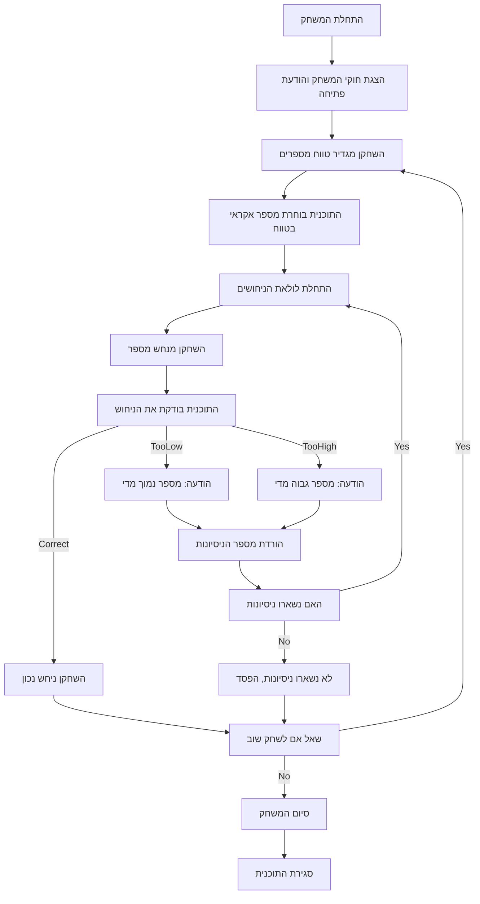

## ניתוח קוד המשחק "GUESS" (נחש את המספר)

### 1. <algorithm>
1.  **התחלת המשחק:**
    *   המשחק מברך את השחקן ומסביר את הכללים.
    *   השחקן בוחר טווח מספרים (לדוגמה, 1 עד 100).
    *   התוכנית בוחרת מספר אקראי בטווח הזה.
        *   דוגמה: טווח = 1 עד 100, מספר אקראי = 42.
2.  **לולאת משחק:**
    *   השחקן מנחש מספר.
    *   התוכנית בודקת את הניחוש:
        *   אם הניחוש קטן מהמספר האקראי, התוכנית מודיעה שהמספר גדול יותר.
            *   דוגמה: ניחוש = 20, פלט = "המספר המסתורי גדול יותר."
        *   אם הניחוש גדול מהמספר האקראי, התוכנית מודיעה שהמספר קטן יותר.
            *   דוגמה: ניחוש = 70, פלט = "המספר המסתורי קטן יותר."
        *   אם הניחוש נכון, התוכנית מברכת את השחקן ומציינת כמה ניסיונות לקח לו לנחש.
            *   דוגמה: ניחוש = 42, פלט = "ניחשת נכון! לקח לך 3 ניסיונות."
    *   התוכנית סופרת את מספר הניסיונות שנעשו.
    *   השחקן מקבל מספר מוגבל של ניסיונות.
        *   דוגמה: מספר ניסיונות = 10.
    *   אם השחקן לא הצליח לנחש את המספר לאחר מספר הניסיונות המוגבל, התוכנית מודיעה על כך ומציעה לשחק שוב.
3.  **סיום המשחק:**
    *   התוכנית שואלת אם השחקן רוצה לשחק שוב.
    *   אם השחקן עונה "כן":
        *   המשחק מתחיל מחדש עם טווח חדש.
    *   אם השחקן עונה "לא":
        *   המשחק מסתיים.

### 2. <mermaid>

**ניתוח תלויות:**

אין תלויות חיצוניות (ייבוא) שנדרשות לתיאור תהליך המשחק עצמו. המשחק מבוסס על לוגיקה בסיסית של קלט משתמש, השוואה ותנאים.  עם זאת,  התיאור מציין שהמימוש בפייתון ישתמש במודול `random` ליצירת מספר אקראי. לכן,  במימוש אמיתי נדרש `import random`,  אבל זה לא חלק מהאלגוריתם הכללי של המשחק.

### 3. <explanation>
**ייבואים (Imports):**

*   הטקסט מציין שמימוש בפייתון ישתמש במודול `random` כדי ליצור את המספר האקראי.  מודול זה לא מוגדר ישירות במסמך הזה,  אלא כחלק מההמלצות למימוש.
*   אין ייבוא ספציפי מחבילות `src.` או מודולים אחרים של הפרויקט במסמך זה.

**מחלקות (Classes):**

*   אין מחלקות המוגדרות ישירות במסמך זה. המסמך מתאר את הלוגיקה של המשחק באמצעות הוראות שלבים, ללא שימוש בגישה מונחית עצמים.
*   במימוש אמיתי,  ייתכן ותיווצר מחלקה `Game` כדי לנהל את מצב המשחק, את טווח המספרים ואת מספר הניסיונות, אך זה לא מפורט כאן.

**פונקציות (Functions):**

*   המסמך לא מגדיר פונקציות ספציפיות,  אלא רק מפרט את השלבים ההגיוניים של המשחק.
*   במימוש בפייתון, סביר להניח שיהיו פונקציות:
    *   `start_game()` - אתחול המשחק, בחירת הטווח והמספר האקראי.
    *   `get_user_guess()` - לקבל את ניחוש המשתמש.
    *   `check_guess(guess, secret_number)` - לבדוק את הניחוש ולהחזיר תוצאה (נמוך, גבוה, נכון).
    *   `play_again()` - שאלה אם לשחק שוב.
    *   `main()` - פונקציה ראשית שתאגד את כל הפונקציות ותנהל את זרימת המשחק.
*   דוגמה לפונקציה `check_guess(guess, secret_number)`:
    *   **פרמטרים:** `guess` (הניחוש של המשתמש), `secret_number` (המספר האקראי).
    *   **ערך מוחזר:** מחרוזת ("נמוך", "גבוה", "נכון") או ערך בוליאני המציין האם הניחוש נכון.
    *   **מטרה:** השוואת הניחוש למספר האקראי ומתן משוב למשתמש.

**משתנים (Variables):**

*   אין משתנים ספציפיים מוגדרים במסמך, אבל נצפה לראות את הבאים במימוש:
    *   `secret_number`: מספר אקראי שהתוכנית בחרה.
    *   `min_range`: הגבול התחתון של הטווח.
    *   `max_range`: הגבול העליון של הטווח.
    *   `tries`: מספר הניסיונות שנותרו למשתמש.
    *   `guess`: ניחוש המשתמש.

**בעיות אפשריות ותחומים לשיפור:**

*   **טיפול בקלט לא תקין:** המשחק צריך להתמודד עם קלט שאינו מספר (לדוגמה, אם המשתמש מזין טקסט במקום מספר).
*   **בחירת טווח גמישה:** המשחק יכול להציע אפשרות למשתמש לבחור טווחים שונים (לא רק 1 עד 100).
*   **רמות קושי:** ניתן להוסיף רמות קושי שונות על ידי שינוי מספר הניסיונות או הטווח.
*   **GUI (ממשק משתמש גרפי):** המשחק יכול להיות יותר ידידותי למשתמש על ידי הוספת GUI.
*   **תיעוד:** ייתכן וחסר תיעוד על השימוש בפונקציות שכן הממשק הוא טקסטואלי בלבד.

**שרשרת קשרים עם חלקים אחרים בפרויקט:**

*   המשחק יכול להיות חלק מתיקיית משחקים בפרויקט, וייתכן שהוא ישתמש בפונקציות גלובליות לטיפול בקלט ופלט (אם כאלה קיימות בפרויקט).
*   במידה והפרויקט מוגדר עם מבנה של מחלקות, המחלקה `Game` תהיה קשורה למחלקות אחרות בפרויקט.

לסיכום, המסמך מספק תיאור ברור של הלוגיקה של המשחק "Guess".  האלגוריתם פשוט,  אך דורש מימוש של פונקציות ספציפיות וטיפול בקלט ופלט בעת המימוש.  המסמך לא כולל פרטים קונקרטיים של מימוש,  אבל מהווה בסיס טוב לפיתוח המשחק.