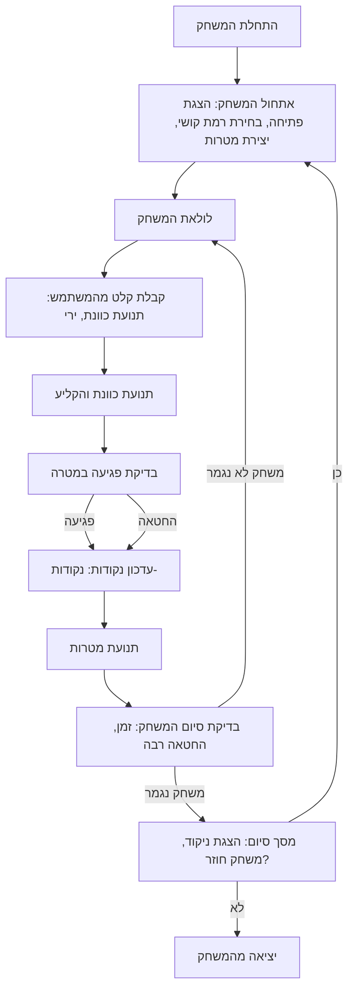

## ניתוח קוד: GUNNER (משחק ירי)

### 1. <algorithm>

הקוד מתאר משחק ארקייד בשם "GUNNER", שבו השחקן שולט ביורה ויורה במטרות נעות. הנה תיאור צעד אחר צעד של תהליך העבודה:

1. **אתחול המשחק:**
   - הצגת הודעת פתיחה לשחקן והסבר על חוקי המשחק.
   - מתן אפשרות לשחקן לבחור רמת קושי (קל, בינוני, קשה).
   - בהתאם לרמת הקושי, הגדרת מהירות תנועת המטרות.
   - יצירת מספר מטרות במיקומים אקראיים על המסך.
   - *דוגמה*:
     - הודעת פתיחה: "ברוכים הבאים למשחק GUNNER!"
     - בחירת רמת קושי: "בחר רמת קושי (קל/בינוני/קשה):"
     - הגדרת מהירות מטרה: מהירות=5 עבור רמה קלה, מהירות=10 עבור רמה בינונית, מהירות=15 עבור רמה קשה.
     - יצירת מטרות: מטרה1(x=20, y=50), מטרה2(x=80, y=120), מטרה3(x=150, y=70).

2. **תהליך המשחק המרכזי:**
   - **בקרות:**
     - השחקן שולט בכוונת באמצעות מקשי החצים (או העכבר) כדי לכוון למטרות.
     - השחקן יורה באמצעות מקש הרווח או הכפתור השמאלי של העכבר.
     - *דוגמה*:
       - תנועת כוונת: השחקן לוחץ על חץ ימין, הכוונת זזה ימינה.
       - ירי: השחקן לוחץ על מקש הרווח, נוצר קליע.
   - **ירי:**
     - מעקב אחר פגיעות והפחתת נקודות על החטאות.
     - חישוב נקודות עבור כל פגיעה במטרה.
     - המטרות נעות באופן אקראי על המסך, ומהירותן גדלה עם כל רמה.
     - *דוגמה*:
       - פגיעה: קליע פוגע במטרה1, נקודות+=10.
       - החטאה: קליע לא פוגע במטרה, נקודות-=2.
       - תנועת מטרה: מטרה1 זזה ל(x=22, y=55).
   - **רמות קושי:**
     - ברמה קלה, המטרות נעות לאט והכמות שלהן מוגבלת.
     - ברמה בינונית, המטרות נעות מהר יותר וקיימות יותר מטרות.
     - ברמה קשה, המטרות נעות במהירות גבוהה ומופיעות בכמות גדולה יותר.
     - *דוגמה*:
       - רמה קלה: 3 מטרות, מהירות איטית.
       - רמה בינונית: 5 מטרות, מהירות בינונית.
       - רמה קשה: 7 מטרות, מהירות גבוהה.

3. **חישוב נקודות:**
   - שמירת ספירת הנקודות, שגדלה עם כל פגיעה במטרה.
   - הפחתת נקודות על החטאות, במקרה שהשחקן מפספס מטרה או לא מספיק לירות בה.
   - *דוגמה*:
     - פגיעה: נקודות=100, נקודות+=10, נקודות=110.
     - החטאה: נקודות=110, נקודות-=2, נקודות=108.

4. **סיום המשחק:**
   - המשחק מסתיים כאשר הזמן ברמה מסתיים או כשהשחקן מפספס יותר מדי מטרות.
   - הצגת הניקוד הסופי והצעה להתחיל משחק חדש או לצאת.
   - אם השחקן בוחר להתחיל משחק חדש, יתחיל משחק חדש באותה רמת קושי או ברמת קושי שונה.
   - אם בוחר לצאת, המשחק יסתיים.
   - *דוגמה*:
     - סיום משחק: "המשחק הסתיים! הנקודות שלך: 150"
     - שאלה: "האם תרצה לשחק שוב? (כן/לא)"

**זרימת נתונים:**
- השחקן בוחר רמת קושי -> המהירות והכמות של המטרות מוגדרות.
- השחקן שולט בכוונת -> המיקום של הכוונת מעודכן.
- השחקן יורה -> הקליע נוצר והאם הוא פוגע במטרה נבדק.
- הפגיעה או ההחטאה -> הנקודות מחושבות.
- הזמן נגמר או מפספסים יותר מדי מטרות -> המשחק מסתיים.
- הניקוד הסופי מוצג -> בחירת המשחק הבא או סיום.

### 2. <mermaid>

**הסבר התרשים:**
- **Start:** תחילת המשחק.
- **Initialize:** אתחול המשחק, כולל הודעת פתיחה, בחירת רמת קושי, הגדרת מהירות המטרות ויצירת המטרות.
- **GameLoop:** הלולאה הראשית של המשחק.
- **Input:** קבלת קלט מהמשתמש (תנועת כוונת, ירי).
- **Movement:** עדכון מיקום הכוונת והקליעים.
- **CheckHit:** בדיקה האם הקליע פגע במטרה.
- **ScoreUpdate:** עדכון הנקודות בהתאם לפגיעה או החטאה.
- **MoveTargets:** הזזת המטרות באופן אקראי.
- **GameEndCheck:** בדיקה האם המשחק צריך להסתיים (זמן או החטאה רבה).
- **EndScreen:** מסך סיום המשחק, כולל הצגת הנקודות והאפשרות לשחק שוב.
- **Exit:** יציאה מהמשחק.

### 3. <explanation>

**ייבוא (Imports):**

הקוד אינו כולל שום ייבוא, אך מציע שימוש במודולים הבאים:
- **`pygame`:** מודול ליצירת ממשק גרפי וטיפול באנימציות, מתאים ליצירת משחקים.
- **`random`:** מודול ליצירת מספרים אקראיים, שימושי ליצירת מטרות במיקומים אקראיים.

**מחלקות (Classes):**

הקוד אינו מגדיר מחלקות, אך ניתן להשתמש במחלקות כדי לייצג את האלמנטים השונים במשחק, למשל:

-   **`Target` (מטרה)**:
    -   **מאפיינים**: מיקום (x, y), גודל, מהירות.
    -   **שיטות**: עדכון מיקום, בדיקת פגיעה.
-   **`Gunner` (יורה)**:
    -   **מאפיינים**: מיקום כוונת, ספירת נקודות.
    -   **שיטות**: ירי, עדכון מיקום כוונת.
-   **`Bullet` (קליע)**:
    -   **מאפיינים**: מיקום, מהירות.
    -   **שיטות**: עדכון מיקום, בדיקת פגיעה במטרה.

**פונקציות (Functions):**

-   **`init_game()`**: מאתחלת את המשחק, מציגה הודעת פתיחה, מגדירה רמת קושי, יוצרת מטרות.
    -   **פרמטרים**: אין.
    -   **ערך מוחזר**: אין.
    -   **מטרה**: הכנה של המשחק לתחילת המשחק.
-   **`game_loop()`**: הלולאה הראשית של המשחק.
    -   **פרמטרים**: אין.
    -   **ערך מוחזר**: אין.
    -   **מטרה**: ריצה רציפה של המשחק, קבלת קלט, הזזת מטרות, בדיקת פגיעה, עדכון ניקוד.
-   **`handle_input()`**: מקבלת את קלט המשתמש.
    -   **פרמטרים**: אין.
    -   **ערך מוחזר**: פעולה של המשתמש.
    -   **מטרה**: מעקב אחר לחיצות על מקשי החצים/עכבר וטיפול בהן.
-   **`update_game()`**: מעדכנת את מצב המשחק, הזזה של הכוונת והקליעים והמטרות.
    -   **פרמטרים**: אין.
    -   **ערך מוחזר**: אין.
    -   **מטרה**: טיפול בתנועת הגופים במשחק.
-   **`check_hit()`**: בודקת האם הקליע פגע במטרה.
    -   **פרמטרים**: מיקום הקליע ומיקום המטרה.
    -   **ערך מוחזר**: `True` אם פגע, `False` אחרת.
    -   **מטרה**: זיהוי פגיעות במטרות.
-   **`update_score()`**: מעדכנת את הנקודות.
    -   **פרמטרים**: האם פגע או החטיא, כמות נקודות.
    -   **ערך מוחזר**: ספירת הנקודות המעודכנת.
    -   **מטרה**: חישוב הנקודות ועדכון ספירה.
-   **`end_game()`**: מסיימת את המשחק ומציגה את התוצאות.
    -   **פרמטרים**: ספירת הנקודות.
    -   **ערך מוחזר**: אין.
    -   **מטרה**: הצגת מסך הסיום והאפשרות להתחיל משחק חדש או לצאת.

**משתנים (Variables):**

-   `level`: רמת הקושי שנבחרה על ידי השחקן ("קל", "בינוני", "קשה").
-   `score`: מספר הנקודות של השחקן.
-   `targets`: רשימה של אובייקטים של מטרות.
-   `gunner_position`: מיקום הכוונת על המסך.
-   `bullet_position`: מיקום הקליע על המסך.
-   `game_time`: משך המשחק.
-   `is_playing`: משתנה בוליאני המציין האם המשחק פעיל או לא.

**בעיות אפשריות ותחומים לשיפור:**

- הקוד המוצג אינו קוד ממשי אלא תיאור כללי, לכן יש צורך לממש את כל הפונקציות והמחלקות.
- לא כלולות אפשרויות שימור תוצאות שיא.
- יש אפשרות להוסיף סוגי מטרות שונות, כמו מטרות נייחות וזזות.
- יש צורך לטפל בחריגות קלט ובמצבים לא צפויים.

**שרשרת קשרים:**
- המשתמש בוחר רמת קושי -> משפיע על מהירות וקצב הופעת המטרות.
- קלט המשתמש (תנועה, ירי) -> משפיע על מצב הכוונת והקליעים.
- פגיעות במטרות -> משפיעות על הניקוד.
- הזמן או החטאות רבות -> משפיעים על סיום המשחק.

ניתוח זה מספק מבט מעמיק על המשחק, על כל שלביו ומרכיביו, תוך שימוש בתרשים זרימה ובהסברים מפורטים.