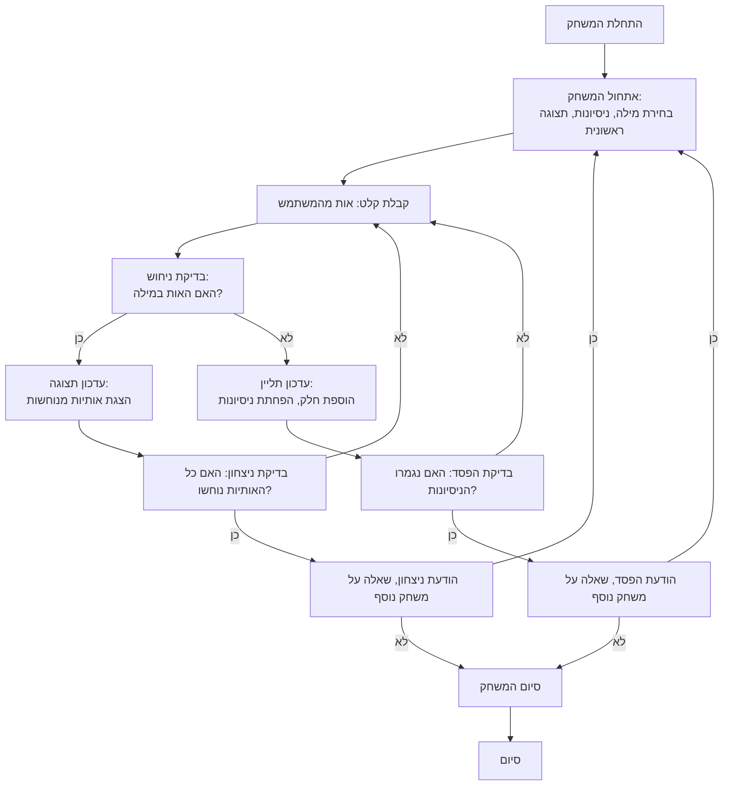

## ניתוח קוד המשחק "תלייה" (Hangman)

### <algorithm>
1.  **אתחול משחק**:
    *   הצגת הודעת פתיחה והסבר על הכללים למשתמש.
    *   בחירת מילה אקראית מרשימה מוגדרת מראש.
    *   הגדרת מספר ניסיונות למשחק, לדוגמה, 6 ניסיונות.
    *   הצגת אורך המילה שנבחרה באמצעות קווים תחתונים (לדוגמה, "\_ \_ \_ \_ \_").
    *   דוגמה:
        ```
        ברוכים הבאים למשחק התלייה!
        עליכם לנחש את המילה. יש לכם 6 ניסיונות.
        המילה היא: _ _ _ _ _
        ```
2.  **לולאת המשחק הראשית**:
    *   קבלת קלט מהמשתמש - אות ניחוש.
    *   בדיקה האם האות קיימת במילה הנבחרת:
        *   אם האות קיימת, הצגת האות במקומות המתאימים במילה.
            *   לדוגמה, אם המילה היא "תפוח" והמשתמש ניחש "ת", יופיע: "ת _ _ _ _".
        *   אם האות לא קיימת, הוספת חלק לציור התליין והפחתת מספר הניסיונות שנותרו.
            *   דוגמה: אם ניחשו "ל" שלא במילה, מספר הניסיונות יורד ב-1.
    *   בדיקה האם המשתמש ניצח או הפסיד:
        *   ניצחון - כל האותיות במילה נוחשו נכון לפני שנגמרו הניסיונות.
            *   לדוגמה, אם המילה היא "תפוח" והמשתמש ניחש את כל האותיות, המשחק מסתיים בניצחון.
        *   הפסד - מספר הניסיונות הסתיים לפני שנוחשו כל האותיות.
            *   דוגמה: אם מספר הניסיונות ירד ל-0 והמשתמש לא ניחש את כל האותיות, המשחק מסתיים בהפסד.
    *   חזרה לראש הלולאה עד להכרעת המשחק.
3.  **סיום המשחק**:
    *   הצגת הודעת ניצחון או הפסד בהתאם לתוצאה.
    *   שאלה אם המשתמש רוצה לשחק שוב.
    *   אם המשתמש מעוניין לשחק שוב, המשחק מתחיל מחדש (שלב 1).
    *   אם המשתמש לא מעוניין, המשחק מסתיים.
    *   דוגמה:
        ```
        ניצחתם! המילה הייתה תפוח!
        האם תרצו לשחק שוב? (כן/לא)
        > לא
        תודה ששיחקתם!
        ```

### <mermaid>


### <explanation>

1.  **ייבואים (Imports)**:
    *   הקוד לא מכיל שום ייבוא ספציפי, כגון `import random`.  ההנחה היא שהמשחק ישתמש בספריית `random` כדי לבחור מילה באופן אקראי. זהו פרט יישומי שיש להוסיף בקוד.

2.  **מחלקות (Classes)**:
    *   אין מחלקות בקוד הזה. זהו תיאור מילולי של המשחק, ללא ייצוג קוד. אם נממש את המשחק, נצטרך לבנות לפחות מחלקה אחת כדי לייצג את מצב המשחק.

3.  **פונקציות (Functions)**:
    *   אין פונקציות מוגדרות כרגע, אך נצטרך לממש פונקציות כמו:
        *   `init_game()`: מאתחלת את המשחק, בוחרת מילה, מגדירה ניסיונות ומציגה מצב התחלתי.
        *   `get_guess()`: קולטת את ניחוש המשתמש.
        *   `check_guess(guess, word, display)`: בודקת האם האות קיימת במילה, מעדכנת את התצוגה או את התליין, ומחזירה את מצב המשחק.
        *   `check_win(display)`: בודקת האם המשתמש ניצח (כל האותיות נוחשו).
        *   `check_lose(attempts)`: בודקת האם המשתמש הפסיד (נגמרו הניסיונות).
        *   `play_again()`: שואלת את המשתמש אם לשחק שוב ומחזירה תשובה בוליאנית.

4.  **משתנים (Variables)**:
    *   `word_list` (רשימה): רשימת המילים שמהן תבחר המילה האקראית. לדוגמה: `word_list = ["תפוח", "בננה", "אגס"]`.
    *   `word` (מחרוזת): המילה שנבחרה באופן אקראי מהרשימה.
    *   `attempts` (מספר שלם): מספר הניסיונות שנותרו למשתמש.
    *   `display` (רשימה): רשימה המייצגת את המילה עם האותיות המנוחשות. לדוגמה: `["_", "a", "_", "_", "e"]`.
    *   `hangman_parts` (רשימה): רשימה המייצגת את חלקי התליין (לדוגמה: `["ראש", "גוף", "יד ימין", "יד שמאל", "רגל ימין", "רגל שמאל"]`).

5.  **בעיות אפשריות או תחומים לשיפור**:
    *   **אין קלט שגיאות:** אין טיפול מפורש בקלט שאינו אותיות, או במספר אותיות שהוכנסו.
    *   **תצוגה:** התצוגה של התליין היא טקסטואלית בלבד. ניתן לשפר את התצוגה באמצעות גרפיקה.
    *   **רמות קושי:** ניתן להוסיף רמות קושי על ידי שינוי מספר הניסיונות או אורך המילים.
    *   **רשימת מילים:** כדאי לאפשר הרחבה של רשימת המילים בקלות.

**שרשרת קשרים עם חלקים אחרים בפרויקט:**

*   הקוד הזה מהווה חלק ממשחקון בתוך פרויקט גדול יותר.  הוא יכול להיות חלק ממודול של משחקי מילים.
*   הקוד משתמש בפונקציות מספריות שונות לצורך ניהול המשחק.
*   הקוד יכול ליצור אינטראקציה עם מנגנון התצוגה הגרפי של הפרויקט (אם קיים).

**הערות נוספות:**

*   הקוד הנוכחי הוא תיאור מילולי של המשחק. כדי לממש את המשחק בפועל, יש לכתוב קוד פייתון שישתמש באלגוריתם המתואר.
*   בנוסף, צריך לטפל בשגיאות אפשריות ולשפר את הממשק משתמש בהתאם.