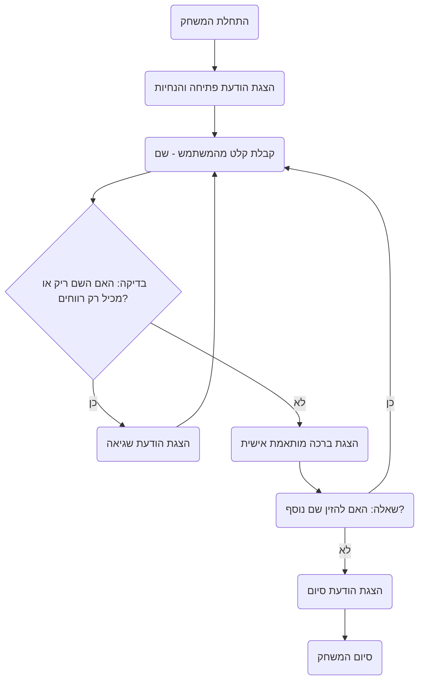

## <algorithm>

הקוד מתאר משחק פשוט בו המשתמש מזין את שמו והתוכנית מברכת אותו. המשחק ממשיך עד שהמשתמש בוחר להפסיק.

1. **אתחול המשחק**:
   - התוכנית מציגה הודעת פתיחה המזמינה את המשתמש להזין את שמו.
     *דוגמה*: `Привет! Введи своё имя, и я тебя поприветствую.`

2. **קבלת קלט מהמשתמש**:
   - התוכנית קולטת את קלט המשתמש (השם).
   - הקלט עובר בדיקה: האם הוא ריק או מכיל רק רווחים.
     - *דוגמה*: קלט ריק: `""` או קלט עם רווחים: `"   "`.
   - אם הקלט לא תקין, התוכנית מציגה הודעת שגיאה ומבקשת קלט חדש.

3. **הצגת ברכה מותאמת אישית**:
   - התוכנית מציגה ברכה המכילה את השם שהוזן.
     *דוגמה*: עבור קלט "Иван": `Привет, Иван! Рад познакомиться!`

4. **שאלה האם להמשיך**:
   - התוכנית שואלת את המשתמש האם הוא רוצה להזין שם נוסף.
     *דוגמה*: `Хотите ввести другое имя? (да/нет)`

5. **תגובה לשאלה**:
   - אם המשתמש משיב "כן", התוכנית חוזרת לשלב 2 (קבלת קלט מהמשתמש).
   - אם המשתמש משיב "לא", התוכנית מציגה הודעת סיום ומסיימת את פעולתה.
     *דוגמה*: `Спасибо за игру! До свидания!`

## <mermaid>

## <explanation>

**ייבואים (Imports):**

אין ייבוא מפורש בקוד זה, מכיוון שהקוד מתאר את לוגיקת המשחק ולא קוד בפועל. אם קוד כזה היה ממומש ב-Python, ייתכן שהיו נעשה שימוש בפונקציות קלט/פלט מובנות כמו `input()` ו-`print()`.

**מחלקות (Classes):**

אין מחלקות בקוד זה. הקוד מציג לוגיקה פרוצדורלית פשוטה ללא מבני נתונים מורכבים או ארגון אובייקטי.

**פונקציות (Functions):**

הקוד אינו מגדיר פונקציות מפורשות. עם זאת, ניתן לראות בלוגיקה שלבים ברורים שניתן לממש באמצעות פונקציות נפרדות:

-   **`greet_user()`**: פונקציה שתציג הודעת פתיחה ותקבל את שם המשתמש.
    -   *פרמטרים*: אין.
    -   *ערך מוחזר*: שם המשתמש שהוזן.
    -   *מטרה*: לאתחל את המשחק ולקבל את קלט המשתמש.
    -   *דוגמה*: `greet_user()` תחזיר את השם `Иван`.
-   **`validate_name(name)`**: פונקציה שתבדוק אם השם שהוזן תקין.
    -   *פרמטרים*: `name` (מחרוזת).
    -   *ערך מוחזר*: `True` אם השם תקין, `False` אחרת.
    -   *מטרה*: לוודא שהקלט אינו ריק או מכיל רק רווחים.
    -   *דוגמה*: `validate_name("   ")` תחזיר `False`, `validate_name("Иван")` תחזיר `True`.
-   **`print_greeting(name)`**: פונקציה שתציג ברכה מותאמת אישית.
    -   *פרמטרים*: `name` (מחרוזת).
    -   *ערך מוחזר*: אין.
    -   *מטרה*: להציג הודעת ברכה עם שם המשתמש.
    -   *דוגמה*: `print_greeting("Мария")` תדפיס `Привет, Мария! Рад познакомиться!`
-   **`ask_continue()`**: פונקציה שתשאל את המשתמש האם להמשיך.
    -   *פרמטרים*: אין.
    -   *ערך מוחזר*: `True` אם המשתמש מעוניין להמשיך, `False` אחרת.
    -   *מטרה*: לשאול את המשתמש האם הוא רוצה להזין שם נוסף.
    -   *דוגמה*: `ask_continue()` תחזיר `True` אם המשתמש הזין "כן", `False` אם הזין "לא".
-   **`print_end_message()`**: פונקציה שתציג הודעת סיום.
    -   *פרמטרים*: אין.
    -   *ערך מוחזר*: אין.
    -   *מטרה*: להציג הודעת סיום למשתמש.
    -   *דוגמה*: `print_end_message()` תדפיס `Спасибо за игру! До свидания!`

**משתנים (Variables):**

המשתנים העיקריים במשחק הם:

-   `name` (מחרוזת): משמש לאחסון שם המשתמש שהוזן.
-   `continue_game` (בוליאני): משמש לשליטה על הלולאה הראשית של המשחק, `True` אם המשתמש רוצה להמשיך, `False` אם לא.

**בעיות אפשריות או תחומים לשיפור:**

1.  **טיפול בשגיאות:** הקוד מתאר בדיקה פשוטה לקלט ריק או רווחים, אך אין טיפול מקיף בשגיאות קלט אפשריות (למשל, קלט שאינו טקסט).
2.  **גמישות:** ניתן להוסיף גמישות למשחק על ידי הוספת אפשרויות נוספות או התאמה אישית.
3.  **שימוש בפונקציות:** הקוד יכול להרוויח ממימוש פונקציות נפרדות לכל שלב לוגי, דבר שיגדיל את קריאות הקוד ויקל על תחזוקתו.

**שרשרת קשרים עם חלקים אחרים בפרויקט:**

במידה וקוד זה יהפוך להיות חלק מפרויקט גדול יותר:

-   **מערכת משחקים:** ניתן ליצור מערכת משחקים שבה כל משחק הוא קובץ נפרד, והלוגיקה המרכזית של המשחקים (כמו טיפול בשגיאות, קלט/פלט) מופרדת.
-   **ממשק משתמש:** ניתן להרחיב את המשחק לממשק משתמש גרפי (GUI) אם צריך.
-   **שמירה וטעינה:** ניתן להוסיף אפשרות לשמירה וטעינה של התקדמות המשחק, אם זה רלוונטי.

בסה"כ, הקוד הזה מהווה בסיס טוב למשחק פשוט. על ידי מימוש הפונקציות השונות באופן מפורש, ניתן לשפר את הקריאות, התחזוקה והגמישות של הקוד.