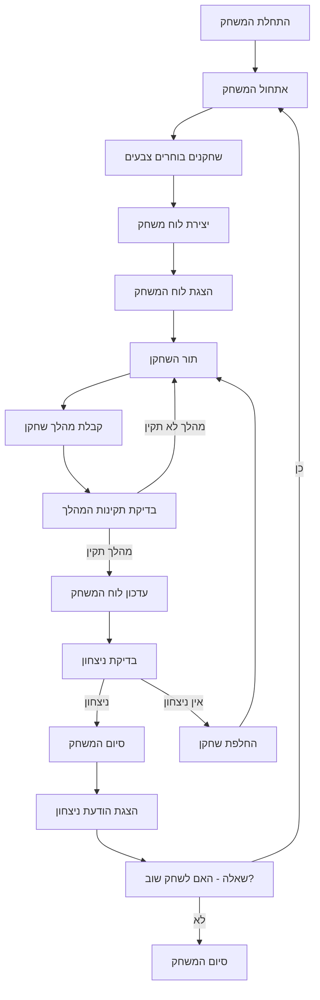

## ניתוח קוד המשחק "הקס"

### <algorithm>
1. **אתחול המשחק:**
    -   הצגת הודעת פתיחה למשתמש והסבר על חוקי המשחק.
    -   יצירת לוח משחק בצורת מעוין בגודל 11x11 (או גודל מותאם אישית).
        -   דוגמה: יצירת רשימה דו-ממדית המייצגת את הלוח, כאשר כל תא ריק מסומן בתו מסוים (למשל, ".").
    -   אפשרות לשחקנים לבחור את הצבע שלהם (אדום או כחול).
        -   דוגמה: משתנה `player1_color` יכול להכיל "אדום" ו- `player2_color` יכול להכיל "כחול".
    -   הצגת לוח המשחק למשתמש.
2.  **תהליך המשחק:**
    -   **תור השחקן:**
        -   השחקן בוחר תא בלוח.
            -   דוגמה: השחקן מקליד "A1", שמתורגם לקואורדינטות (0,0) בלוח.
        -   בדיקה שהתא שנבחר פנוי. אם לא, בקשת תור חדש.
            -   דוגמה: בדיקה שהערך בתא הנבחר בלוח הוא ".".
        -   הצבת האבן של השחקן בתא הנבחר.
            -   דוגמה: החלפת הערך בתא הנבחר מ"." ל"X" (עבור שחקן 1) או "O" (עבור שחקן 2).
        -   עדכון לוח המשחק והצגתו למשתמש.
    -   **בדיקת ניצחון:**
        -   בדיקה האם השחקן הצליח לחבר את הצדדים הנגדיים של הלוח בצבעו.
            -   דוגמה: עבור השחקן האדום, בדיקה האם קיימת דרך מהצד העליון לתחתון דרך תאים עם "X". עבור השחקן הכחול, בדיקה האם קיימת דרך מהצד השמאלי לימני דרך תאים עם "O".
    -   **החלפת תורות:**
        -   החלפת התור לשחקן הבא.
            -   דוגמה: אם היה תור השחקן הראשון, התור עובר לשחקן השני.
3. **סיום המשחק:**
    -   הצגת הודעת ניצחון לשחקן המנצח.
        -   דוגמה: "מזל טוב! שחקן [צבע] ניצח!".
    -   הצגת אפשרות לשחק שוב.
        -   דוגמה: שאלה "האם תרצו לשחק שוב? (כן/לא)".
    -   אם לא, סיום המשחק.

### <mermaid>

### <explanation>
**ייבואים (Imports)**:
-   אין ייבוא מיוחד בקוד זה. הקוד מתאר את הלוגיקה הכללית של המשחק ואינו תלוי בחבילות ספציפיות של פייתון.

**מחלקות (Classes)**:
-   אין מחלקות בקוד זה. הקוד מתאר את הפונקציונליות של המשחק בלבד.

**פונקציות (Functions)**:
-   אין פונקציות מוגדרות בקוד זה, אך ניתן ליישם פונקציות נפרדות עבור כל אחד מהשלבים הבאים:
    -   `init_game()`: לאתחול המשחק, יצירת לוח והגדרת השחקנים.
    -   `display_board()`: להצגת לוח המשחק למשתמש.
    -   `get_player_move()`: לקבלת מהלך מהמשתמש.
    -   `validate_move()`: לבדיקה שהמהלך תקין (התא פנוי).
    -   `update_board()`: לעדכון לוח המשחק לאחר מהלך.
    -   `check_win()`: לבדיקת האם יש מנצח.
    -   `switch_player()`: להחלפת השחקן.
    -   `end_game()`: לסיום המשחק והצגת הודעה.

**משתנים (Variables)**:
-   `board`: משתנה המייצג את לוח המשחק (בדרך כלל רשימה דו-ממדית).
-   `player1_color`, `player2_color`: משתנים המייצגים את צבעי השחקנים ("אדום" או "כחול").
-   `current_player`: משתנה המציין איזה שחקן משחק כעת.

**בעיות אפשריות או תחומים לשיפור**:
-   **בדיקת ניצחון:** הקוד הנוכחי לא מפרט כיצד בדיקת הניצחון תתבצע בפועל. יש להוסיף אלגוריתם (כמו חיפוש לעומק/רוחב) כדי לבדוק האם יש חיבור בין צדדי הלוח.
-   **קלט משתמש:** הקוד לא כולל את הדרך בה המשתמש יכניס קלט (למשל, מהלך).
-   **גרפיקה:** הקוד לא כולל שום חלק גרפי, שניתן להוסיף כדי לשפר את חוויית המשתמש.
-   **משחק נגד המחשב:** הקוד לא כולל אפשרות למשחק נגד המחשב.
-   **גודל לוח:** הקוד מציין שניתן להתאים את גודל הלוח, אך לא מספק דרך לעשות זאת.

**שרשרת קשרים עם חלקים אחרים בפרויקט**:
-   הקוד יכול להיות מיושם כחלק מפרויקט גדול יותר הכולל:
    -   ממשק משתמש (CLI, GUI).
    -   אלגוריתמים לבינה מלאכותית למשחק נגד המחשב.
    -   מנגנון שמירה וטעינת משחקים.
    -   ספריית עזר (למשל, עבור טיפול בלוח).