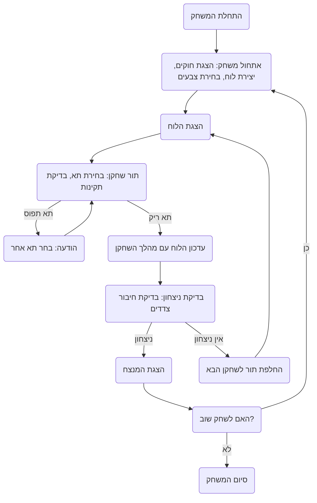

## <algorithm>

1. **התחלת המשחק:**
    - המשחק מתחיל בהצגת הודעת פתיחה והסבר על חוקי המשחק לשחקנים.
    - לדוגמה: "ברוכים הבאים למשחק HEX! עליכם לחבר בין הצדדים הנגדיים של הלוח."
    - לוח משחק בגודל 11x11 (או גודל שנקבע על ידי המשתמש) מיוצר כמבנה נתונים (למשל, רשימה של רשימות).
    - לדוגמה: `board = [['.' for _ in range(11)] for _ in range(11)]`, כאשר `.` מייצג תא ריק.
    - השחקנים בוחרים צבעים: שחקן אחד משתמש באדום, והשני בכחול.
    - לדוגמה: שחקן 1 בוחר אדום, שחקן 2 בוחר כחול.
    - הלוח מוצג לשחקנים.
    - לדוגמה:
       ```
       . . . . . . . . . . .
       . . . . . . . . . . .
       . . . . . . . . . . .
       . . . . . . . . . . .
       . . . . . . . . . . .
       . . . . . . . . . . .
       . . . . . . . . . . .
       . . . . . . . . . . .
       . . . . . . . . . . .
       . . . . . . . . . . .
       . . . . . . . . . . .
       ```

2. **מהלך שחקן:**
    - השחקן בוחר תא בלוח על ידי ציון קואורדינטות (למשל, A1).
    - לדוגמה: שחקן 1 בוחר A1.
    - התוכנית בודקת האם התא ריק; אם לא, מוצגת הודעה והשחקן מתבקש לבחור תא אחר.
    - לדוגמה: אם A1 תפוס, ההודעה תהיה "התא תפוס, בחר תא אחר".
    - אם התא ריק, התוכנית מעדכנת את הלוח עם סימון השחקן (X לאדום, O לכחול).
    - לדוגמה: אם שחקן 1 בחר A1, אז `board[0][0]` משתנה ל-`X`.
    - התוכנית בודקת האם השחקן הנוכחי ניצח לאחר המהלך.

3. **בדיקת ניצחון:**
    - עבור שחקן אדום, התוכנית בודקת האם קיימת דרך מקושרת מהצד העליון של הלוח לצד התחתון של הלוח באמצעות חיבור תאים המסומנים ב-X.
    - לדוגמה: אם קיימת רצף תאים מהצורה X בטורים 1, 2, 3, ... ועד 11 בשורות המתאימות.
    - עבור שחקן כחול, התוכנית בודקת האם קיימת דרך מקושרת מהצד השמאלי של הלוח לצד הימני של הלוח באמצעות חיבור תאים המסומנים ב-O.
    - לדוגמה: אם קיימת רצף תאים מהצורה O בשורות 1, 2, 3, ... ועד 11 בטורים המתאימים.
    - התוכנית משתמשת באלגוריתם חיפוש (למשל, DFS או BFS) כדי לבדוק האם קיימים נתיבים מחוברים.

4. **החלפת תורות:**
    - אם לא נמצא מנצח, התוכנית מחליפה את התור לשחקן השני.

5. **סיום המשחק:**
    - ברגע שנמצא מנצח, התוכנית מציגה הודעה המכריזה על המנצח.
    - לדוגמה: "מזל טוב! שחקן אדום ניצח!"
    - לאחר מכן, השחקנים יכולים לבחור לשחק שוב או לסיים את המשחק.
    - לדוגמה: "האם תרצו לשחק שוב? (כן/לא)"



## <explanation>

**ייבואים (Imports):**

בקטע הקוד שסופק לא מופיעים ייבואים, כיוון שהוא מתאר את הלוגיקה של המשחק ולא קוד ממשי. עם זאת, במידה ויש צורך ביישום, ייתכן שימוש בספריות כגון `numpy` לעבודה עם לוחות דו-מימדיים, או ספריות גרפיות כמו `pygame` ליצירת ממשק משתמש גרפי.

**מחלקות (Classes):**

אין מחלקות מוגדרות בקוד, אבל ניתן ליישם מחלקות כמו `Board` לייצוג הלוח, `Player` לייצוג השחקנים ו-`Game` לניהול המשחק.

*   **`Board`**:
    *   **מאפיינים:** גודל הלוח, מבנה נתונים לייצוג הלוח (למשל, רשימה של רשימות), שיטות לגישה ועדכון תאים.
    *   **שיטות:**
        *   `__init__(self, size)`: מאתחל לוח חדש בגודל נתון.
        *   `get_cell(self, row, col)`: מחזיר את הערך של תא נתון.
        *   `set_cell(self, row, col, value)`: מעדכן את הערך של תא נתון.
        *   `display(self)`: מציג את הלוח בצורה טקסטואלית.

*   **`Player`**:
    *   **מאפיינים:** צבע השחקן (אדום/כחול).
    *   **שיטות:**
        *   `__init__(self, color)`: מאתחל שחקן חדש עם צבע נתון.
        *   `get_color(self)`: מחזיר את צבע השחקן.

*   **`Game`**:
    *   **מאפיינים:** לוח משחק, שחקנים, תור נוכחי.
    *   **שיטות:**
        *   `__init__(self, size)`: מאתחל משחק חדש עם לוח ויוצר את השחקנים.
        *   `play_turn(self, row, col)`: מבצע מהלך עבור השחקן הנוכחי.
        *   `check_win(self, player)`: בודק האם שחקן מסוים ניצח.
        *   `switch_player(self)`: מעביר את התור לשחקן השני.
        *   `start(self)`: מתחיל את המשחק.

**פונקציות (Functions):**

אין פונקציות ספציפיות בקוד, אבל פונקציות שניתן ליישם:

*   `initialize_game(size)`: אתחול משחק חדש, החזרת לוח חדש וקביעת השחקנים.
    *   **פרמטרים**: גודל הלוח.
    *   **ערך מוחזר**: לוח חדש, שני שחקנים.
    *   **מטרה**: יצירת משחק חדש.
*   `display_board(board)`: הדפסת לוח המשחק למסך.
    *   **פרמטרים**: לוח המשחק.
    *   **ערך מוחזר**: אין.
    *   **מטרה**: הצגת הלוח לשחקנים.
*   `player_turn(board, player)`: לקיחת מהלך מהשחקן ובדיקת תקינות המהלך.
    *   **פרמטרים**: לוח המשחק, השחקן הנוכחי.
    *   **ערך מוחזר**: קואורדינטות המהלך או False אם המהלך אינו תקין.
    *   **מטרה**: קבלת קלט מהמשתמש וביצוע בדיקה שהמהלך אפשרי.
*   `update_board(board, row, col, player)`: עדכון לוח המשחק לאחר ביצוע מהלך.
    *   **פרמטרים**: לוח המשחק, שורה, עמודה, השחקן הנוכחי.
    *   **ערך מוחזר**: לוח מעודכן.
    *   **מטרה**: עדכון הלוח עם סימון השחקן.
*   `check_win(board, player)`: בדיקה האם השחקן ניצח.
    *   **פרמטרים**: לוח המשחק, השחקן הנוכחי.
    *   **ערך מוחזר**: True אם ניצח, False אחרת.
    *   **מטרה**: בדיקה האם קיים חיבור בין הצדדים עבור השחקן.
*   `switch_player(current_player)`: החלפת תור לשחקן הבא.
    *   **פרמטרים**: השחקן הנוכחי.
    *   **ערך מוחזר**: השחקן הבא בתור.
    *   **מטרה**: מעבר בין השחקנים.
*   `game_over(board, player)`: מציג את המנצח וההודעה המתאימה.
    *   **פרמטרים**: לוח המשחק, השחקן המנצח.
    *   **ערך מוחזר**: אין.
    *   **מטרה**: הכרזת מנצח.

**משתנים (Variables):**

*   `board`: משתנה המייצג את לוח המשחק (למשל, רשימה של רשימות).
*   `player1`, `player2`: משתנים המייצגים את השחקנים (למשל, אובייקטים של מחלקת Player).
*   `current_player`: משתנה המייצג את השחקן הנוכחי.
*   `size`: גודל הלוח (למשל, 11).
*   `row`, `col`: משתנים המייצגים קואורדינטות בלוח.

**בעיות אפשריות:**

*   **בדיקת ניצחון:** בדיקת חיבור בין צדדים יכולה להיות מורכבת ומצריכה יישום של אלגוריתם חיפוש (DFS או BFS).
*   **ממשק משתמש:** ממשק טקסטואלי יכול להיות פחות אינטואיטיבי למשתמשים; ייתכן שימוש בספריות גרפיות לייצוג המשחק באופן נוח יותר.

**תחומים לשיפור:**

*   **אינטליגנציה מלאכותית:** ניתן להוסיף אפשרות לשחק נגד מחשב באמצעות אלגוריתמי AI פשוטים (למשל, מינימקס).
*   **ממשק גרפי:** שימוש ב-pygame או ספריות אחרות ליצירת ממשק משתמש גרפי.
*   **אימות קלט:** הוספת בדיקות נוספות למהלכים של השחקנים כדי למנוע שגיאות.
*   **אופטימיזציה:** שיפור ביצועי האלגוריתם, במיוחד אלגוריתם בדיקת ניצחון.

**שרשרת קשרים עם חלקים אחרים בפרויקט:**

*   אם קיימים מודולים אחרים בפרויקט, כגון `utils` המכיל פונקציות עזר, ניתן לכלול אותם כייבוא (למשל, `from src.utils import board_utils`).
*   ניתן להרחיב את המשחק כך שיתממשק עם שרת רשת למשחק מקוון (למשל, שימוש בספריות כגון `flask` או `socket`).