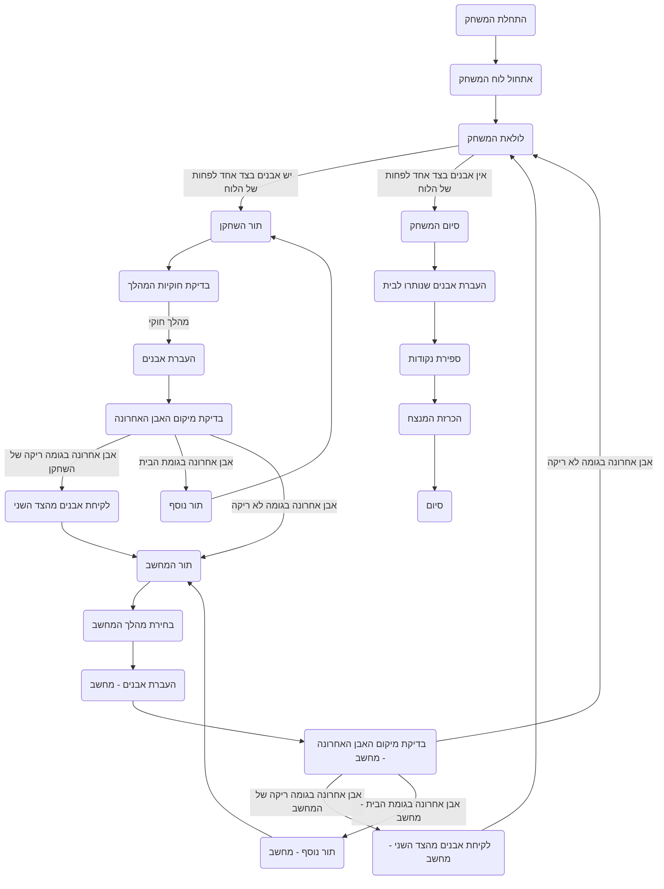

# ניתוח קוד המשחק Awari

## 1. <algorithm>

הקוד מתאר את כללי המשחק Awari, כולל התהליך של איך לשחק נכון ואיך הקוד צריך לעבוד כדי ליישם את המשחק. להלן תרשים זרימה של תהליך המשחק:

1. **אתחול המשחק**:
   - יוצרים מערך לייצוג הלוח, עם 14 תאים: 6 גומות לכל שחקן וגומת בית לכל שחקן.
     - דוגמה: `[0, 4, 4, 4, 4, 4, 4, 0, 4, 4, 4, 4, 4, 4]` (גומות הבית בהתחלה ריקות, כל שאר הגומות עם 4 אבנים).
   - הגומות הראשונות (1-6) שייכות לשחקן הראשון, הגומות הבאות (8-13) שייכות לשחקן השני, והגומות ה-0 וה-7 הן גומות הבית של השחקנים, בהתאמה.
2. **לולאת המשחק הראשית**:
   - כל עוד יש אבנים בצד אחד לפחות של הלוח, המשחק נמשך.
   - **תור השחקן**:
     - מבקשים מהשחקן לבחור גומה (1-6).
     - בודקים שהגומה שנבחרה חוקית (לא ריקה, שייכת לשחקן).
     - מעבירים את האבנים מהגומה בכיוון השעון:
       - מוסיפים אבן אחת לכל גומה בדרך (למעט גומת הבית של היריב).
       - אם האבן האחרונה נוחתת בגומה ריקה של השחקן, ויש אבנים מול הגומה הזו, לוקחים את כל האבנים האלו לבית השחקן.
       - אם האבן האחרונה נוחתת בגומת הבית, השחקן זוכה לתור נוסף.
   - **תור המחשב**:
     - המחשב בוחר גומה בצד שלו (8-13) באמצעות אלגוריתם פשוט (למשל, הגומה הראשונה שאינה ריקה).
     - מעביר את האבנים לפי אותם כללים כמו השחקן.
   - **סיום המשחק**:
     - המשחק מסתיים כאשר כל הגומות בצד של אחד השחקנים ריקות.
     - מעבירים את כל האבנים הנותרות לגומת הבית של השחקן בעל האבנים.
3. **ספירת נקודות**:
   - סופרים את האבנים בגומות הבית של כל שחקן.
   - מכריזים על המנצח.
4. **פונקציות נוספות**:
   - הצגת הלוח אחרי כל תור.
   - אפשרות להתחיל משחק חדש או לצאת.

## 2. <mermaid>

**הסבר התלויות:**

אין תלויות חיצוניות בקוד זה. כל התהליך מתואר באופן מילולי ואינו תלוי בספריות חיצוניות.

## 3. <explanation>

**ייבואים (Imports):**

אין ייבואים בקוד זה. הקוד מציג תיאור של חוקי המשחק, לכן אין תלות בספריות חיצוניות.

**מחלקות (Classes):**

אין שימוש במחלקות בקוד זה, זהו תיאור של אלגוריתם משחק ולא קוד ממשי.

**פונקציות (Functions):**

בקוד המוצג אין הגדרות לפונקציות, אך ניתן להסיק אילו פונקציות יהיו נחוצות ליישום המשחק:

*   **`initialize_board()`**: תפקידה ליצור מערך המייצג את לוח המשחק ולאתחל את כמות האבנים בכל גומה.
*   **`player_turn(board)`**: תפקידה לקבל את בחירת השחקן, לבדוק את תקינותה, להעביר את האבנים ולעדכן את לוח המשחק.
*   **`computer_turn(board)`**: תפקידה לבחור את גומת המחשב, להעביר את האבנים ולעדכן את לוח המשחק.
*   **`move_stones(board, start_pos)`**: תפקידה להעביר את האבנים מהגומה שנבחרה בכיוון השעון.
*  **`move_stones_computer(board, start_pos)`**: תפקידה להעביר את האבנים מהגומה שנבחרה על ידי המחשב בכיוון השעון.
*   **`check_last_stone(board, last_pos, player_side)`**: תפקידה לבדוק את מיקום האבן האחרונה ולקבוע האם יש ללכוד אבנים או להמשיך את התור.
*  **`check_last_stone_computer(board, last_pos, player_side)`**: תפקידה לבדוק את מיקום האבן האחרונה ולקבוע האם יש ללכוד אבנים או להמשיך את התור - עבור המחשב.
*   **`capture_stones(board, pos)`**: תפקידה לקחת אבנים מגומה יריבה ולהעבירן לבית של השחקן.
*  **`capture_stones_computer(board, pos)`**: תפקידה לקחת אבנים מגומה יריבה ולהעבירן לבית של המחשב.
*   **`is_game_over(board)`**: תפקידה לבדוק אם המשחק הסתיים (אבנים רק בצד של שחקן אחד).
*   **`count_scores(board)`**: תפקידה לספור את האבנים בגומות הבית ולקבוע את המנצח.
*  **`display_board(board)`**: תפקידה להציג את לוח המשחק למשתמש.

**משתנים (Variables):**

*   `board`: מערך של מספרים שלמים המייצג את מצב הלוח.
*  `player_side` : מספר שלם המציין את הצד של השחקן (0 - צד השחקן, 1 - צד המחשב).
*   `start_pos`: מספר שלם המייצג את האינדקס של הגומה ממנה מתחילים להעביר את האבנים.
*   `last_pos`: מספר שלם המייצג את האינדקס של הגומה בה נוחתת האבן האחרונה.

**בעיות אפשריות ותחומים לשיפור:**

*   האלגוריתם של המחשב לבחירת גומה פשוט מאוד וניתן לשיפור (למשל, אלגוריתם מינימקס).
*   אין טיפול מפורט במקרים קיצוניים (למשל, קלט לא חוקי).
*   הקוד אינו כולל טיפול מסודר בשגיאות.
*   הצגת הלוח היא בסיסית וניתן לשפר אותה ויזואלית.

**קשר עם חלקים אחרים בפרויקט:**

במידה והמשחק יהיה חלק מפרויקט גדול יותר, הוא יצטרך לתקשר עם ממשק המשתמש, טיפול בקלט והגדרות המשחק.

הקוד הזה מספק מסגרת בסיסית להבנה של המשחק Awari וליישום שלו.